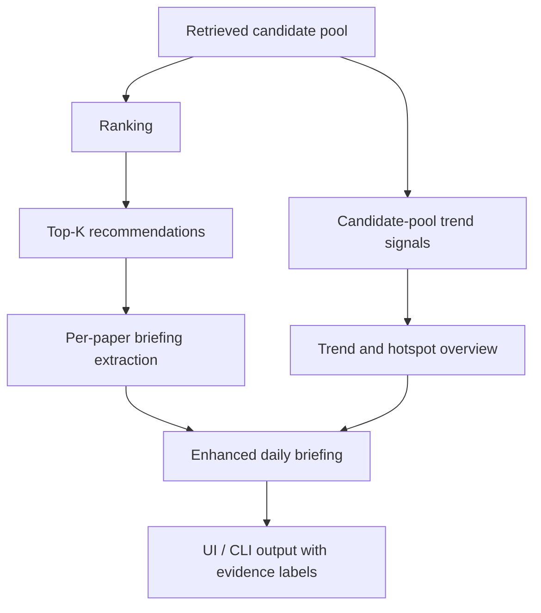

# Improve Briefing Quality

## Problem Frame

The current daily briefing is too shallow for research use. It mainly turns the final Top-K papers into short abstract-level summaries, then produces a brief executive summary. This makes the output readable, but it does not help the user understand what the selected papers actually contribute, how they differ, or what broader trends are visible in the retrieved candidate pool.

The improved briefing should behave more like a research reading guide plus a compact field overview. It should explain the Top-K papers clearly and also summarize trend and hotspot signals from the broader search result set, while keeping the default workflow fast and stable by not downloading or parsing PDFs.

## Requirements

**Top-K Paper Briefs**
- R1. The briefing must include richer per-paper explanations for the final Top-K papers, not just one-sentence summaries.
- R2. Each Top-K paper brief must explain the paper's problem, method or approach when supported by the available evidence, key contribution, and why it is relevant to the user's topic.
- R3. Each Top-K paper brief must preserve rank, score, evidence source, and arXiv provenance so users can trace claims back to the ranked recommendation.
- R4. The briefing must compare the Top-K papers when possible, highlighting differences such as method-focused, system-focused, application-focused, benchmark-focused, or survey-like work.

**Trend and Hotspot Overview**
- R5. The briefing must summarize broader topic trends using retrieval and ranking context beyond the final Top-K when candidate-pool data is available.
- R6. Trend output should cover recurring methods, application areas, categories, and repeated phrases or topic clusters visible in the candidate pool.
- R7. The trend overview must distinguish strong signals from weak signals, including enough candidate-count or coverage context to show when the candidate pool is small, heavily deduped, or mostly metadata-only.
- R8. The briefing must avoid presenting candidate-pool trends as full-paper conclusions when only title, abstract, category, ranking, or retrieval metadata was used.

**User-Facing Output**
- R9. The briefing must include a stronger executive summary that gives an overall judgment about the topic, not only the title of the top-ranked paper.
- R10. The briefing must include a reading-priority section that suggests which Top-K papers to read first and why.
- R11. The UI and CLI surfaces must remain compact enough for a daily workflow, with detailed Top-K briefs and trend sections available without overwhelming the summary table.
- R12. The output must remain useful in fake/offline mode so tests and demos can verify structure and fallback behavior without live LLM calls.

**Evidence and Fallback Behavior**
- R13. The default briefing mode must not download or parse PDFs; it must use abstracts, metadata, ranking signals, retrieval-source metadata, and candidate-pool summaries.
- R14. If abstracts are missing for some papers, the briefing must clearly mark those items as metadata-limited and avoid unsupported method or contribution claims.
- R15. If candidate-pool trend data is unavailable, the briefing must still produce richer Top-K paper briefs and explicitly state that broader trends were not assessed.
- R16. If LLM briefing generation fails, deterministic fallback output must preserve the improved section structure rather than collapsing to a generic one-line fallback.

## Expected Output Shape

The enhanced briefing should present information in this order:

1. Executive summary: overall judgment about the topic and the most important takeaway.
2. Top-K paper briefs: richer per-paper reading guide for the ranked recommendations.
3. Trend and hotspot overview: recurring directions visible across the candidate pool when enough evidence exists.
4. Top-K comparison: how the recommended papers differ and which roles they play in the topic landscape.
5. Reading priority: which papers to read first depending on the user's goal.
6. Evidence boundary: concise note on whether claims are based on abstract, metadata, ranking, or retrieval signals.

## Success Criteria

- A user can read the briefing and understand what each Top-K paper is about, why it was recommended, and how it differs from the other recommended papers.
- The briefing includes a credible trend or hotspot overview when the retrieval candidate pool contains enough metadata to support one.
- The briefing does not imply full-text evidence unless a future explicit deep mode provides it.
- Fake/offline tests can verify the enhanced briefing shape, evidence labels, candidate-pool trend fallback, and deterministic fallback behavior.
- The generated briefing is materially more useful than the current 2-3 sentence executive summary plus table, without making the default workflow depend on PDF parsing.

## Scope Boundaries

- Do not make PDF/full-text parsing part of the default briefing flow.
- Do not replace the selected-paper deep explanation workflow; this improvement is for the daily briefing surface.
- Do not require a vector database, persistent analytics system, or non-arXiv source integration.
- Do not make the briefing claim experimental details, limitations, or full methodological specifics that are not supported by available evidence.
- Do not make broad trend summaries mandatory when the candidate pool is too small or unavailable.

## Key Decisions

- Default evidence level: Use abstract, metadata, ranking, retrieval, and candidate-pool signals only. This keeps the daily workflow fast and consistent with the current project boundary.
- Briefing shape: Combine paper-level reading guidance with topic-level trend overview. The user wants both richer Top-K explanations and a sense of current hotspots.
- PDF handling: Keep full-text reading out of scope for the default mode. A future deep briefing mode can reuse selected-paper full-text behavior if needed.
- Offline behavior: Preserve fake-provider and deterministic paths so the improved briefing can be tested and demonstrated without live services.

## High-Level Flow

## Dependencies / Assumptions

- The project already has retrieval, ranking, extraction, and briefing workflow steps.
- The improved search work provides candidate-pool and retrieval metadata that can support trend summaries when available.
- The existing selected-paper deep explanation workflow remains available for users who need deeper full-text analysis of a specific paper.

## Outstanding Questions

### Resolve Before Planning

- None.

### Deferred to Planning

- [Affects R5-R7][Technical] Decide how to summarize candidate-pool trend signals without overfitting to noisy title and abstract terms.
- [Affects R9-R11][Technical] Decide the exact briefing contract shape and how to render the enhanced sections in UI and CLI.
- [Affects R16][Technical] Decide how deterministic fallback should format richer sections while staying concise.

## Next Steps

-> /ce:plan for structured implementation planning.
