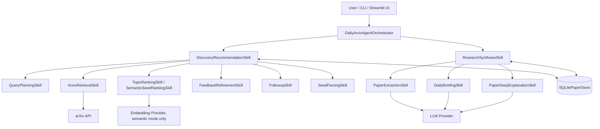
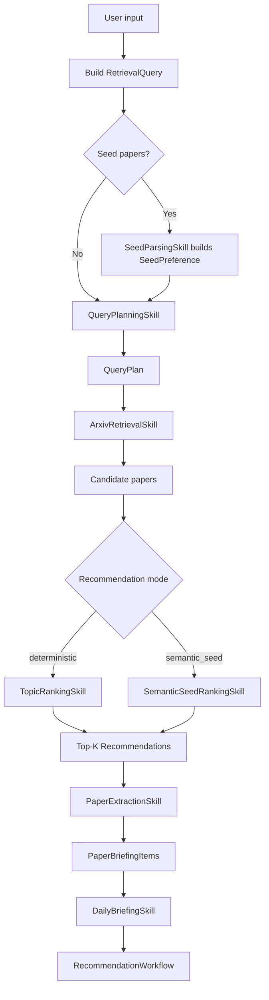
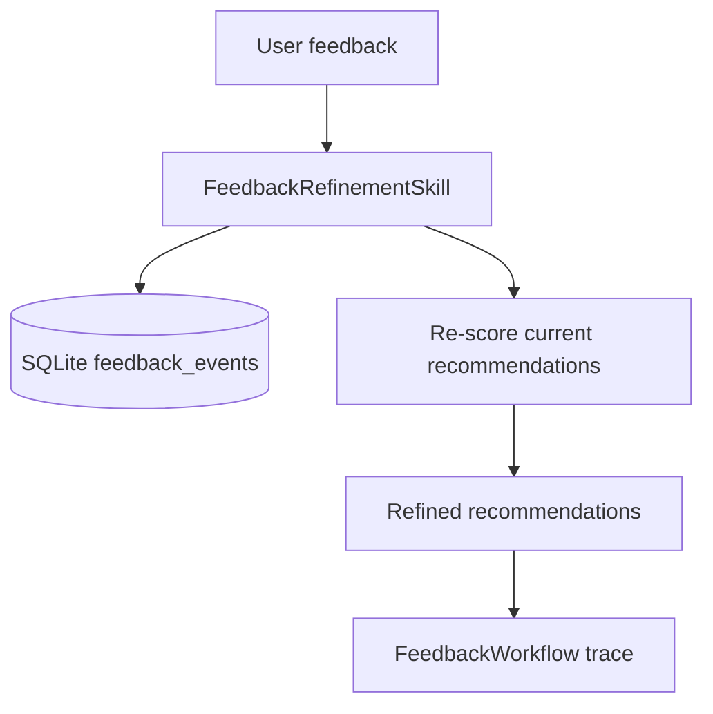
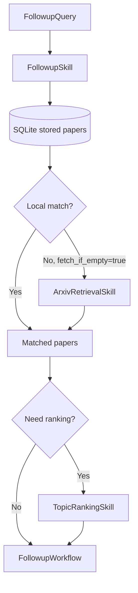
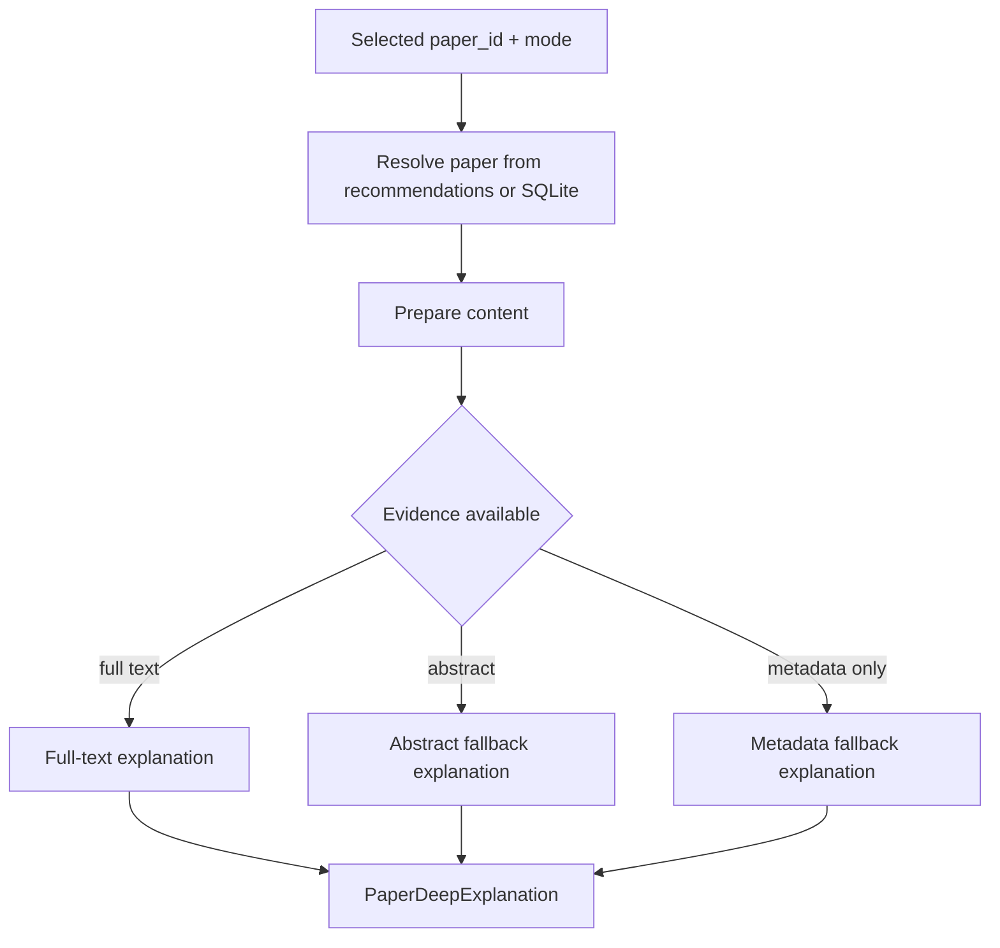

# 当前架构与数据流向

本文档说明 Daily arXiv Research Briefing Agent 当前的高层架构和主要数据流。它面向代码阅读、报告撰写和演示讲解，不展开排序公式、缓存键、重试策略等实现细节。

## 1. 架构概览

系统现在是 **Agent + 两个公开 Skills** 的结构：

1. `DailyArxivAgentOrchestrator` 是总调度器，负责把用户请求组织成完整工作流，并生成可展示的 workflow trace。
2. `DiscoveryRecommendationSkill` 负责发现和推荐：seed 解析、query planning、arXiv 检索、候选论文排序、feedback refinement、follow-up filtering。
3. `ResearchSynthesisSkill` 负责研究内容生成：结构化抽取、daily briefing、单篇论文 deep explanation。

原来的细粒度 Skill 仍然保留为内部子能力。这样对外可以讲成两个主要 Skill，同时保留旧有全部功能、测试粒度和兼容 import。

两个公开 Skill 的详细说明见：

- `docs/discovery-recommendation-skill.md`
- `docs/research-synthesis-skill.md`

## 2. 主要组件职责

| 组件 | 职责 |
| --- | --- |
| `DailyArxivAgentOrchestrator` | 对外工作流入口。负责推荐、反馈 refinement、follow-up、deep explanation，并汇总 trace。 |
| `DiscoveryRecommendationSkill` | 公开的推荐侧 Skill。把检索、排序、反馈和 follow-up 相关能力收敛到一个入口。 |
| `ResearchSynthesisSkill` | 公开的生成侧 Skill。把 briefing item、最终简报和单篇解释收敛到一个入口。 |
| `SQLitePaperStore` | 本地状态层。保存论文 metadata、检索结果、seed preference、feedback、全文缓存和 embedding cache。 |
| `LLMProvider` | 生成结构化 briefing item、executive summary 和 deep explanation。测试中可用 fake provider。 |
| `EmbeddingProvider` | 只用于 semantic seed recommendation 和 semantic feedback refinement。 |

## 3. 推荐工作流数据流

推荐流程是系统的主路径。用户给出 topic、category、date range、seed papers、top-k 等输入后，数据按下面方式流动：

主流程输出 `RecommendationWorkflow`，其中包括：

- `papers`：检索到的候选论文。
- `recommendations`：排序后的 Top-K 推荐。
- `briefing`：最终 daily briefing。
- `trace`：每个内部阶段的状态、输入摘要、输出摘要、fallback/error 信息和证据来源。

## 4. Feedback 数据流

用户可以对推荐论文标记 `like` 或 `dislike`。这些反馈会被保存到 SQLite，并在之后影响推荐排序或显式 refinement。

在 deterministic 推荐中，历史 feedback 可以直接作为 ranking 信号。  
在 semantic seed 推荐中，系统先生成 semantic recommendations，再用 feedback refinement 统一处理反馈影响。

## 5. Follow-up 数据流

Follow-up query 用于在已有本地论文基础上继续筛选，例如“有没有 graph neural 相关论文？”。

Follow-up 是 local-first：优先使用 SQLite 中已有论文，只有本地没有命中且允许补检索时才访问 arXiv。

## 6. Deep Explanation 数据流

Deep explanation 是用户选中某篇推荐论文后触发的单篇解释流程。

支持的解释模式包括：

- `method`
- `experiment`
- `limitations`

Deep explanation 会尽量使用全文；如果全文不可用，会退回到 abstract，再退回到 metadata，并在结果中标明证据边界。

## 7. 状态、证据与 Trace

系统所有 Skill 结果都通过 `SkillResult` 返回。这个统一结构让 CLI、UI、测试和报告可以用同一套字段理解工作流状态：

- `status`：`success`、`empty`、`fallback`、`error`
- `data`：结构化输出
- `evidence_source`：结果基于 metadata、abstract、ranking、full text 等哪类证据
- `provenance`：来源信息
- `error`：结构化错误码和错误信息
- `metadata`：可展示的诊断信息

Orchestrator 会把每个内部阶段记录为 `WorkflowTraceStep`。因此最终输出不仅有推荐和简报，也能展示“系统做了哪些步骤、每一步是否成功、用了什么证据、是否发生 fallback”。

## 8. 当前架构的讲解口径

对外讲解时，可以把系统概括为：

1. 用户输入研究兴趣。
2. `DiscoveryRecommendationSkill` 把兴趣转成查询，检索 arXiv，结合 topic、seed、feedback 和 semantic signal 生成推荐。
3. `ResearchSynthesisSkill` 把推荐论文转成结构化 briefing item、最终 daily briefing，或对单篇论文做深入解释。
4. `SQLitePaperStore` 贯穿全流程，提供缓存、复用、反馈记忆和离线 follow-up。
5. `WorkflowTraceStep` 让整个 Agent workflow 可解释、可测试、可展示。

## 9. 本文档不展开的内容

本文档只说明高层架构和数据流，不展开：

- arXiv query variant 的具体构造规则。
- deterministic ranking 的各项评分公式。
- semantic embedding cache identity 的字段细节。
- feedback score delta 的具体计算方式。
- briefing trend overview 的阈值和代表性判断。
- provider prompt 和 JSON 校验细节。

这些内容保留在 `docs/recommendation-workflow-technical-overview.md` 中。
