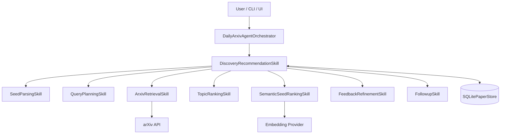
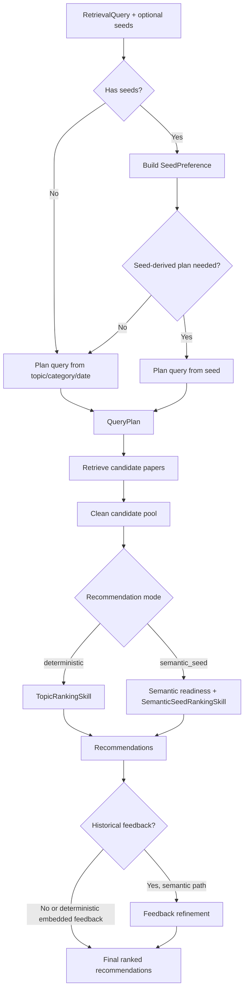
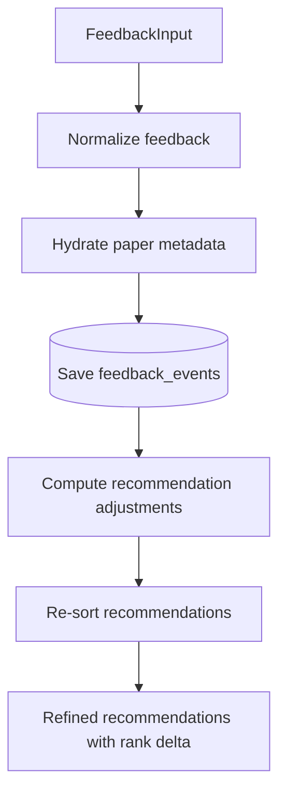
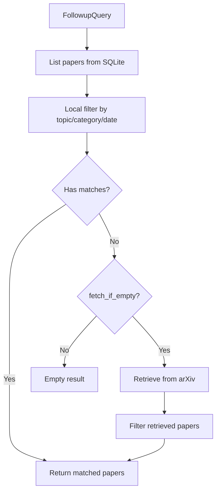

# DiscoveryRecommendationSkill 详解

`DiscoveryRecommendationSkill` 是当前架构中的公开推荐侧 Skill。它不直接生成简报文本，而是负责把用户研究兴趣转成可排序、可解释、可复用的论文推荐结果。

代码位置：

- `src/daily_arxiv_agent/skills/discovery_recommendation.py`

## 1. 它解决什么问题

用户输入通常不是一组可以直接排序的论文，而是一些研究兴趣信号，例如：

- topic：如 `multimodal agents`
- arXiv category：如 `cs.LG`
- date range
- seed papers
- recommendation mode
- 历史 like/dislike feedback
- follow-up query

`DiscoveryRecommendationSkill` 的职责是把这些信号组织成推荐侧工作流：

1. 理解用户想找什么。
2. 构造 arXiv 查询计划。
3. 检索并缓存候选论文。
4. 根据 topic、seed、semantic similarity、feedback 等信号排序。
5. 输出 Top-K `Recommendation`。
6. 支持用户反馈和后续 follow-up 查询。

换句话说，它回答的是：

> “哪些论文值得推荐？为什么它们排在前面？这个推荐能否被反馈继续调整？”

## 2. 它在系统中的位置

`DailyArxivAgentOrchestrator` 是工作流入口。推荐、feedback refinement 和 follow-up 相关能力都会通过 `DiscoveryRecommendationSkill` 组织。



这个 Skill 是 facade：它把多个旧的细粒度 Skill 收敛成一个公开推荐入口，但不移动旧实现代码。这样保留了旧有全部功能和测试覆盖。

## 3. 内部子能力

| 内部能力 | 作用 |
| --- | --- |
| `SeedParsingSkill` | 把 arXiv ID、arXiv URL、title text 转成 `SeedPreference`。 |
| `QueryPlanningSkill` | 把 `RetrievalQuery` 或 seed preference 转成 `QueryPlan`。 |
| `ArxivRetrievalSkill` | 调用 arXiv Atom API，解析论文 metadata，并写入 SQLite cache。 |
| `TopicRankingSkill` | 使用本地 deterministic 信号排序候选论文。 |
| `SemanticSeedRankingSkill` | 使用 embedding similarity 做 seed-based semantic ranking。 |
| `FeedbackRefinementSkill` | 记录用户反馈，并据此调整推荐顺序。 |
| `FollowupSkill` | 优先基于本地 SQLite 论文执行 follow-up filtering，必要时补检索。 |

## 4. 公开方法

`DiscoveryRecommendationSkill` 暴露的是推荐侧的任务入口，而不是底层算法入口。

| 方法 | 输入 | 输出 | 说明 |
| --- | --- | --- | --- |
| `build_seed_preference(...)` | seed strings、profile ID | `SkillResult[SeedPreference]` | 标准化 seed papers，构造用户兴趣表示。 |
| `plan_query(...)` | `RetrievalQuery` | `SkillResult[QueryPlan]` | 为 topic/category/date 构造检索计划。 |
| `plan_query_from_seed(...)` | `RetrievalQuery`、`SeedPreference` | `SkillResult[QueryPlan]` | 在 seed-only 或 seed-heavy 场景下从 seed 派生查询。 |
| `retrieve_papers(...)` | `RetrievalQuery`、可选 `QueryPlan` | `SkillResult[list[PaperMetadata]]` | 检索或复用缓存论文。 |
| `rank_recommendations(...)` | 候选论文、topic、seed、feedback、query context | `SkillResult[list[Recommendation]]` | deterministic ranking。 |
| `check_semantic_readiness(...)` | `SeedPreference` | `SemanticReadiness` | 检查 semantic seed 模式是否具备运行条件。 |
| `rank_semantic_recommendations(...)` | 候选论文、seed、profile | `SkillResult[list[Recommendation]]` | semantic seed ranking。 |
| `record_feedback(...)` | paper-level feedback | `SkillResult[list[FeedbackEvent]]` | 保存 like/dislike feedback。 |
| `refine_feedback(...)` | 当前 recommendations、feedback | `SkillResult[list[Recommendation]]` | 输出反馈调整后的推荐列表。 |
| `query_followup(...)` | `FollowupQuery` | `SkillResult[list[PaperMetadata]]` | 本地优先回答 follow-up query。 |

## 5. 推荐主流程如何完成工作

推荐主流程通常由 orchestrator 串联，但逻辑上属于 `DiscoveryRecommendationSkill` 的推荐侧职责。



### 5.1 输入标准化

主输入是 `RetrievalQuery`。它表达用户想检索什么，包括 topic、category、date range、search mode、candidate pool size、query planner mode 等。

如果用户提供 seed papers，`build_seed_preference(...)` 会先把 seed 标准化成 `SeedPreference`。这个对象包含：

- `profile_id`
- seed paper records
- preference text
- deterministic sparse vector

后续 deterministic ranking 和 semantic seed ranking 都可以使用这个兴趣表示。

### 5.2 查询规划

`plan_query(...)` 会把用户输入转成 `QueryPlan`。`QueryPlan` 不是最终论文结果，而是“如何检索”的计划：

- required terms
- optional terms
- phrases
- categories
- query variants
- planner provenance

这个阶段的价值是让 arXiv 检索可检查、可缓存、可解释，而不是把用户输入直接拼成一次请求。

### 5.3 检索候选论文

`retrieve_papers(...)` 接收 `RetrievalQuery` 和可选 `QueryPlan`：

1. 先查 SQLite 是否已有可复用结果。
2. 缓存不足时调用 arXiv Atom API。
3. 解析返回的 Atom XML。
4. 标准化成 `PaperMetadata`。
5. 保存论文和检索 run 信息。

输出不是最终推荐，而是候选池。后续 ranking 会从候选池中选 Top-K。

### 5.4 排序推荐

排序有两条路径。

deterministic path 使用 `rank_recommendations(...)`：

- topic / query plan terms
- query phrases
- retrieval source metadata
- category/date context
- seed preference
- feedback events

semantic seed path 使用 `check_semantic_readiness(...)` 和 `rank_semantic_recommendations(...)`：

- 先检查 embedding provider、credential、cache、seed 文本质量。
- readiness 失败时 fail closed，不静默切到 deterministic ranking。
- readiness 成功后计算 seed 与候选论文的 embedding similarity。
- semantic similarity 是主信号，lexical/category/recency 等是辅助信号。

两条路径最终都输出 `Recommendation` 列表。每条 recommendation 包含论文、rank、score、rationale、evidence source 和 score breakdown。

## 6. Feedback 如何完成工作

Feedback 是 paper-level 的：

```text
paper_id + like/dislike + optional note
```

`record_feedback(...)` 负责保存反馈事件。`refine_feedback(...)` 负责把反馈应用到当前推荐列表上。



refinement 输出会尽量保留可解释信息：

- previous rank
- new rank
- score delta
- rank delta
- feedback influences
- refinement status

这样 UI 和报告可以展示“用户反馈如何改变了推荐顺序”。

## 7. Follow-up 如何完成工作

Follow-up 的目标不是重新跑完整推荐系统，而是优先复用已有本地论文。



这个设计让 follow-up 查询更快，也能展示系统具备“记住已经检索过的论文”的能力。

## 8. 状态和失败处理

所有公开方法都尽量返回结构化结果，而不是抛出未处理异常。常见状态包括：

- `success`：正常完成。
- `empty`：执行成功，但没有可用数据。
- `fallback`：部分失败，但仍有可用结果。
- `error`：无法产生可靠结果。

这个 Skill 的失败处理原则是：

- 检索失败时尽量使用缓存或 partial result。
- query planning LLM 失败时退回 deterministic plan。
- seed 部分无效时尽量使用剩余有效 seed。
- semantic 配置不满足时 fail closed。
- feedback 输入无效时返回结构化错误。

## 9. 这个 Skill 不做什么

`DiscoveryRecommendationSkill` 的边界很重要。它不负责：

- 生成最终 daily briefing。
- 写 executive summary。
- 对单篇论文生成 method / experiment / limitations 解释。
- 解析 PDF 全文。
- 把推荐结果渲染到 UI。

这些工作属于 `ResearchSynthesisSkill` 或更外层的 CLI/UI。

## 10. 一句话总结

`DiscoveryRecommendationSkill` 是系统的“找论文和排论文”能力中心。它把用户兴趣、arXiv 检索、seed personalization、semantic ranking、feedback 和 follow-up 组织成可解释的推荐数据，为后续 synthesis 阶段提供可靠输入。
