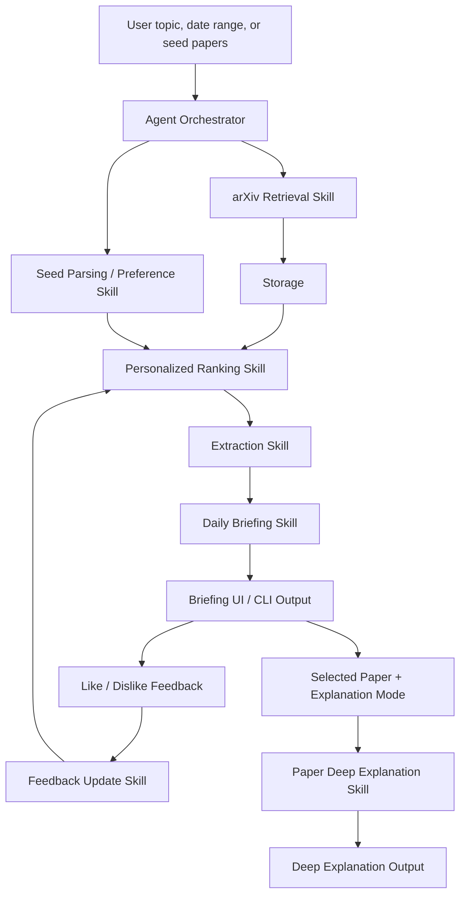

# feat: Build Daily arXiv Research Briefing Agent

## Overview

Build a local, single-user Daily arXiv Research Briefing Agent that demonstrates a complete Agent + Skills workflow: arXiv retrieval, ranking, seed-paper personalization, feedback refinement, daily briefing generation, follow-up filtering, paper-level deep explanation, evaluation hooks, and a lightweight demo UI.

The delivery model is explicitly staged. Each stage should be implemented, tested, manually accepted, then committed and pushed before the next stage begins. This keeps the project reviewable and avoids accumulating unverified changes.

## Problem Frame

The project needs to satisfy the course requirements in `development_checklist.md` while preserving the scope boundaries from the origin requirements document. The core goal is not to build a production SaaS; it is to produce a testable Agent + Skills system whose workflow, intermediate artifacts, and final outputs can be shown in reports and presentation (see origin: `docs/brainstorms/daily-arxiv-research-agent-requirements.md`).

The repository is currently greenfield: there are no application files, tests, package metadata, README, or git remote configured. The plan therefore includes project scaffolding and a git delivery gate before feature work starts.

## Requirements Trace

- R1-R4. Agent + Skills architecture with independently testable Skills and visible workflow.
- R5-R8. arXiv retrieval by date/time range, topic, keyword, category, metadata persistence, and API-safe behavior.
- R9-R13. Explicit keyword ranking and seed-paper-based personalized ranking with explainable scores.
- R14-R17. Like/dislike feedback and refined recommendations with ranking-change rationale.
- R18-R20. Structured extraction and daily briefing output.
- R21-R23. Follow-up filtering by topic and date range while reusing retrieved papers when possible.
- R24-R29. Selected-paper deep explanation in method, experiment, and limitation modes with full-text support and abstract-only fallback.
- R30-R32. Evaluation hooks and course-deliverable support.
- R33-R36. Reliable fallback behavior, evidence-boundary labeling, and provenance preservation.

## Scope Boundaries

- Single-user local demo first; no authentication or multi-user accounts.
- No production deployment, background worker fleet, or hosted database in the first version.
- No bulk full-PDF download for every retrieved paper.
- No custom trained recommendation model in the first version.
- No complex vector database unless implementation proves local embedding storage is insufficient.
- PDF upload for seed papers is deferred until arXiv ID, URL, and title seed support work.

### Deferred to Separate Tasks

- Multi-user SaaS features: separate future iteration after course demo.
- Production deployment and scheduling: separate future iteration after local workflow works.
- PDF upload as seed input: optional later stage if core seed-paper personalization is accepted.

## Context & Research

### Relevant Code and Patterns

- `development_checklist.md` is the original course requirement checklist.
- `docs/brainstorms/daily-arxiv-research-agent-requirements.md` is the source of product behavior, scope boundaries, and success criteria.
- No existing application code, tests, package metadata, or local patterns exist yet.
- No git remote is configured. Push gates require a remote to be added before the first push.

### External References

- arXiv API user manual: use Atom API queries, `search_query`, `start`, `max_results`, sorting, and date/category query terms.
- arXiv API Terms of Use: use reasonable request pacing and avoid excessive or abusive access.
- Streamlit documentation: suitable for a local demo UI with forms, session state, cached data, and table rendering.

## Key Technical Decisions

- Use Python for the first implementation: It fits arXiv parsing, PDF extraction, ML embeddings, LLM integration, testing, and Streamlit demos.
- Use explicit Skill classes/functions with Pydantic-style contracts: This makes each Skill independently testable and easier to describe in individual reports.
- Use a custom lightweight orchestrator before introducing a heavy agent framework: The course needs visible Agent orchestration, not necessarily framework complexity.
- Store local state in SQLite: It supports papers, recommendations, seed papers, feedback, briefings, and provenance without requiring a server.
- Use metadata and abstracts for retrieval, ranking, and briefing; parse full text only for selected deep explanation: This satisfies quality needs while respecting arXiv usage and keeping runtime bounded.
- Use `httpx` plus an Atom parser for arXiv access: This keeps the API layer explicit and easy to fixture-test.
- Use an explainable vector-ranking baseline before heavier semantic models: `scikit-learn` TF-IDF vectors can support keyword similarity, seed-paper centroids, recency/category boosts, and feedback adjustment with deterministic tests. A sentence-transformer implementation can be added behind the same interface later if presentation quality needs stronger semantic matching.
- Use `pymupdf` for selected-paper full-text extraction: It is sufficient for PDF text extraction in the demo and can fail over to abstract-only output when parsing is weak.
- Use a provider adapter for LLM calls: Planning should not lock every Skill to one provider. The implementation should include one configured provider path plus a deterministic fake provider for tests.
- Make fallback behavior part of the contract: empty results, invalid seed input, arXiv failures, PDF failures, and LLM failures should return structured fallback output, not crash the workflow.

## Open Questions

### Resolved During Planning

- Initial architecture: local Python application with Skills, orchestrator, SQLite state, tests, CLI/demo entry point, and Streamlit UI.
- Initial ranking approach: explainable hybrid ranking, not model training.
- Initial PDF policy: parse full text only for a user-selected paper; use abstract-only fallback with clear evidence labeling.
- Initial delivery workflow: each stage ends with automated verification, manual acceptance, then commit and push.

### Deferred to Implementation

- Exact schema fields and method names: settle while implementing contracts, keeping requirements traceability intact.
- Exact visual styling of Streamlit screens: keep simple and functional unless presentation polish is requested.
- Final evaluation fixture set: start with small fixed arXiv IDs and expand if results are too weak for presentation.

## Output Structure

The tree is the expected shape of the first complete version. It is a scope guide, not a hard constraint.

```text
.
├── README.md
├── pyproject.toml
├── .env.example
├── .gitignore
├── development_checklist.md
├── docs/
│   ├── brainstorms/
│   ├── plans/
│   └── demo/
├── src/
│   └── daily_arxiv_agent/
│       ├── __init__.py
│       ├── contracts.py
│       ├── config.py
│       ├── storage.py
│       ├── orchestrator.py
│       ├── cli.py
│       ├── ui/
│       │   └── streamlit_app.py
│       ├── skills/
│       │   ├── arxiv_retrieval.py
│       │   ├── seed_parsing.py
│       │   ├── ranking.py
│       │   ├── feedback.py
│       │   ├── extraction.py
│       │   ├── briefing.py
│       │   ├── followup.py
│       │   └── deep_explanation.py
│       ├── llm/
│       │   ├── base.py
│       │   ├── fake.py
│       │   └── provider.py
│       └── evaluation/
│           └── metrics.py
└── tests/
    ├── fixtures/
    ├── skills/
    ├── test_orchestrator.py
    └── test_storage.py
```

## High-Level Technical Design

> *This illustrates the intended approach and is directional guidance for review, not implementation specification. The implementing agent should treat it as context, not code to reproduce.*



## Phased Delivery and Acceptance Gates

Each phase follows the same gate:

1. Implement the phase.
2. Run that phase's automated verification.
3. Produce the manual acceptance artifact listed for the phase.
4. User reviews and accepts the phase.
5. Only after acceptance, create a git commit for that phase and push it.
6. Start the next phase only after the pushed commit is confirmed.

Prerequisite for push: configure a git remote before the first accepted phase is pushed.

## Dependencies / Prerequisites

- Git remote must be configured before the first accepted phase can be pushed.
- All Python development must run inside the `daily-arxiv-agent` conda environment.
- Baseline Python dependencies should include `pytest`, `pydantic`, `httpx`, `feedparser` or equivalent Atom parsing support, `scikit-learn`, `pymupdf`, and `streamlit`. Prefer conda packages when available; use pip only inside the conda environment.
- LLM-backed extraction and explanation require credentials for the chosen provider; tests must use the fake provider and not require live credentials.
- Live arXiv calls require network access; fixture-backed tests must remain available for offline development.

## Implementation Units

- [x] **Unit 0: Project Scaffold and Delivery Workflow**

**Goal:** Create the baseline Python project structure, testing setup, local configuration pattern, and staged delivery documentation.

**Requirements:** R1, R4, R30, R32

**Dependencies:** None

**Files:**
- Create: `pyproject.toml`
- Create: `.gitignore`
- Create: `.env.example`
- Create: `environment.yml`
- Create: `README.md`
- Create: `src/daily_arxiv_agent/__init__.py`
- Create: `src/daily_arxiv_agent/contracts.py`
- Create: `src/daily_arxiv_agent/config.py`
- Create: `tests/test_contracts.py`
- Create: `docs/demo/staged-acceptance.md`
- Modify: `docs/plans/2026-04-21-001-feat-daily-arxiv-agent-plan.md`

**Approach:**
- Define the package, test runner, lint/format expectations, and minimal typed contracts for papers, recommendations, Skill results, fallback status, evidence source, and provenance.
- Document the staged acceptance workflow in `docs/demo/staged-acceptance.md`, including the rule that each accepted phase is committed and pushed before continuing.
- Keep dependency choices minimal in this unit; add feature dependencies when the relevant unit needs them.

**Execution note:** Implement contract tests first so later Skills share a stable shape.

**Patterns to follow:**
- Origin requirements in `docs/brainstorms/daily-arxiv-research-agent-requirements.md`.

**Test scenarios:**
- Happy path: constructing a paper metadata object with title, authors, abstract, categories, dates, arXiv URL, and PDF URL succeeds.
- Happy path: constructing a successful Skill result includes data, provenance, evidence source, and no error.
- Error path: constructing a fallback Skill result includes an error code/message and does not require successful data.
- Edge case: empty optional fields are represented consistently without breaking serialization.

**Verification:**
- Project installs in editable mode.
- Contract tests pass.
- README explains how to set up, run tests, run the demo, and follow staged acceptance.
- User accepts the scaffold and delivery workflow, then the phase is committed and pushed.

- [x] **Unit 1: arXiv Retrieval and Local Storage**

**Goal:** Retrieve arXiv papers by date range, topic/keyword/category, normalize metadata, and persist/reuse results locally.

**Requirements:** R5, R6, R7, R8, R21, R22, R23, R33, R36

**Dependencies:** Unit 0

**Files:**
- Create: `src/daily_arxiv_agent/storage.py`
- Create: `src/daily_arxiv_agent/skills/arxiv_retrieval.py`
- Create: `tests/skills/test_arxiv_retrieval.py`
- Create: `tests/test_storage.py`
- Create: `tests/fixtures/arxiv_atom_response.xml`
- Modify: `src/daily_arxiv_agent/contracts.py`
- Modify: `README.md`

**Approach:**
- Build an arXiv retrieval Skill that produces normalized paper records from Atom responses.
- Support date/time range, keyword/topic query, category filter, pagination inputs, and request pacing.
- Persist paper metadata in SQLite with provenance and retrieval metadata.
- Reuse stored results for follow-up filtering when the relevant result set already exists.
- Do not download PDFs in this unit.

**Execution note:** Add fixture-based parser and storage tests before wiring live API behavior.

**Patterns to follow:**
- arXiv API user manual query parameters and Atom response shape.
- arXiv API Terms of Use for polite access.

**Test scenarios:**
- Happy path: parsing a fixture Atom response returns normalized paper records with title, authors, abstract, category, date, arXiv URL, and PDF URL.
- Happy path: a date range and category query builds an arXiv-compatible search request.
- Happy path: retrieved papers are persisted and can be loaded for follow-up filtering.
- Edge case: empty arXiv response returns a successful empty result with a user-facing message.
- Error path: network/API failure returns a fallback Skill result and preserves the failed query metadata.
- Error path: malformed Atom response returns a fallback Skill result without corrupting existing storage.
- Integration: retrieval Skill writes papers to SQLite and a later call can reuse them without re-fetching.

**Verification:**
- Automated tests prove parsing, query construction, error handling, and SQLite persistence.
- Manual acceptance artifact: a saved sample retrieval output for one topic/category/date range in `docs/demo/`.
- User accepts retrieval and storage behavior, then the phase is committed and pushed.

- [ ] **Unit 2: Explicit Topic Ranking and Daily Briefing MVP**

**Goal:** Rank retrieved papers by explicit topic/keyword, extract structured briefing fields, and generate a first daily briefing from metadata and abstracts.

**Requirements:** R9, R12, R13, R18, R19, R20, R30, R34, R35, R36

**Dependencies:** Unit 1

**Files:**
- Create: `src/daily_arxiv_agent/skills/ranking.py`
- Create: `src/daily_arxiv_agent/skills/extraction.py`
- Create: `src/daily_arxiv_agent/skills/briefing.py`
- Create: `src/daily_arxiv_agent/llm/base.py`
- Create: `src/daily_arxiv_agent/llm/fake.py`
- Create: `src/daily_arxiv_agent/llm/provider.py`
- Create: `tests/skills/test_ranking.py`
- Create: `tests/skills/test_extraction.py`
- Create: `tests/skills/test_briefing.py`
- Modify: `src/daily_arxiv_agent/contracts.py`
- Modify: `README.md`

**Approach:**
- Start with deterministic topic/keyword ranking that can run without external services in tests.
- Add an LLM adapter boundary and fake test provider for structured extraction and briefing generation.
- Require every briefing item to label its evidence source as metadata/abstract and keep provenance links.
- Generate a summary table, ranked list, brief paper introductions, and a highlighted paper.

**Execution note:** Keep LLM-dependent behavior behind an adapter so tests do not require live API credentials.

**Patterns to follow:**
- Contracts from Unit 0.
- Retrieval output from Unit 1.

**Test scenarios:**
- Happy path: keyword query ranks papers with matching title/abstract above unrelated papers.
- Happy path: Top-K output includes rank, score, rationale, and paper provenance.
- Happy path: fake LLM extraction returns summary, contributions, methods, and relevance rationale in the expected structure.
- Happy path: briefing generation includes summary table, highlighted paper, and all ranked paper references.
- Edge case: fewer papers than Top-K returns all available papers without error.
- Edge case: missing abstract produces evidence-boundary labeling and avoids fabricated method details.
- Error path: LLM adapter failure returns fallback extraction/briefing output with a clear error message.

**Verification:**
- Automated tests prove ranking, extraction contract, briefing shape, evidence labeling, and LLM fallback.
- Manual acceptance artifact: one generated daily briefing in `docs/demo/`.
- User accepts keyword ranking and briefing MVP, then the phase is committed and pushed.

- [ ] **Unit 3: Seed-Paper Personalization**

**Goal:** Allow users to provide seed papers by arXiv ID, URL, or title; build a user interest representation; and rank new papers using seed-paper similarity.

**Requirements:** R10, R11, R12, R13, R33, R34, R36

**Dependencies:** Unit 2

**Files:**
- Create: `src/daily_arxiv_agent/skills/seed_parsing.py`
- Create: `tests/skills/test_seed_parsing.py`
- Modify: `src/daily_arxiv_agent/skills/ranking.py`
- Modify: `tests/skills/test_ranking.py`
- Modify: `src/daily_arxiv_agent/storage.py`
- Modify: `tests/test_storage.py`
- Modify: `README.md`

**Approach:**
- Normalize seed inputs into paper-like records or preference text.
- Fetch metadata for arXiv ID/URL seeds when possible; title-only seeds should still contribute to preference text.
- Create an embedding or vector-like preference representation behind a replaceable interface.
- Combine seed similarity with existing keyword ranking when both are available.

**Execution note:** Use deterministic fake embeddings in tests so ranking behavior is predictable.

**Patterns to follow:**
- arXiv retrieval normalization from Unit 1.
- Ranking contract from Unit 2.

**Test scenarios:**
- Happy path: arXiv ID seed resolves into metadata and contributes to the preference representation.
- Happy path: arXiv URL seed is normalized to the same paper identity as the equivalent ID.
- Happy path: title-only seed contributes to preference text without requiring API success.
- Happy path: seed-paper ranking returns Top-K with seed-similarity rationale.
- Edge case: duplicate seeds collapse to one preference contribution.
- Error path: invalid seed input returns a structured validation error and does not crash the workflow.
- Error path: seed metadata fetch failure falls back to available seed text when possible.
- Integration: seed preference stored locally can be reused for a later recommendation call.

**Verification:**
- Automated tests prove seed parsing, preference construction, duplicate handling, ranking influence, and fallback behavior.
- Manual acceptance artifact: seed-paper-based recommendation list in `docs/demo/`.
- User accepts seed personalization, then the phase is committed and pushed.

- [ ] **Unit 4: Feedback Refinement Loop**

**Goal:** Record like/dislike feedback, update the preference representation, and generate refined recommendations with change rationale.

**Requirements:** R14, R15, R16, R17, R30, R33, R36

**Dependencies:** Unit 3

**Files:**
- Create: `src/daily_arxiv_agent/skills/feedback.py`
- Create: `tests/skills/test_feedback.py`
- Modify: `src/daily_arxiv_agent/skills/ranking.py`
- Modify: `tests/skills/test_ranking.py`
- Modify: `src/daily_arxiv_agent/storage.py`
- Modify: `tests/test_storage.py`
- Modify: `README.md`

**Approach:**
- Store feedback events tied to paper IDs, recommendation runs, and user/profile state.
- Update preference representation with a simple explainable adjustment: liked papers pull similar papers upward; disliked papers push similar papers downward.
- Include ranking delta and rationale in refined recommendations.

**Execution note:** Treat the feedback loop as behavior-critical; write tests for before/after ranking movement.

**Patterns to follow:**
- Preference representation from Unit 3.
- Provenance and fallback result contract from Unit 0.

**Test scenarios:**
- Happy path: liking a paper increases the score of similar papers in a refined ranking.
- Happy path: disliking a paper decreases the score of similar papers in a refined ranking.
- Happy path: refined recommendations include previous rank, new rank, score delta, and rationale.
- Edge case: feedback on a paper not in the current result set is recorded but does not break refinement.
- Edge case: conflicting feedback on the same paper follows a documented latest-wins or aggregate rule.
- Error path: invalid feedback value is rejected with a structured validation error.
- Integration: feedback persisted in SQLite influences a later recommendation call.

**Verification:**
- Automated tests prove feedback recording, preference update, ranking deltas, and invalid feedback handling.
- Manual acceptance artifact: before/after recommendation comparison in `docs/demo/`.
- User accepts feedback refinement, then the phase is committed and pushed.

- [ ] **Unit 5: Agent Orchestrator and Follow-up Queries**

**Goal:** Wire Skills into coherent recommendation and follow-up workflows with inspectable intermediate steps.

**Requirements:** R1, R2, R4, R21, R22, R23, R31, R33, R36

**Dependencies:** Unit 4

**Files:**
- Create: `src/daily_arxiv_agent/orchestrator.py`
- Create: `src/daily_arxiv_agent/skills/followup.py`
- Create: `src/daily_arxiv_agent/cli.py`
- Create: `tests/test_orchestrator.py`
- Create: `tests/skills/test_followup.py`
- Modify: `README.md`

**Approach:**
- Define orchestrator methods for recommendation runs, feedback refinement runs, and follow-up query runs.
- Record each Skill call, input summary, output summary, evidence source, and fallback status as workflow trace data.
- Add a small CLI or scripted demo entry point for non-UI verification.
- Follow-up queries should filter local stored/retrieved results first, then fetch only when necessary.

**Execution note:** Add an integration test that exercises the full recommendation workflow with fakes before adding CLI output.

**Patterns to follow:**
- Skill contracts from Unit 0.
- Storage and retrieval behavior from Unit 1.

**Test scenarios:**
- Happy path: a recommendation workflow calls retrieval, ranking, extraction, and briefing in order and returns a workflow trace.
- Happy path: a feedback refinement workflow records feedback and returns updated recommendations.
- Happy path: a follow-up topic/date query filters stored papers without unnecessary re-fetching.
- Edge case: no stored papers for a follow-up query triggers retrieval or a clear fallback depending on inputs.
- Error path: one Skill failure appears in the workflow trace and produces a user-facing fallback result.
- Integration: CLI/demo command can run a fixture-backed workflow end to end.

**Verification:**
- Automated tests prove orchestrator sequencing, trace visibility, follow-up reuse, and failure propagation.
- Manual acceptance artifact: workflow trace output in `docs/demo/`.
- User accepts orchestrator and follow-up behavior, then the phase is committed and pushed.

- [ ] **Unit 6: Paper-Level Deep Explanation**

**Goal:** Let users select a recommended paper and generate method/framework, experiment/results, and limitations explanations using full text when available.

**Requirements:** R3, R24, R25, R26, R27, R28, R29, R33, R34, R35, R36

**Dependencies:** Unit 5

**Files:**
- Create: `src/daily_arxiv_agent/skills/deep_explanation.py`
- Create: `tests/skills/test_deep_explanation.py`
- Create: `tests/fixtures/sample_paper_text.txt`
- Modify: `src/daily_arxiv_agent/orchestrator.py`
- Modify: `tests/test_orchestrator.py`
- Modify: `README.md`

**Approach:**
- Add a content preparation path that can use cached full text, parse selected-paper PDF, or fall back to abstract.
- Keep PDF download/parse limited to selected papers.
- Generate mode-specific explanation outputs and label evidence source.
- Require explanation output to say when datasets, baselines, metrics, or limitations were not found in the available source.

**Execution note:** Use text fixtures and fake LLM responses to prove evidence-boundary behavior before live PDF parsing.

**Patterns to follow:**
- LLM adapter from Unit 2.
- Evidence source and provenance contracts from Unit 0.

**Test scenarios:**
- Happy path: method mode returns problem, method overview, core workflow, inputs/outputs, and innovation.
- Happy path: experiment mode returns datasets, baselines, metrics, setup, and conclusions when fixture text contains them.
- Happy path: limitations mode returns stated limitations, assumptions, missing validation, and risks when fixture text supports them.
- Edge case: abstract-only fallback clearly labels evidence source and avoids unsupported experiment claims.
- Error path: PDF parsing failure returns abstract-only fallback if abstract exists.
- Error path: missing selected paper returns a structured not-found error.
- Integration: orchestrator can run selected-paper explanation after a recommendation workflow.

**Verification:**
- Automated tests prove all three explanation modes, full-text/abstract fallback, and missing-evidence wording.
- Manual acceptance artifact: three explanation outputs for one paper in `docs/demo/`.
- User accepts deep explanation behavior, then the phase is committed and pushed.

- [ ] **Unit 7: Streamlit Demo UI**

**Goal:** Provide a local UI that demonstrates the Agent workflow, recommendation list, feedback loop, follow-up filtering, and deep explanation modes.

**Requirements:** R4, R14, R16, R17, R19, R20, R21, R22, R24, R25, R31, R32, R34, R36

**Dependencies:** Unit 6

**Files:**
- Create: `src/daily_arxiv_agent/ui/streamlit_app.py`
- Create: `tests/test_ui_smoke.py`
- Modify: `README.md`
- Modify: `docs/demo/staged-acceptance.md`

**Approach:**
- Build a simple first-screen app with inputs for topic/date/category and seed papers.
- Show workflow trace, summary table, ranked recommendations, like/dislike controls, refined recommendations, and paper explanation mode selection.
- Keep UI state local using Streamlit session state and storage-backed run IDs.
- Avoid complex frontend polish; prioritize clear demo flow and readable outputs.

**Execution note:** Add smoke tests around importability and core UI helpers; rely on manual acceptance for interaction quality.

**Patterns to follow:**
- Orchestrator public methods from Unit 5 and Unit 6.
- Streamlit docs for session state, forms, tables, and caching.

**Test scenarios:**
- Happy path: UI helper can render recommendation rows from structured recommendation objects.
- Happy path: UI helper can render workflow trace steps and evidence labels.
- Edge case: empty recommendation result renders a clear empty-state message.
- Error path: fallback Skill result renders an error message without breaking the page.
- Integration: app imports without side effects that require live API credentials.

**Verification:**
- Automated smoke tests pass.
- Manual acceptance artifact: screenshots or a short demo note showing initial recommendations, feedback refinement, and one deep explanation.
- User accepts demo UI, then the phase is committed and pushed.

- [ ] **Unit 8: Evaluation, Documentation, and Final Course Demo Package**

**Goal:** Add lightweight evaluation hooks, final demo artifacts, and documentation for course submission.

**Requirements:** R30, R31, R32

**Dependencies:** Unit 7

**Files:**
- Create: `src/daily_arxiv_agent/evaluation/metrics.py`
- Create: `tests/test_evaluation.py`
- Create: `docs/demo/final-demo-script.md`
- Create: `docs/demo/evaluation-summary.md`
- Modify: `README.md`
- Modify: `docs/demo/staged-acceptance.md`

**Approach:**
- Add simple evaluation functions for recommendation overlap/score movement, feedback before/after changes, and explanation completeness checks.
- Document a final demo script that walks through one full workflow.
- Add report-support notes mapping Agent and Skills to course deliverables.

**Execution note:** Evaluation should be lightweight and deterministic; avoid turning this into a research benchmark project.

**Patterns to follow:**
- Recommendation and explanation outputs from prior units.

**Test scenarios:**
- Happy path: recommendation evaluation compares ranked results against expected relevant paper IDs.
- Happy path: feedback evaluation detects rank movement after likes/dislikes.
- Happy path: explanation completeness check reports which required sections are present.
- Edge case: empty recommendation list returns a meaningful zero-data evaluation result.
- Error path: malformed evaluation fixture returns a structured validation error.

**Verification:**
- Automated tests prove metric helpers and fixture handling.
- Manual acceptance artifact: final demo script and evaluation summary under `docs/demo/`.
- User accepts final demo package, then the phase is committed and pushed.

## System-Wide Impact

- **Interaction graph:** The orchestrator is the central entry point. Skills communicate through structured contracts and storage, not hidden global state.
- **Error propagation:** Skills return structured fallback results with error codes/messages; the orchestrator preserves them in workflow traces and user-facing outputs.
- **State lifecycle risks:** Retrieved papers, seed preferences, feedback events, recommendation runs, and briefings must remain linked by stable run IDs or paper IDs to avoid confusing before/after comparisons.
- **API surface parity:** CLI and Streamlit UI should call the same orchestrator methods so behavior stays consistent across demo surfaces.
- **Integration coverage:** Full workflow tests must prove retrieval-to-briefing, feedback-to-refinement, and selected-paper-to-explanation paths.
- **Unchanged invariants:** The project remains local/single-user and does not introduce auth, production deployment, or bulk PDF harvesting.

## Acceptance Plan

| Phase | Acceptance artifact | User acceptance question | Commit/push gate |
|-------|---------------------|--------------------------|------------------|
| Unit 0 | Passing scaffold tests and `docs/demo/staged-acceptance.md` | Does the project skeleton and staged workflow match how you want to work? | Commit/push only after yes |
| Unit 1 | Sample retrieval output in `docs/demo/` | Are retrieval filters, metadata, and fallback behavior acceptable? | Commit/push only after yes |
| Unit 2 | Generated daily briefing in `docs/demo/` | Is keyword ranking and briefing output good enough for MVP? | Commit/push only after yes |
| Unit 3 | Seed-paper recommendation list in `docs/demo/` | Does seed-based personalization behave plausibly? | Commit/push only after yes |
| Unit 4 | Before/after feedback comparison in `docs/demo/` | Do ranking changes after like/dislike look explainable? | Commit/push only after yes |
| Unit 5 | Workflow trace output in `docs/demo/` | Is Agent orchestration visible and understandable? | Commit/push only after yes |
| Unit 6 | Three explanation outputs in `docs/demo/` | Are method, experiment, and limitation explanations acceptable? | Commit/push only after yes |
| Unit 7 | UI screenshots/demo notes in `docs/demo/` | Is the demo UI sufficient for presentation? | Commit/push only after yes |
| Unit 8 | Final demo script and evaluation summary | Is the package ready for course reporting/presentation? | Commit/push only after yes |

## Risks & Dependencies

| Risk | Likelihood | Impact | Mitigation |
|------|------------|--------|------------|
| No git remote is configured | High | Push gates cannot complete | Configure remote before first accepted phase is pushed |
| arXiv API access is slow or temporarily unavailable | Medium | Retrieval demos become flaky | Use fixture-backed tests and save demo artifacts under `docs/demo/` |
| LLM credentials are unavailable | Medium | Extraction/explanation cannot run live | Keep fake provider for tests and document credential setup in `.env.example` |
| PDF parsing quality varies by paper | High | Deep explanation may miss experiment or limitation details | Use abstract-only fallback and evidence-boundary labeling |
| Recommendation quality is subjective | Medium | Demo may feel weak | Use fixed seed papers, visible score/rationale, and before/after feedback examples |
| Scope creep into production platform | Medium | Course deliverable slips | Keep SaaS/deployment/multi-user work explicitly deferred |
| Too many uncommitted changes accumulate | Medium | Review and rollback become harder | Enforce acceptance gate and commit/push after each phase |

## Documentation / Operational Notes

- `README.md` should stay current after every accepted phase.
- `docs/demo/staged-acceptance.md` should record how each phase is manually accepted.
- `docs/demo/` should contain stable demo artifacts so presentation does not depend on live arXiv/LLM availability.
- `.env.example` should document required optional credentials without committing secrets.
- If a remote is added later, document the expected branch/push target before the first push.

## Alternative Approaches Considered

- FastAPI + Postgres + frontend: rejected for first version because infrastructure would dominate before the workflow is proven.
- Full-text RAG for every paper: rejected for first version because bulk PDF parsing is expensive and unnecessary for daily ranking.
- Agent framework-first implementation: deferred until the custom orchestrator proves insufficient.
- Abstract-only explanations: allowed only as fallback because experiment/results and limitations modes need stronger evidence.

## Sources & References

- **Origin document:** `docs/brainstorms/daily-arxiv-research-agent-requirements.md`
- **Course checklist:** `development_checklist.md`
- **arXiv API User Manual:** https://info.arxiv.org/help/api/user-manual.html
- **arXiv API Terms of Use:** https://info.arxiv.org/help/api/tou.html
- **Streamlit documentation:** https://docs.streamlit.io/
