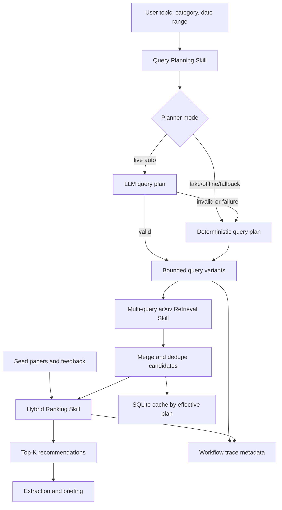

# feat: Improve arXiv Search with Hybrid Retrieval and Query Planning

## Overview

Improve paper discovery by replacing the current single literal topic query with a broader, inspectable search pipeline: deterministic and optional LLM query planning, multi-query arXiv metadata retrieval, candidate merge and dedupe, and hybrid ranking. The final recommendation count remains small and readable, while the retrieval layer gathers a larger metadata candidate pool for ranking.

The plan preserves the existing Agent + Skills shape and keeps routine search metadata-only. It does not introduce bulk PDF download, model training, or production search infrastructure.

## Problem Frame

The current retrieval Skill uses the raw topic as one mostly literal arXiv query and retrieves a small first page sorted by submitted date. That makes realistic topics fragile: adding more keywords often narrows the query too much, and the downstream ranking Skill can only rank a tiny candidate set. The origin document defines the intended behavior: treat topic input as an intent signal, retrieve a broader candidate pool, and use hybrid ranking while keeping evidence and fallback behavior visible (see origin: `docs/brainstorms/2026-04-30-001-improve-arxiv-search-requirements.md`).

## Requirements Trace

- R1-R2. Separate final Top-K from retrieval candidate size and support paginated arXiv metadata fetching with request pacing.
- R3-R5. Support multiple query variants, merge and dedupe candidates, and preserve query-strategy provenance.
- R6-R9. Replace literal-only topic search with deterministic query expansion and fallback behavior.
- R10-R11. Add optional LLM query planning with bounded, auditable output and visible fallback.
- R12-R15. Upgrade ranking to combine lexical, phrase, result-order/query-source, recency, category, seed, and feedback signals while avoiding unlabeled zero-evidence fill.
- R16-R18. Expose candidate pool size, broad/strict search mode, and query/ranking trace details in the UI and workflow trace.
- R19. Bring follow-up topic matching closer to the improved search behavior while keeping local-first semantics.

## Success Criteria

- Broad deterministic search for a multi-keyword fixture topic retrieves more relevant candidates than the current strict literal topic query.
- Hybrid ranking places exact, phrase, and related-term matches above recency-only, category-only, and unrelated candidates in offline fixtures.
- A category/date-only recommendation search returns a ranked recency/category list with an explicit ranking mode instead of failing at ranking.
- CLI/UI broad mode is not made the default until offline search-quality fixtures demonstrate improved candidate coverage and Top-K relevance.
- Query planning, retrieval, ranking, and UI trace output remain usable in fake/offline mode with no live LLM or live arXiv dependency.
- Live LLM planner mode documents what query data is shared with the configured provider and can be disabled or redacted from visible trace output.

## Scope Boundaries

- No routine PDF download for search or ranking.
- No custom trained recommendation model.
- No replacement of arXiv as the primary metadata source.
- No production-scale search index, vector database, background scheduler, or hosted database.
- LLM query planning is an enhancement, not a dependency for search correctness.
- Semantic ranking beyond deterministic sparse/vector signals is optional and should not block the core improvement.

### Deferred to Separate Tasks

- Full embedding model integration: future iteration if deterministic hybrid ranking is still weak.
- Search across non-arXiv sources: future source-integration work after arXiv quality improves.
- Persistent analytics for real user search quality: future evaluation and observability work.

## Context & Research

### Relevant Code and Patterns

- `src/daily_arxiv_agent/contracts.py` defines `RetrievalQuery`, `PaperMetadata`, `Provenance`, `Recommendation`, `SkillResult`, and existing status/evidence enums.
- `src/daily_arxiv_agent/skills/arxiv_retrieval.py` currently builds one `search_query`, calls arXiv once, parses Atom XML, and saves one retrieval result set.
- `src/daily_arxiv_agent/storage.py` already caches paper payloads and retrieval result rows keyed by serialized query JSON.
- `src/daily_arxiv_agent/skills/ranking.py` currently performs deterministic topic, seed, and feedback scoring with explainable rationales.
- `src/daily_arxiv_agent/skills/seed_parsing.py` already provides `DeterministicTextVectorizer`, sparse cosine similarity, and candidate-paper text construction that ranking can reuse.
- `src/daily_arxiv_agent/orchestrator.py` records Skill trace metadata and is the right place to expose query planning and retrieval/ranking summary details.
- `src/daily_arxiv_agent/ui/streamlit_app.py` already separates `top_k` from retrieval `max_results`, but the UI labels make this relationship unclear.
- Existing tests in `tests/skills/test_arxiv_retrieval.py`, `tests/skills/test_ranking.py`, `tests/skills/test_followup.py`, `tests/test_orchestrator.py`, and `tests/test_ui_smoke.py` provide the fixtures and patterns to extend.

### Institutional Learnings

- `docs/solutions/2026-04-23-001-live-api-readiness.md` records that live arXiv retrieval is already the default when no fixture is supplied, and LLM calls must remain injectable and test-safe through fake providers.
- The same note confirms live LLM errors should remain surfaced as structured Skill fallback/error output, not page crashes.

### External References

- arXiv API user manual: supports `search_query`, field prefixes such as title/abstract/category, Boolean query composition, `start`, `max_results`, submitted-date filtering, and `sortBy` values including relevance and submitted date.

## Key Technical Decisions

- Add a query-planning Skill rather than embedding expansion directly in ranking: retrieval needs expanded arXiv query variants before candidates exist, and traceability is clearer as its own Skill boundary.
- Default to broad search: the current pain is missed papers; broad mode should favor recall and let hybrid ranking demote weak candidates.
- Keep strict mode: users still need a predictable, narrow mode for exact topic/category/date checks and for deterministic tests.
- Use bounded retrieval budgets: broad mode should target about 100 merged candidates with a default page size of 50 and a maximum of 4 arXiv requests per search unless the user configures otherwise.
- Cache by effective query plan: cache hits must account for topic, date/category filters, search mode, candidate budget, query variants, and sort strategy, not only the raw user topic.
- Treat arXiv relevance as ordering, not a numeric score: the API can sort by relevance, but ranking should use result position/query source as a weak signal instead of assuming a returned score.
- Extend existing LLM provider boundaries for query planning: fake provider returns deterministic output, live provider can produce structured JSON, and query planning falls back to deterministic output on provider failure.
- Prefer deterministic sparse similarity first: reuse existing vectorizer/cosine patterns before introducing a new embedding dependency.
- Gate broad-as-default behind offline quality evidence: deterministic fixtures must show better coverage and acceptable Top-K quality before broad mode becomes the CLI/UI default.
- Support category/date-only recommendation intentionally: when no topic, seed, or feedback exists but category/date filters produced candidates, ranking should use recency, category, and query-source signals and label the ranking mode accordingly.
- Keep retrieval-source metadata run-scoped: variant label, sort mode, position, and first-seen order belong to a retrieval result entry or run-specific wrapper, not the global `PaperMetadata` payload.
- Make LLM planning cacheable and privacy-aware: live plans should use deterministic low-temperature output, canonicalized variants, raw-input planner caching where practical, and minimum-necessary prompt content.
- Treat partial retrievals differently from complete cache hits: degraded partial result sets must be marked partial and must not silently satisfy later cache reads as if all variants succeeded.

## Open Questions

### Resolved During Planning

- Default search mode: broad.
- Default retrieval budget: target 100 merged candidates, page size 50, maximum 4 arXiv requests per recommendation search.
- LLM planning behavior: `auto` mode, using live LLM planning when configured and falling back to deterministic planning on invalid output or provider failure.
- First ranking shape: deterministic hybrid score with lexical, phrase, query-source/order, recency, category, seed, and feedback signals; no hard dependency on embeddings.
- UI terminology: display retrieval size as candidate pool size and final count as Top K recommendations.
- Category/date-only behavior: allow it as a recency/category recommendation mode, with explicit rationale that no topic evidence was provided.
- LLM prompt privacy: live query planning should send only user topic, category/date filters, search mode, and bounded planner instructions; seed-paper abstracts/full text should not be sent unless a future task deliberately adds that support.
- Planner quality guard: a valid LLM plan must still preserve minimum overlap with deterministic required terms, or it falls back/merges with deterministic variants.
- Cache completeness policy: complete merged retrievals are normal cache hits; partial retrievals may be stored with status metadata but should be retried or clearly surfaced before reuse.

### Deferred to Implementation

- Exact scoring weights: tune against fixtures while preserving the signal categories and rationale output.
- Exact query-variant count: keep bounded by retrieval request budget; implementation can reduce variants when topic input is short.
- Exact LLM prompt wording: settle while adding provider tests, with strict structured output validation.
- Cache schema details: implementation may add columns or use existing JSON fields, but cache behavior must remain backward-compatible for existing stored papers.
- Exact search-quality thresholds: tune fixture expectations during implementation, but broad-as-default must be gated by the Success Criteria above.

## High-Level Technical Design

> *This illustrates the intended approach and is directional guidance for review, not implementation specification. The implementing agent should treat it as context, not code to reproduce.*

## Implementation Units

- [x] **Unit 1: Search Contracts, Config, and Cache Keys**

**Goal:** Add the typed inputs and persisted metadata needed for broad/strict search modes, query plans, candidate pool sizing, and plan-aware caching.

**Requirements:** R1, R5, R9, R11, R16, R18

**Dependencies:** None

**Files:**
- Modify: `src/daily_arxiv_agent/contracts.py`
- Modify: `src/daily_arxiv_agent/config.py`
- Modify: `.env.example`
- Modify: `src/daily_arxiv_agent/storage.py`
- Test: `tests/test_contracts.py`
- Test: `tests/test_storage.py`

**Approach:**
- Add contracts for search mode, query-plan variants, planner provenance, retrieval budget, and per-paper retrieval-source metadata.
- Keep existing `RetrievalQuery` fields compatible, but clarify or extend retrieval sizing so `top_k` remains final output count and retrieval size controls candidate pool size.
- Add config defaults for search mode, candidate target, page size, maximum requests per search, and query-planner mode.
- Extend storage so retrieval results can be saved and loaded by an effective cache key derived from the raw query plus query-plan metadata, while retaining existing query-based methods as compatibility wrappers.
- Store retrieval-source metadata on retrieval result rows or a run-specific retrieval wrapper keyed by effective plan and paper ID; do not persist variant/order metadata as global paper metadata.
- Track cache completeness status so complete retrievals, partial retrievals, and planner-cache entries can be distinguished.

**Execution note:** Add contract and storage tests before changing retrieval behavior.

**Patterns to follow:**
- Pydantic validation style in `src/daily_arxiv_agent/contracts.py`.
- JSON query-key pattern in `SQLitePaperStore.query_key`.

**Test scenarios:**
- Happy path: constructing a broad search query with candidate pool size and default planner mode succeeds.
- Happy path: strict search mode serializes to a stable cache key distinct from broad mode.
- Edge case: invalid date range still fails as it does today.
- Edge case: candidate pool size below one or page size above allowed bounds is rejected or normalized according to the chosen contract.
- Integration: saving retrieval results by effective plan key and loading them preserves paper order and metadata.
- Integration: run-scoped retrieval metadata for one paper can differ across two different effective plans without overwriting the global paper payload.
- Edge case: partial retrieval cache entries are marked partial and do not masquerade as complete cache hits.
- Backward compatibility: existing `save_retrieval(query, papers)` and `load_retrieval(query)` behavior still works for old tests.

**Verification:**
- Contracts validate new search parameters without breaking existing retrieval, ranking, and storage tests.

- [x] **Unit 2: Deterministic and LLM Query Planning**

**Goal:** Create a query-planning Skill that turns user topic input into bounded, inspectable arXiv query variants, with optional LLM expansion and deterministic fallback.

**Requirements:** R6, R7, R8, R9, R10, R11, R18

**Dependencies:** Unit 1

**Files:**
- Create: `src/daily_arxiv_agent/skills/query_planning.py`
- Modify: `src/daily_arxiv_agent/llm/base.py`
- Modify: `src/daily_arxiv_agent/llm/fake.py`
- Modify: `src/daily_arxiv_agent/llm/openai_provider.py`
- Modify: `src/daily_arxiv_agent/llm/provider.py`
- Test: `tests/skills/test_query_planning.py`
- Test: `tests/test_llm_provider.py`

**Approach:**
- Build deterministic expansion from normalized topic text: token cleanup, stopword removal, phrase extraction, singular/plural normalization, fielded title/abstract/all variants, and category/date clauses supplied by retrieval inputs.
- Add a bounded LLM planner output shape containing required terms, optional phrases, related terms, suggested categories, exclusions, and a short planner rationale.
- Validate LLM output strictly: empty plans, excessive terms, malformed categories, or unsafe query fragments fall back to deterministic planning.
- Require a semantic guard for LLM output: valid JSON is not enough; live plans must preserve minimum overlap with deterministic required terms or be merged with/fall back to the deterministic plan.
- Keep live LLM prompt content minimum-necessary: topic, category/date filters, search mode, and bounded instructions only. Do not send seed-paper abstracts or full text in this plan.
- Canonicalize planner output for cache stability: normalize case, sort/dedupe variants where order is not semantically meaningful, and use deterministic low-temperature provider settings for live planner calls.
- Keep generated arXiv query strings available in Skill metadata, but mark which fields are safe to persist versus transient/debug-only.

**Patterns to follow:**
- Provider validation and retry style in `src/daily_arxiv_agent/llm/openai_provider.py`.
- Deterministic fake behavior in `src/daily_arxiv_agent/llm/fake.py`.
- Token normalization style in `src/daily_arxiv_agent/skills/ranking.py` and `src/daily_arxiv_agent/skills/followup.py`.

**Test scenarios:**
- Happy path: topic `multimodal llm agents for robotic manipulation` produces multiple fielded query variants instead of one full literal phrase.
- Happy path: strict mode includes a narrower phrase-oriented variant.
- Happy path: fake provider query planning returns deterministic structured output.
- Edge case: empty topic with category/date still produces a valid category/date query plan.
- Edge case: duplicate or near-duplicate terms are deduped in planner output.
- Error path: malformed LLM JSON falls back to deterministic query planning and records fallback metadata.
- Error path: provider exception returns a fallback Skill result with deterministic plan data.
- Error path: valid but semantically divergent LLM output falls back to or merges with deterministic required terms.
- Privacy: query-planning tests prove live planner prompts do not include seed-paper abstracts or full text.
- Integration: planner metadata includes mode, source, generated terms, query variant count, and whether LLM fallback happened.

**Verification:**
- Query planning can run fully offline and produces stable outputs for fixture topics.

- [x] **Unit 3: Multi-Query arXiv Retrieval, Pagination, and Dedupe**

**Goal:** Update arXiv retrieval to execute bounded query plans, page through metadata results, merge candidates, dedupe by arXiv paper ID, and cache the merged result set.

**Requirements:** R1, R2, R3, R4, R5, R18

**Dependencies:** Unit 1, Unit 2

**Files:**
- Modify: `src/daily_arxiv_agent/skills/arxiv_retrieval.py`
- Modify: `src/daily_arxiv_agent/storage.py`
- Modify: `src/daily_arxiv_agent/contracts.py`
- Test: `tests/skills/test_arxiv_retrieval.py`
- Test fixture: `tests/fixtures/arxiv_atom_response.xml`

**Approach:**
- Allow retrieval to accept an effective query plan from the orchestrator, while keeping a compatibility path that internally creates a deterministic plan when none is supplied.
- Fetch query variants with `sortBy=relevance` and `sortBy=submittedDate` according to the plan and mode.
- Stop fetching when the merged candidate target is reached, all variants are exhausted, or the maximum request budget is consumed.
- Preserve retry, rate-limit, request-delay, and parse-fallback behavior from the existing retrieval Skill.
- Record per-paper source metadata such as variant label, sort mode, variant position, and first-seen order on the retrieval run/result entry, not on the global `PaperMetadata` row.
- Save complete merged retrievals under the effective plan cache key. Partial merged retrievals may be stored for diagnostics or fallback, but normal cache reads should surface partial status and retry missing variants unless the caller explicitly accepts partial cache data.
- Report actual candidate count and request count; do not treat the target of 100 candidates as guaranteed under the four-request budget.

**Patterns to follow:**
- Existing `_fetch_response`, retry, `Retry-After`, and Atom parsing flow in `src/daily_arxiv_agent/skills/arxiv_retrieval.py`.
- Existing SQLite retrieval result ordering in `src/daily_arxiv_agent/storage.py`.

**Test scenarios:**
- Happy path: broad plan with two variants calls the fake client twice and returns a deduped merged candidate list.
- Happy path: repeated broad retrieval with the same effective plan hits cache and makes no client calls.
- Happy path: submitted-date and relevance variants set the expected request parameters.
- Edge case: duplicate paper IDs across variants keep one `PaperMetadata` item and aggregate retrieval-source metadata.
- Edge case: candidate target reached before all variants are exhausted stops additional requests.
- Edge case: four requests may yield fewer than 100 unique candidates after dedupe; metadata reports actual unique count and budget exhaustion.
- Error path: one variant fails with retryable network error while a later variant succeeds; the Skill returns successful partial data with visible warning or fallback metadata according to the chosen contract.
- Error path: a partial result saved after variant failure is not reused later as a complete cache hit.
- Error path: all variants fail and no cache exists returns the existing structured request failure shape.
- Error path: malformed Atom XML from one variant does not corrupt cached prior results.

**Verification:**
- Retrieval remains fixture-testable and live-safe, and cache behavior is based on effective search strategy rather than raw topic only.

- [ ] **Unit 4: Hybrid Ranking and Evidence-Aware Top-K**

**Goal:** Upgrade ranking to use multiple explainable signals and stop treating every non-matching candidate as equivalent filler.

**Requirements:** R12, R13, R14, R15

**Dependencies:** Unit 1, Unit 3

**Files:**
- Modify: `src/daily_arxiv_agent/skills/ranking.py`
- Modify: `src/daily_arxiv_agent/contracts.py`
- Test: `tests/skills/test_ranking.py`
- Test: `tests/test_contracts.py`

**Approach:**
- Add a score-breakdown model or metadata shape so each recommendation can expose major signals without overloading rationale text.
- Score lexical term coverage, phrase hits, query-source/result-order signal, recency, category fit, seed similarity, and feedback adjustment.
- Reuse deterministic sparse vector and cosine helpers for first-pass similarity; do not require an embedding model.
- Add a minimum evidence threshold for normal Top-K selection. If there are too few qualifying papers, include fallback items only with explicit rationale.
- Support category/date-only recommendation searches: when a valid retrieval plan has no topic, seed, or feedback, rank by recency, category fit, and query-source signals, and label rationales as category/date based rather than topic-relevant.
- Keep score sorting stable and deterministic.

**Patterns to follow:**
- Existing ranking return envelope and rationale style in `src/daily_arxiv_agent/skills/ranking.py`.
- Seed and feedback scoring integrations already present in `TopicRankingSkill`.

**Test scenarios:**
- Happy path: a paper matching exact phrase and title terms outranks a paper matching only one abstract term.
- Happy path: a paper first seen in a relevance-sorted variant receives a small query-source/order boost.
- Happy path: seed preference and feedback still affect rankings after new lexical signals are added.
- Happy path: recent papers receive a bounded recency boost without overpowering clear relevance.
- Edge case: category fit boosts matching category but does not admit category-only papers as relevant when topic evidence is absent.
- Edge case: category/date-only retrieval returns ranked papers with `category_recency` or equivalent ranking mode instead of `ranking_input_missing`.
- Edge case: fewer qualifying papers than `top_k` returns labeled fallback inclusions rather than silent zero-evidence rows.
- Error path: missing topic with no seed, no feedback, and no retrieval/category/date context still returns `ranking_input_missing`.
- Integration: ranking metadata reports ranking mode and score-signal names used.

**Verification:**
- Ranking rationale and score breakdown explain why papers moved without depending on live services.

- [ ] **Unit 5: Orchestrator, Follow-Up, and Trace Integration**

**Goal:** Wire query planning, enhanced retrieval, and hybrid ranking into the Agent workflow and update follow-up search behavior without losing local-first semantics.

**Requirements:** R9, R10, R11, R18, R19

**Dependencies:** Unit 2, Unit 3, Unit 4

**Files:**
- Modify: `src/daily_arxiv_agent/orchestrator.py`
- Modify: `src/daily_arxiv_agent/skills/followup.py`
- Modify: `src/daily_arxiv_agent/skills/__init__.py`
- Test: `tests/test_orchestrator.py`
- Test: `tests/skills/test_followup.py`

**Approach:**
- Add a query-planning trace step before retrieval when topic/category/date inputs require search planning.
- Pass the generated query plan to retrieval and ranking so both layers use consistent terms and variants.
- Include candidate count, query variant count, cache hit, planner source, fallback status, and ranking mode in trace metadata.
- Update follow-up local filtering to use the deterministic planner's normalized terms and phrase logic instead of requiring every raw topic token to appear literally.
- Add trace privacy controls: raw query variants and planner rationale should be omitted or redacted from normal UI/CLI trace output unless debug detail is requested.
- Preserve follow-up behavior that checks stored papers before attempting retrieval.

**Patterns to follow:**
- Existing `_safe_skill_call` and `_append_trace` usage in `src/daily_arxiv_agent/orchestrator.py`.
- Existing local-first flow in `src/daily_arxiv_agent/skills/followup.py`.

**Test scenarios:**
- Happy path: recommendation workflow trace includes query planning, retrieval, ranking, extraction, and briefing in order.
- Happy path: planner fallback is visible in trace but workflow still produces recommendations from deterministic plan.
- Happy path: retrieval trace shows candidate count before ranking and whether cache was used.
- Happy path: category/date-only recommendation workflow ranks by recency/category instead of failing.
- Happy path: follow-up local search matches normalized topic terms and avoids live retrieval when stored papers match.
- Privacy: normal trace rows expose counts/status/source but not raw expanded query text when redaction is enabled.
- Edge case: empty query plan or empty retrieval result produces a clear EMPTY workflow result.
- Error path: query planning Skill failure is captured by orchestrator and converted to deterministic fallback rather than crashing when possible.
- Integration: ranking receives retrieval-source metadata and exposes score-signal metadata in workflow trace.

**Verification:**
- End-to-end recommendation and follow-up workflows remain inspectable and deterministic under fake providers.

- [ ] **Unit 6: CLI, UI, and Documentation Surface**

**Goal:** Expose improved search controls and trace details to users without making the demo UI noisy.

**Requirements:** R16, R17, R18

**Dependencies:** Unit 5. Broad-as-default behavior depends on Unit 7's offline quality gate passing; Unit 6 may expose controls before that gate, but should keep strict or existing behavior as default until the gate passes.

**Files:**
- Modify: `src/daily_arxiv_agent/cli.py`
- Modify: `src/daily_arxiv_agent/ui/streamlit_app.py`
- Modify: `README.md`
- Modify: `.env.example`
- Test: `tests/test_ui_smoke.py`
- Test: `tests/test_orchestrator.py`

**Approach:**
- Relabel retrieval count as candidate pool size and keep Top K as final recommendation count.
- Add broad/strict search mode control. Broad should be the default; strict should preserve a narrower behavior for exact queries and demos.
- Expose query-planner mode as an advanced sidebar control near LLM mode: deterministic, LLM, or auto. If the control is hidden in a compact layout, show read-only requested mode, resolved source, and fallback status in the result summary.
- Organize the recommendation screen so primary inputs remain topic/category/date, then search mode and candidate pool size, then Top K; result summary metrics should show candidates retrieved, recommendations shown, planner source, and cache status before the recommendations table.
- Show concise trace details: planner source/fallback, query variants count, candidate count, cache hit, and ranking mode. Avoid dumping every query string into the main table; use trace metadata or an expander.
- Define user-facing states for planning/fetching, empty retrieval, partial retrieval with usable candidates, LLM-to-deterministic planner fallback, cache hit, live planner configuration error, and fallback Top-K inclusions.
- Keep controls and trace output accessible: text labels rather than color-only status, keyboard-reachable expanders, clear help text for candidate pool size versus Top K, and table/detail layouts that remain readable on narrow screens.
- Document that live LLM planner mode shares query text and filters with the configured provider; provide a redacted trace option for demos or screenshots.
- Update CLI flags and README examples so real and fixture-backed demos can exercise broad search without hidden defaults.

**Patterns to follow:**
- Existing Streamlit state management and runtime error handling in `src/daily_arxiv_agent/ui/streamlit_app.py`.
- Existing CLI fixture-client pattern in `src/daily_arxiv_agent/cli.py`.

**Test scenarios:**
- Happy path: UI state builds a retrieval query with candidate pool size and broad search mode.
- Happy path: UI trace rows render query-planning and retrieval metadata without requiring Streamlit import side effects.
- Happy path: CLI accepts search mode and candidate pool options and passes them into `RetrievalQuery`.
- Edge case: fake LLM mode with auto planner displays deterministic planner source.
- Error path: live LLM planner configuration error surfaces as a runtime notice instead of crashing the page render.
- Error path: partial retrieval shows a warning/notice and still renders usable recommendations when enough candidates exist.
- Accessibility: candidate pool, Top K, planner status, and trace expanders have text labels and remain usable in narrow layouts.
- Integration: recommendation rows still render existing fields after adding score-breakdown metadata.

**Verification:**
- Users can run a broad search from CLI/UI and see how many candidates were retrieved versus how many recommendations were shown.

- [ ] **Unit 7: Search Quality Fixtures and Evaluation Hooks**

**Goal:** Add deterministic checks that prove the new search pipeline improves recall and ranking behavior for multi-keyword topics.

**Requirements:** Success Criteria, R12, R13, R18

**Dependencies:** Unit 3, Unit 4, Unit 5

**Files:**
- Modify: `src/daily_arxiv_agent/evaluation/metrics.py`
- Modify: `tests/test_evaluation.py`
- Create: `tests/fixtures/arxiv_search_quality_response.xml`
- Modify: `docs/demo/evaluation-summary.md`
- Create: `docs/demo/improved-search-demo.md`

**Approach:**
- Add fixture papers that represent exact matches, synonym/related-term matches, recency-only candidates, category-only candidates, and unrelated papers.
- Add evaluation helper output for candidate count, relevant paper coverage, Top-K precision, and ranking rationale coverage.
- Document one before/after scenario showing why literal topic search was weak and how broad hybrid search improves candidate coverage.
- Treat this unit as a release gate for making broad mode the CLI/UI default; UI wiring can exist before this gate, but broad should not be promoted as default until these checks pass.
- Keep evaluation deterministic and offline; live arXiv runs may be documented as optional manual acceptance only.

**Patterns to follow:**
- Existing evaluation fixture patterns in `tests/test_evaluation.py`.
- Existing demo artifact style in `docs/demo/`.

**Test scenarios:**
- Happy path: broad search fixture retrieves more relevant candidates than strict literal mode for a multi-keyword topic.
- Happy path: hybrid ranking places exact and synonym/related-term matches above recency-only or category-only papers.
- Happy path: default request budget reaches a documented minimum useful candidate count for the fixture or reports budget exhaustion clearly.
- Happy path: a valid but bad LLM query plan does not beat the deterministic planner unless it preserves required terms and improves fixture coverage.
- Edge case: unrelated candidates do not appear in Top-K when enough evidence-bearing papers exist.
- Integration: evaluation summary includes candidate count, Top-K IDs, and rationale coverage.

**Verification:**
- Search-quality tests provide an offline acceptance signal for the improvement without requiring live arXiv or live LLM access.

## System-Wide Impact

- **Interaction graph:** Recommendation workflow gains a query-planning step before retrieval; retrieval now returns a merged candidate pool; ranking consumes retrieval-source metadata.
- **Error propagation:** LLM query-planner failures should degrade to deterministic planning; arXiv failures should continue using structured FALLBACK/ERROR results and cached data when available.
- **State lifecycle risks:** Cache keys become more complex because effective plans include query variants and budgets. Old cached papers must remain readable, and partial retrieval cache rows must remain distinguishable from complete retrievals.
- **API surface parity:** CLI, UI, orchestrator, follow-up, tests, and README need the same search-mode and candidate-pool concepts.
- **Integration coverage:** End-to-end tests must prove query planning, retrieval, ranking, extraction, and briefing still compose under fake providers.
- **Privacy surface:** Live planner prompts, SQLite query-plan cache rows, workflow traces, screenshots, and demo artifacts can expose research intent; docs and UI/CLI output should make this visible and redaction-capable.
- **Unchanged invariants:** No routine PDF downloads; paper metadata shape remains compatible where possible; fake provider remains deterministic; local-first follow-up remains local-first.

## Risks & Dependencies

| Risk | Mitigation |
|------|------------|
| Broad search causes too many arXiv requests | Use bounded request budgets, existing request delay, cache hits, visible candidate/request metadata, and fixture checks that show whether the default budget is useful. |
| LLM planner generates unsafe or invalid query fragments | Validate against a strict query-plan schema and fall back to deterministic planning. |
| LLM planner returns valid but poor expansions | Require overlap with deterministic required terms, compare against deterministic fixture quality, and merge/fallback when live plans degrade coverage. |
| Cache misses increase because LLM query plans vary | Canonicalize effective plans, use deterministic provider settings, and add planner-cache behavior for raw search inputs where practical. |
| Partial retrieval becomes a trusted complete cache hit | Persist completeness status and retry or visibly label partial cache data before using it for future ranking. |
| Query plans expose sensitive research intent | Minimize live planner prompt content, document third-party sharing, avoid persisting unnecessary rationale, and support redacted trace output. |
| Ranking weights overfit fixtures | Keep weights simple, expose score breakdowns, and test broad categories of behavior rather than exact magic scores where possible. |
| UI becomes crowded | Put detailed query variants and score signals in trace metadata or expanders, with concise main metrics. |
| Existing tests assume one arXiv request | Update tests intentionally while preserving a strict/compatibility path for single-query behavior. |

## Documentation / Operational Notes

- Update `README.md` to explain candidate pool size versus Top K, broad versus strict mode, and deterministic versus LLM query planning.
- Update `.env.example` with search defaults and query-planner mode.
- Add a demo artifact showing a multi-keyword topic that benefits from broad hybrid search.
- Document that live LLM planner mode sends query text and filters to the configured provider, while fake/deterministic mode stays local.
- Document that local SQLite caches may contain topics, query variants, and trace metadata; include guidance for deleting or redacting local demo data.
- Manual live arXiv acceptance should stay optional and clearly labeled as non-deterministic.

## Phased Delivery

### Phase 1: Deterministic Search and Quality Gate

- Units 1, 2 deterministic path, 3, 4, 5, and 7's offline quality gate.
- Goal: broad deterministic query planning, multi-query retrieval, dedupe, cache, orchestration, hybrid ranking, category/date-only ranking, and search-quality fixtures work offline before broad mode is promoted as the default.

### Phase 2: Workflow and Surface Integration

- Unit 6.
- Goal: CLI, UI, and README expose the improved behavior coherently after the offline quality gate passes.

### Phase 3: LLM Planner and Quality Evidence

- Unit 2 live-provider path and LLM-specific Unit 7 checks.
- Goal: optional LLM planning is validated against deterministic planner quality, privacy constraints, and fixture coverage before users rely on it.

## Sources & References

- **Origin document:** `docs/brainstorms/2026-04-30-001-improve-arxiv-search-requirements.md`
- **Original project plan:** `docs/plans/2026-04-21-001-feat-daily-arxiv-agent-plan.md`
- **Live API readiness note:** `docs/solutions/2026-04-23-001-live-api-readiness.md`
- **Current retrieval Skill:** `src/daily_arxiv_agent/skills/arxiv_retrieval.py`
- **Current ranking Skill:** `src/daily_arxiv_agent/skills/ranking.py`
- **Current orchestrator:** `src/daily_arxiv_agent/orchestrator.py`
- **arXiv API user manual:** https://info.arxiv.org/help/api/user-manual.html
