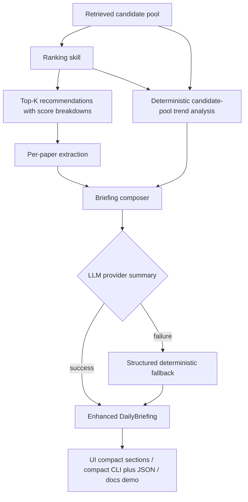

# feat: Improve Daily Briefing Quality

## Overview

Upgrade the daily briefing from a short Top-K abstract summary into a research reading guide plus compact topic overview. The improved briefing will keep the default workflow abstract/metadata-only, but it will use richer Top-K extraction, ranking evidence, retrieval metadata, and candidate-pool signals to produce clearer paper briefs, trend/hotspot notes, Top-K comparisons, reading priorities, and explicit evidence boundaries.

The work stays inside the current Agent + Skills architecture. Retrieval and ranking continue to determine candidates and Top-K recommendations; briefing becomes a stronger synthesis layer over already-available data rather than a new search or PDF-reading workflow.

## Problem Frame

The current briefing path is too shallow for research use: it extracts basic fields from final Top-K papers, then asks the provider for a 2-3 sentence executive summary. That makes the output easy to render, but it does not explain what each recommended paper contributes, how Top-K papers differ, or what broader trends are visible in the candidate pool (see origin: `docs/brainstorms/2026-05-02-001-improve-briefing-quality-requirements.md`).

The user wants two improvements at once: more useful per-paper Top-K guidance and a trend/hotspot overview from the broader search result set. The default mode must not download PDFs.

## Requirements Trace

- R1-R4. Add richer Top-K paper briefs and comparison notes while preserving rank, score, evidence source, and provenance.
- R5-R8. Summarize broader trend and hotspot signals from the candidate pool when available, with visible signal strength and evidence limits.
- R9-R12. Produce a stronger executive summary, reading priorities, compact UI/CLI output, and fake/offline behavior.
- R13-R16. Keep default briefing abstract/metadata/ranking/retrieval-only, handle missing abstracts safely, preserve useful output when candidate trends or live LLM calls are unavailable, and keep deterministic fallback structured.

## Scope Boundaries

- No default PDF/full-text download or parsing for briefing.
- No replacement of selected-paper deep explanation; deep explanation remains the full-text path for one chosen paper.
- No vector database, persistent analytics system, or non-arXiv source integration.
- No unsupported claims about experiments, limitations, or full methodology when only abstract/metadata evidence exists.
- No requirement that trend summaries appear when the candidate pool is too small or unavailable.

### Deferred to Separate Tasks

- Optional "deep briefing" mode that reads Top 1-3 full texts: future task after the abstract/metadata briefing is solid.
- Cross-source trend analysis beyond arXiv: future source-integration work.

## Context & Research

### Relevant Code and Patterns

- `src/daily_arxiv_agent/contracts.py` defines `PaperBriefingItem`, `DailyBriefing`, `BriefingTableRow`, `Recommendation`, `RankingScoreBreakdown`, `RetrievalSourceMetadata`, and workflow contracts.
- `src/daily_arxiv_agent/skills/briefing.py` currently builds the summary table, invokes `LLMProvider.summarize_briefing`, and returns fallback briefing envelopes.
- `src/daily_arxiv_agent/skills/extraction.py` and provider implementations extract per-paper briefing items from one recommendation at a time.
- `src/daily_arxiv_agent/llm/base.py`, `src/daily_arxiv_agent/llm/fake.py`, and `src/daily_arxiv_agent/llm/openai_provider.py` keep live LLM behavior behind an injectable provider boundary.
- `src/daily_arxiv_agent/orchestrator.py` already has all candidate papers, retrieval metadata, ranking metadata, recommendations, and extracted items in one workflow.
- `src/daily_arxiv_agent/skills/ranking.py` already computes score breakdowns, matched terms/phrases, category/recency/query-source signals, and evidence-aware fallback flags.
- `src/daily_arxiv_agent/ui/streamlit_app.py` renders a compact executive summary and summary table; helper functions already exist for UI smoke tests without importing Streamlit.
- `src/daily_arxiv_agent/cli.py` currently returns the full workflow JSON. R11 requires a compact CLI briefing surface, so JSON serialization alone is not sufficient for the enhanced daily workflow.

### Institutional Learnings

- `docs/solutions/2026-04-23-001-live-api-readiness.md` records that LLM calls must remain injectable and test-safe through fake providers, and live provider failures should surface as structured Skill fallback/error output rather than crashes.

### External References

- Not used. Existing local patterns are sufficient for this internal feature.

## Key Technical Decisions

- Extend existing contracts instead of replacing the briefing workflow: this preserves current consumers while adding richer sections.
- Keep `DailyBriefing.executive_summary`, `summary_table`, `highlighted_paper`, and `items` intact: existing UI, CLI, and tests can migrate incrementally.
- Add structured briefing sections for trend overview, comparison notes, reading priorities, and evidence boundary: structured fields are easier to test and render than one long markdown blob.
- Enrich `PaperBriefingItem` with optional problem/approach-style fields rather than requiring full-text claims: abstract-supported details can be shown, and metadata-only items can remain explicitly limited.
- Store field-level evidence status for richer paper claims: problem, approach, contribution, method, comparison, and reading-priority claims must either cite their abstract/metadata/ranking support or explicitly abstain.
- Model reading priorities as goal-aware guidance, not a single generic reading order.
- Compute candidate-pool trend signals deterministically before provider synthesis: live LLM output can narrate known signals, but signal extraction should remain testable offline.
- Debias candidate-pool trends against the retrieval strategy: repeated query-injected terms are weaker evidence than repeated signals across independent query variants, categories, or date slices.
- Pass candidate pool and metadata into briefing from the orchestrator: do not make briefing re-fetch or re-rank papers.
- Treat candidate-pool trends as weak evidence unless the pool size and repeated signals support stronger wording.
- Treat live LLM calls as an explicit trust boundary: provider prompts receive only allowlisted, bounded fields; untrusted paper text is delimited as data, not instructions.
- Preserve deterministic fallback structure: if live LLM summary fails, output should still contain Top-K briefs, trend availability notes, comparison notes, reading priorities, and evidence boundary.

## Open Questions

### Resolved During Planning

- Default evidence scope: abstract, metadata, ranking, retrieval metadata, and candidate-pool summaries only.
- Contract shape: add structured fields to `DailyBriefing` and optional richer paper fields to `PaperBriefingItem`; keep legacy fields.
- Candidate-pool trends: use deterministic extraction of categories, repeated topic/phrase terms, evidence coverage, and representativeness/debiasing signals, then let provider summarize only within those bounds.
- UI shape: render executive summary first, then a Top-K reading-guide section whose compact summary table acts as the index before detailed paper briefs; render trends, comparison, reading priorities, and evidence boundary after that.
- CLI shape: preserve raw JSON output for automation, but add or document a compact human-readable briefing renderer for the daily workflow.
- Fallback shape: deterministic fallback should populate every enhanced section with conservative text, not collapse to a one-line summary.

### Deferred to Implementation

- Exact term and representativeness thresholds for trend signals: tune against fixtures while preserving a minimum candidate-count/evidence-count guard and query-echo downgrade.
- Exact provider prompt wording: settle while adding provider tests, but require evidence-grounded structured behavior.
- Exact Streamlit layout details: use existing helper-testable rendering patterns and keep the main workflow readable on narrow screens, while following the resolved output order above.

## High-Level Technical Design

> *This illustrates the intended approach and is directional guidance for review, not implementation specification. The implementing agent should treat it as context, not code to reproduce.*

## Implementation Units

- [x] **Unit 1: Enhanced Briefing Contracts**

**Goal:** Add the structured output surface needed for richer paper briefs, trend/hotspot overview, comparisons, reading priorities, and evidence boundary while keeping existing briefing fields compatible.

**Requirements:** R1, R2, R3, R4, R5, R7, R8, R9, R10, R12, R14, R15

**Dependencies:** None

**Files:**
- Modify: `src/daily_arxiv_agent/contracts.py`
- Test: `tests/test_contracts.py`

**Approach:**
- Extend `PaperBriefingItem` with optional evidence-bound fields for problem, approach/method framing, and a fuller reading-guide note. Keep existing `summary`, `contributions`, `methods`, and `relevance_rationale`.
- Add small Pydantic models for candidate-pool trend overview, trend signals, Top-K comparison notes, goal-aware reading priorities, field evidence status, and evidence boundary details.
- Extend `DailyBriefing` with new fields for those sections while preserving `executive_summary`, `summary_table`, `highlighted_paper`, and `items`.
- Keep new fields defaulted so old serialized briefing payloads and existing tests can still validate.
- Ensure evidence labels can express mixed candidate-pool evidence without implying full-text support.
- Ensure every richer paper field can represent an explicit abstention state such as "not available from abstract/metadata" instead of forcing blank strings or unsupported claims.

**Patterns to follow:**
- Existing Pydantic model style in `src/daily_arxiv_agent/contracts.py`.
- Optional/backward-compatible contract additions used by `Recommendation.score_breakdown`.
- Evidence enum usage across ranking, briefing, and deep explanation.

**Test scenarios:**
- Happy path: constructing `DailyBriefing` with enhanced sections preserves executive summary, summary table, items, and provenance.
- Happy path: a `PaperBriefingItem` can include problem/approach/reading-guide fields and still serializes to stable JSON.
- Happy path: reading-priority entries include a user goal or reading intent, paper rank/id, reason, and evidence source.
- Backward compatibility: existing minimal `DailyBriefing` and `PaperBriefingItem` payloads validate without enhanced fields.
- Edge case: trend overview can explicitly represent "not assessed" or "insufficient candidate data" without requiring trend signals.
- Edge case: metadata-only paper brief can omit problem/approach details without validation failure.
- Edge case: abstract-backed paper brief can mark method or contribution fields unavailable when the abstract does not support them.

**Verification:**
- Contract tests prove new fields are structured, optional where needed, and compatible with current briefing outputs.

- [x] **Unit 2: Candidate-Pool Trend Analysis**

**Goal:** Build deterministic, offline-testable trend and hotspot signals from retrieved candidates, ranking context, and evidence coverage.

**Requirements:** R5, R6, R7, R8, R12, R13, R15

**Dependencies:** Unit 1

**Files:**
- Modify: `src/daily_arxiv_agent/skills/briefing.py`
- Test: `tests/skills/test_briefing.py`

**Approach:**
- Add a candidate-pool analysis path inside briefing, fed by optional candidate papers and workflow metadata.
- Derive trend signals from paper categories, repeated title/abstract terms or phrases, Top-K matched terms/phrases, and evidence coverage counts.
- Track retrieval-term provenance so query-required, query-expanded, and ranking-injected terms can be downgraded or excluded from hotspot claims when they only echo the search strategy.
- Add a representativeness gate before labeling anything a hotspot: require support from enough candidates and, when available, repeated signals across independent query variants, categories, or date slices.
- Exclude generic stopwords and avoid claiming "methods" unless the signal is directly visible in title/abstract terms or extracted Top-K method fields.
- Track candidate count, abstract count, metadata-only count, Top-K count, query-echo count, independent-signal count, and whether trend analysis was skipped, weak, or representative enough to summarize.
- Cap the number of displayed signals so a broad retrieval does not produce noisy or oversized briefing payloads.
- Treat the analysis as advisory context for briefing composition, not as a ranking replacement.

**Execution note:** Add deterministic tests before changing provider prompts so candidate-pool signal behavior is fixed independently of LLM wording.

**Patterns to follow:**
- Token normalization and stopword handling in `src/daily_arxiv_agent/skills/ranking.py` and `src/daily_arxiv_agent/skills/query_planning.py`.
- Retrieval metadata redaction and candidate-count reporting in `src/daily_arxiv_agent/orchestrator.py`.
- Evaluation fixture roles in `tests/test_evaluation.py` for exact, related, weak, and unrelated candidate examples.

**Test scenarios:**
- Happy path: candidate pool with repeated "robotic manipulation", "embodied control", and `cs.RO`/`cs.LG` metadata produces bounded trend signals with counts and evidence source.
- Happy path: trend overview reports candidate count, abstract coverage, and Top-K coverage.
- Edge case: no candidate pool returns a trend section stating that broader trends were not assessed.
- Edge case: fewer than the minimum useful candidates returns a weak/insufficient trend assessment rather than overconfident hotspots.
- Edge case: repeated query-expanded terms dominate the candidate pool and are downgraded instead of reported as topic trends.
- Edge case: a repeated term appears across independent query variants/categories and is allowed as a stronger signal.
- Edge case: duplicate or overly generic terms are filtered from hotspot output.
- Edge case: metadata-only candidates contribute category/provenance signals but not unsupported method claims.

**Verification:**
- Briefing tests can validate trend signal generation with no live LLM and no PDF parsing.

- [ ] **Unit 3: Richer Top-K Extraction and Provider Synthesis**

**Goal:** Make Top-K paper briefs and provider-generated executive summaries use richer, evidence-grounded inputs while preserving fake/offline behavior.

**Requirements:** R1, R2, R3, R4, R8, R9, R10, R12, R14, R16

**Dependencies:** Unit 1, Unit 2

**Files:**
- Modify: `src/daily_arxiv_agent/skills/extraction.py`
- Modify: `src/daily_arxiv_agent/skills/briefing.py`
- Modify: `src/daily_arxiv_agent/llm/base.py`
- Modify: `src/daily_arxiv_agent/llm/fake.py`
- Modify: `src/daily_arxiv_agent/llm/openai_provider.py`
- Test: `tests/skills/test_extraction.py`
- Test: `tests/skills/test_briefing.py`
- Test: `tests/test_llm_provider.py`

**Approach:**
- Update extraction behavior so abstract-backed `PaperBriefingItem` outputs include problem/approach-style fields when available from title/abstract and recommendation rationale.
- Add field-level abstention rules: problem, approach, contribution, method, comparison, and reading-priority claims must identify their source support or be marked unavailable/evidence-limited.
- For metadata-only papers, keep extraction conservative and visibly limited.
- Expand provider briefing prompt inputs beyond `summary` to include contributions, methods, relevance rationale, trend signals, comparison context, reading priorities, and evidence boundary notes.
- Keep provider output narrow enough to validate reliably: provider may generate the executive summary or concise narrative fields, but deterministic code owns the structured section shape.
- Add an explicit live-provider data boundary: allowlist prompt fields, exclude raw/expanded queries and full candidate abstracts by default, document retention/logging assumptions, and keep fake/offline mode as the private/test-safe path.
- Treat title, abstract, and metadata text as untrusted external content in provider prompts: delimit it, instruct the provider to ignore instructions inside paper text, and validate generated narrative against deterministic evidence fields where possible.
- Update fake provider to produce stable richer paper briefs and trend-aware executive summaries for offline tests.
- Ensure live provider failures still return structured fallback sections from `DailyBriefingSkill`.

**Patterns to follow:**
- Existing `PaperExtractionSkill.extract` fallback envelope in `src/daily_arxiv_agent/skills/extraction.py`.
- Existing OpenAI provider retry/output validation path in `src/daily_arxiv_agent/llm/openai_provider.py`.
- Deep explanation prompt language that says not to invent missing evidence in `src/daily_arxiv_agent/llm/openai_provider.py`.

**Test scenarios:**
- Happy path: abstract-backed extraction returns summary, problem, approach, contributions, methods, and relevance rationale without full-text claims.
- Happy path: fake provider summary mentions both Top-K reading guidance and candidate-pool trend context.
- Happy path: OpenAI briefing prompt includes contributions/methods/relevance and trend signals, not just title/score/summary.
- Edge case: metadata-only paper extraction marks problem/approach as unavailable or evidence-limited.
- Edge case: vague abstracts support relevance but not method or contribution claims, so unsupported fields abstain.
- Error path: extraction provider failure still returns metadata-only fallback item with enhanced-field defaults.
- Error path: briefing provider failure returns fallback `DailyBriefing` with executive summary, Top-K items, trend availability note, comparison/read-priority sections, and evidence boundary.
- Privacy/scope: provider briefing prompt does not include PDF/full-text content, raw expanded queries, or full candidate abstracts; tests assert the allowlisted payload shape.
- Security: adversarial title/abstract text is treated as untrusted data and cannot override evidence-boundary instructions.

**Verification:**
- Provider and Skill tests prove richer inputs and structured fallback work under fake and live-provider adapters.

- [ ] **Unit 4: Orchestrator Integration and Trace Metadata**

**Goal:** Pass candidate-pool and ranking/retrieval context into briefing without changing retrieval or ranking semantics.

**Requirements:** R3, R5, R7, R9, R10, R12, R13, R15, R16

**Dependencies:** Unit 1, Unit 2, Unit 3

**Files:**
- Modify: `src/daily_arxiv_agent/orchestrator.py`
- Test: `tests/test_orchestrator.py`

**Approach:**
- Update `DailyBriefingSkill.generate` call sites to pass retrieved candidate papers, recommendations, extraction results, and relevant retrieval/ranking metadata.
- Keep `DailyBriefingSkill.generate` backward-compatible for direct callers that only pass recommendations.
- Pass enough internal retrieval-term provenance for trend debiasing while preserving trace redaction rules.
- Add briefing trace metadata for item count, candidate count, trend status, trend signal count, query-echo count, evidence boundary, and fallback section availability.
- Preserve trace redaction rules: do not expose raw expanded queries unless debug trace is requested.
- Do not add new retrieval requests, ranking calls, or PDF parsing to the briefing path.

**Patterns to follow:**
- Current `run_recommendation` flow in `src/daily_arxiv_agent/orchestrator.py`.
- `_trace_metadata` redaction pattern for retrieval and ranking metadata.
- `_workflow_result` aggregation and fallback status propagation.

**Test scenarios:**
- Happy path: recommendation workflow passes full candidate pool into briefing and enhanced briefing reports candidate/trend context.
- Happy path: workflow trace includes briefing metadata with trend status, query-echo counts, and evidence boundary but no raw query strings.
- Edge case: empty retrieval/ranking still returns the existing EMPTY workflow behavior without crashing enhanced briefing.
- Edge case: direct/direct-like briefing generation with no candidate pool still works and marks trends as not assessed.
- Error path: LLM briefing failure marks workflow fallback while preserving enhanced briefing sections.
- Integration: ranking and retrieval metadata continue to appear in their existing trace steps unchanged.

**Verification:**
- Orchestrator tests prove the new briefing inputs compose with query planning, retrieval, ranking, extraction, and fallback status.

- [ ] **Unit 5: UI, CLI, and Documentation Surface**

**Goal:** Render enhanced briefing sections clearly in daily workflow outputs without making the main UI noisy.

**Requirements:** R1, R4, R5, R9, R10, R11, R12, R14, R15

**Dependencies:** Unit 4

**Files:**
- Modify: `src/daily_arxiv_agent/ui/streamlit_app.py`
- Modify: `src/daily_arxiv_agent/cli.py`
- Modify: `README.md`
- Create: `docs/demo/enhanced-briefing-demo.md`
- Modify: `docs/demo/unit2-daily-briefing.md`
- Test: `tests/test_ui_smoke.py`
- Test: `tests/test_cli.py`
- Test: `tests/test_orchestrator.py`

**Approach:**
- Render the enhanced briefing in the requirements order: executive summary, Top-K reading guide, trend/hotspot overview, Top-K comparison, reading priorities, and evidence boundary.
- Keep the compact summary table as the first element inside the Top-K reading-guide section, followed by detailed Top-K paper briefs.
- Use Streamlit expanders or clearly separated subsections for detailed paper briefs so the Top-K section remains scannable without hiding evidence boundaries.
- Add helper functions that convert enhanced briefing fields into testable row/section dictionaries without requiring Streamlit import side effects.
- Add or document a compact CLI briefing renderer for daily human use while preserving raw workflow JSON for automation.
- The compact CLI output should show executive summary, compact Top-K table, optional detailed paper briefs, trend status, reading priorities, and evidence boundary without dumping noisy trace internals by default.
- Add a UI state matrix covering default success, metadata-limited papers, insufficient trends, no trend data, fallback briefing, and narrow-screen behavior.
- Update README and demo artifacts to show the new abstract/metadata-only evidence boundary and explain that PDF parsing is not part of default briefing.

**Patterns to follow:**
- Existing UI helper functions `briefing_rows`, `recommendation_summary_metrics`, and `workflow_trace_rows` in `src/daily_arxiv_agent/ui/streamlit_app.py`.
- Existing raw JSON automation behavior in `src/daily_arxiv_agent/cli.py`, preserved alongside the new compact briefing renderer.
- Demo artifact style in `docs/demo/unit2-daily-briefing.md` and `docs/demo/improved-search-demo.md`.

**Test scenarios:**
- Happy path: UI helper output includes Top-K brief sections, trend signals, comparison notes, reading priorities, and evidence boundary.
- Happy path: current summary table helper still returns the same core columns for backward compatibility.
- Happy path: compact CLI output includes enhanced briefing sections in the required order.
- Happy path: raw workflow JSON from CLI still includes enhanced briefing fields through normal model serialization.
- Edge case: metadata-only paper brief renders an evidence-limited note rather than blank unsupported fields.
- Edge case: trend-not-assessed briefing renders a clear note and does not show empty hotspot tables.
- Error path: fallback briefing notice still appears through existing result notice behavior.
- Accessibility/readability: enhanced sections have semantic headings, text labels, keyboard-reachable expanders, readable long-text/table alternatives, and do not rely on color-only status.

**Verification:**
- UI smoke tests, CLI tests, and orchestrator integration tests prove enhanced sections are present and existing summary outputs are not regressed.

- [ ] **Unit 6: Briefing Quality Evaluation Hooks**

**Goal:** Add deterministic checks and documentation that prove the enhanced briefing is materially richer than the MVP output while staying evidence-bounded.

**Requirements:** Success Criteria, R1, R4, R5, R7, R8, R10, R12, R13, R16

**Dependencies:** Unit 5

**Files:**
- Modify: `src/daily_arxiv_agent/evaluation/metrics.py`
- Modify: `tests/test_evaluation.py`
- Modify: `docs/demo/evaluation-summary.md`
- Modify: `docs/demo/enhanced-briefing-demo.md`

**Approach:**
- Add an evaluation helper for enhanced briefing quality: required section presence, Top-K brief coverage, trend status, reading-priority presence, evidence-boundary presence, claim specificity, and claim-support coverage.
- Treat evidence-boundary violations as failed quality checks when output implies full-text evidence in default mode.
- Treat generic/vacuous content as a quality failure when it has the right sections but lacks supported paper differences, supported problem/approach/contribution claims, or goal-specific reading priorities.
- Reuse existing search-quality fixture papers where possible so candidate-pool trend tests cover exact, related, weak, and unrelated candidates.
- Document one before/after briefing example comparing MVP-style summary output against enhanced briefing structure.
- Keep evaluation deterministic and offline.

**Patterns to follow:**
- Existing evaluation helper style in `src/daily_arxiv_agent/evaluation/metrics.py`.
- Existing search-quality tests and demo artifact in `tests/test_evaluation.py` and `docs/demo/improved-search-demo.md`.

**Test scenarios:**
- Happy path: enhanced briefing with all required sections returns complete quality evaluation.
- Happy path: enhanced briefing with specific supported paper differences and goal-aware priorities passes semantic quality checks.
- Happy path: briefing with Top-K items but no candidate pool passes Top-K coverage and reports trend-not-assessed rather than failing.
- Edge case: missing reading priorities or evidence boundary lowers completeness and identifies missing sections.
- Edge case: structurally complete but generic briefing fails specificity/support checks.
- Edge case: metadata-only evidence boundary is accepted when no abstracts are available.
- Error path: default-mode briefing text that claims full-text evidence fails or is flagged by the evaluation helper.
- Integration: fixture-backed enhanced briefing produces Top-K coverage, trend signal coverage, and evidence-boundary coverage in offline mode.

**Verification:**
- Evaluation tests prove enhanced briefing quality and claim support are measurable without live arXiv, live LLM, or PDF parsing.

## System-Wide Impact

- **Interaction graph:** Recommendation workflow remains `query_planning -> arxiv_retrieval -> ranking -> extraction -> briefing`; briefing receives more context but does not introduce a new workflow step.
- **Error propagation:** Extraction failures still produce item-level fallback output; briefing provider failures produce structured fallback `DailyBriefing`; workflow status remains fallback when child Skills fallback.
- **State lifecycle risks:** No database migration is planned. Existing serialized briefing payload consumers must tolerate new optional fields. Candidate-pool context is run-scoped and should not be persisted as global paper metadata.
- **API surface parity:** Direct Skill usage, orchestrator workflow JSON, compact CLI output, raw CLI JSON, and UI rendering must all see the same enhanced `DailyBriefing` contract.
- **Integration coverage:** End-to-end tests must prove retrieval, ranking, extraction, and enhanced briefing compose with fake providers and fixture retrieval.
- **Unchanged invariants:** Default briefing does not parse PDFs; selected-paper deep explanation remains the only full-text workflow. Existing summary table and highlighted paper fields remain available.

## Risks & Dependencies

| Risk | Mitigation |
|------|------------|
| Trend signals overstate noisy candidate-pool terms | Require candidate-count/evidence coverage context, cap signals, and label weak or unavailable trends explicitly |
| Trend signals mirror retrieval/query bias | Track term provenance, downgrade query-injected terms, require independent support before labeling hotspots, and add adversarial query-echo fixtures |
| Contract expansion breaks existing tests or serialized outputs | Add optional/defaulted fields and keep existing `DailyBriefing` and `PaperBriefingItem` fields intact |
| Provider prompt becomes too large for broad candidate pools | Send bounded trend signals and Top-K details, not raw full candidate abstracts |
| Live provider receives more research-context data than intended | Add a provider data-boundary allowlist, exclude raw expanded queries by default, document provider retention/logging assumptions, and test prompt payload shape |
| Retrieved paper text injects instructions into LLM prompts | Delimit paper fields as untrusted content, instruct the provider to ignore instructions inside them, validate narrative against deterministic evidence, and test adversarial abstracts |
| LLM invents unsupported details | Keep structured sections generated from deterministic/extracted evidence; prompt provider to stay evidence-grounded; fallback remains deterministic |
| Structurally complete briefings remain generic or vacuous | Add semantic quality fixtures and evaluate specificity, supported paper differences, and forbidden unsupported claims |
| UI becomes too busy | Keep the summary table as the compact index inside the Top-K section and move detailed paper briefs/trends into labeled sections or expanders |
| Fake/offline mode diverges from live behavior | Update fake provider and deterministic evaluation checks alongside live provider prompt changes |

## Documentation / Operational Notes

- Update README to describe enhanced briefing shape, compact CLI output, raw JSON automation output, and default evidence boundary.
- Add or update demo artifacts under `docs/demo/` with an enhanced briefing example.
- No new environment variables are required.
- No rollout flag is required because contract additions are backward-compatible and default evidence scope remains conservative.

## Sources & References

- **Origin document:** `docs/brainstorms/2026-05-02-001-improve-briefing-quality-requirements.md`
- Related plan: `docs/plans/2026-04-21-001-feat-daily-arxiv-agent-plan.md`
- Related plan: `docs/plans/2026-04-30-001-feat-hybrid-arxiv-search-plan.md`
- Related solution note: `docs/solutions/2026-04-23-001-live-api-readiness.md`
- Related code: `src/daily_arxiv_agent/skills/briefing.py`
- Related code: `src/daily_arxiv_agent/skills/extraction.py`
- Related code: `src/daily_arxiv_agent/llm/openai_provider.py`
- Related code: `src/daily_arxiv_agent/orchestrator.py`
- Related code: `src/daily_arxiv_agent/ui/streamlit_app.py`
