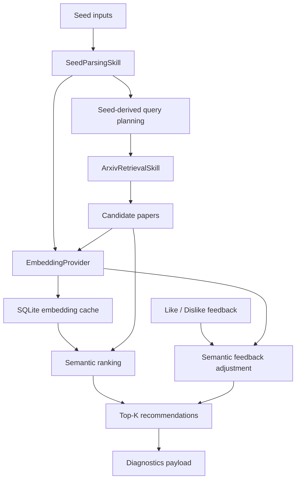

# feat: Add Semantic Seed Recommendation

## Overview

Add a semantic-first recommendation path for seed-paper workflows. When a user provides seed papers, especially with no explicit topic, the agent should derive a seed-based candidate retrieval plan, fetch a bounded candidate pool, embed seed and candidate paper metadata, rank candidates primarily by semantic similarity, and expose diagnostics that explain seed-paper relatedness and like/dislike effects.

The runtime semantic path should fail closed when the configured real embedding provider is unavailable: it should return a clear structured error instead of silently falling back to deterministic word-vector recommendations. A fake embedding provider remains in scope for tests and deterministic local verification; it is a testing adapter, not a product fallback.

## Problem Frame

The current seed-paper mechanism only reranks whatever the topic/category/date retrieval step already found. If the topic is empty, retrieval does not know how to search for papers similar to the seeds, so ranking quality is bounded by a weak candidate pool. The existing sparse word-vector similarity also misses papers that are semantically related but use different terms.

Semantic seed recommendation needs two capabilities together:

- Seed-derived retrieval so topicless runs can gather plausible candidates from arXiv.
- Semantic scoring so seed/candidate similarity is based on embedding vectors over title, abstract, and categories rather than only overlapping words.

## Requirements Trace

- R1. Topicless recommendation runs with valid seed papers must retrieve candidates using seed-derived query variants rather than relying on `all:*` or category/date-only retrieval.
- R2. Seed papers and candidate papers must be embedded through a replaceable provider interface with a real OpenAI-compatible implementation and a deterministic fake implementation for tests.
- R3. Semantic seed similarity must be the primary ranking signal in seed-only mode, combined with lexical, category, recency, retrieval-source, and feedback signals as secondary signals.
- R4. The semantic runtime path must fail closed when embedding configuration or provider calls fail; it must not silently return deterministic fallback recommendations for semantic mode.
- R5. Seed papers themselves must be excluded from recommendation results.
- R6. Embeddings must be cached locally by provider/model/dimensions/input identity to avoid unnecessary repeated API calls.
- R7. Like/dislike feedback must use the same semantic similarity basis when semantic ranking is active, and refined recommendations must preserve structured score movement data.
- R8. UI and trace output must make semantic recommendation explainable: seed-candidate similarity, score breakdown, provider mode, cache behavior, readiness state, and failure reason should be visible without exposing raw embeddings or provider payloads.
- R9. Existing deterministic topic search, topic+seed deterministic ranking, retrieval caching, and briefing workflows must remain usable. Topicless seed runs are the single implicit semantic activation path; all other semantic behavior requires an explicit recommendation mode or configuration.
- R10. Semantic mode must include a pre-run readiness check that validates seed quality, provider configuration, credential availability, endpoint safety, and cache settings before arXiv retrieval or embedding calls.
- R11. Seed-derived retrieval must include a candidate-pool quality gate: fixture seeds with known relevant candidates must retrieve those candidates within the configured budget, and insufficient pools must be labeled before ranking.
- R12. Real embedding providers must use a minimum-necessary data boundary: only title, abstract, and categories may be sent for seed/candidate embedding in this iteration; authors, full text, raw feedback notes, and raw provider responses are excluded.
- R13. Embedding cache behavior must include lifecycle controls: cache keys must avoid cross-model pollution, cache metadata must support retention/cleanup, and users must have a documented way to clear or disable embedding caching.

## Scope Boundaries

- No vector database in this iteration. SQLite-backed embedding cache is sufficient for local single-user workflows.
- No bulk PDF download or full-text embedding for routine ranking. Use title, abstract, and categories only.
- No custom trained recommendation model.
- No silent deterministic fallback in semantic runtime mode. Structured error output is preferred over low-quality recommendations.
- No guarantee that OpenAI embeddings are the only future provider; the first real provider should be OpenAI-compatible, behind an interface.
- No raw seed-derived terms, embedding vectors, provider request bodies, provider response bodies, or per-input cache keys in normal trace/UI output. Those details are debug-only and local-only.

### Deferred to Separate Tasks

- Full diagnostic visualization beyond compact semantic fields and run-level readiness/status: future UI iteration after the semantic payload shape is stable.
- Semantic feedback refinement and feedback influence visualization: Phase 2 after initial semantic seed recommendations are working.
- CLI seed-mode parity and comparative evaluation dashboards: Phase 3 after the API/UI path is stable.
- 2D embedding map or graph visualization beyond basic Streamlit charts: future UI iteration after diagnostics payloads are stable.
- Local Hugging Face / sentence-transformers provider: future provider implementation after the OpenAI-compatible path is working.
- Approximate nearest-neighbor indexing: future scale improvement if SQLite embedding cache becomes insufficient.

## Context & Research

### Relevant Code and Patterns

- `src/daily_arxiv_agent/skills/seed_parsing.py` normalizes seed inputs, fetches arXiv seed metadata, builds `SeedPreference`, and provides text construction helpers.
- `src/daily_arxiv_agent/skills/query_planning.py` already builds bounded `QueryPlan` objects and should be mirrored for seed-derived query planning.
- `src/daily_arxiv_agent/skills/arxiv_retrieval.py` executes query plans, dedupes candidates, preserves retrieval-source metadata, and caches retrieval result sets.
- `src/daily_arxiv_agent/skills/ranking.py` already combines lexical, phrase, query-source, recency, category, seed, and feedback signals into `RankingScoreBreakdown`.
- `src/daily_arxiv_agent/skills/feedback.py` records latest-wins feedback and applies similarity-based score deltas; this is the right behavior to preserve with semantic vectors.
- `src/daily_arxiv_agent/llm/base.py`, `src/daily_arxiv_agent/llm/openai_provider.py`, `src/daily_arxiv_agent/llm/provider.py`, and `src/daily_arxiv_agent/llm/fake.py` show the existing live/fake provider boundary and retry style.
- `src/daily_arxiv_agent/storage.py` owns SQLite schema initialization, compatibility schema upgrades, retrieval cache keys, seed preference persistence, feedback event persistence, and full-text cache helpers.
- `src/daily_arxiv_agent/ui/streamlit_app.py` already renders recommendation rows, workflow trace rows, ranking mode, candidate counts, cache status, and feedback before/after rows.

### Institutional Learnings

- `docs/solutions/2026-04-23-001-live-api-readiness.md` records that live OpenAI provider behavior should remain injectable, test-safe through fake providers, and fail with clear configuration errors when credentials are missing.
- `docs/plans/2026-04-30-001-feat-hybrid-arxiv-search-plan.md` records the prior decision to keep query planning and retrieval inspectable, cache effective query plans, avoid routine PDF downloads, and keep fake/offline paths deterministic.

### External References

- OpenAI Embeddings guide: `https://platform.openai.com/docs/guides/embeddings`
- OpenAI model docs for `text-embedding-3-small`: `https://platform.openai.com/docs/models/text-embedding-3-small`
- OpenAI model docs for `text-embedding-3-large`: `https://platform.openai.com/docs/models/text-embedding-3-large`

## Key Technical Decisions

- Semantic mode activation is explicit except for topicless seed runs: seed-only runs use semantic mode by default because there is no topic for deterministic retrieval; topic+seed runs remain deterministic unless `recommendation_mode` requests semantic scoring.
- Semantic mode is fail-closed, not fallback-backed: provider/configuration failure returns a structured semantic error and no recommendation rows. Low-evidence labels are allowed only after embedding succeeds; they are not deterministic fallback recommendations.
- Add semantic readiness before retrieval: semantic mode should validate usable seed text, provider config, credential status, endpoint safety, and cache settings before query planning, retrieval, embedding, extraction, or briefing.
- Keep fake embeddings for tests and local demos only: the provider factory must never auto-switch to fake after real-provider failure. `EMBEDDING_PROVIDER=fake` is valid only when explicitly configured and must be visibly labeled as non-production.
- Use seed-derived retrieval before semantic ranking: Embeddings improve ranking quality only after relevant candidates exist, so topicless seed runs must first build arXiv query variants from seed title, abstract, category, and extracted phrases.
- Rank seed-only results by semantic evidence first: secondary lexical, phrase, category, recency, query-source, and feedback signals are bounded boosts and must not dominate a materially lower semantic match.
- Cache embeddings by serialized embedding input identity and provider settings: the cache key is provider/model/dimensions/input-version/normalized serialized input hash. Input role is metadata unless it changes the serialized embedding input.
- Keep credentials separated: `EMBEDDING_API_KEY` is the primary credential. Reusing `OPENAI_API_KEY` requires an explicit opt-in configuration, and custom embedding base URLs must not inherit OpenAI credentials implicitly.
- Preserve existing deterministic workflows: Existing topic recommendation, query planning, retrieval, briefing, follow-up, and deterministic tests should continue unless semantic seed mode is selected or activated by seed-only inputs.
- Make diagnostics first-class: Visualization should rely on structured data, not parsed rationale strings.

## Open Questions

### Resolved During Planning

- Should semantic mode have product fallback to deterministic word-vector recommendation? No. Semantic runtime should fail closed with a clear error; fake provider remains only for tests and local deterministic verification.
- Which real provider should the first implementation target? OpenAI-compatible embeddings, because the project already has OpenAI-compatible live provider patterns and environment-variable configuration.
- Should semantic similarity also affect feedback? Yes. Like/dislike should use semantic similarity when semantic ranking is active so feedback behavior matches recommendation behavior.
- When should semantic mode activate? Seed-only recommendation runs should activate semantic mode by default because deterministic retrieval has no topic to search with; topic+seed runs may remain hybrid deterministic unless the configured recommendation mode requests semantic scoring.
- What happens when semantic feedback refinement fails after recommendations already exist? Keep the original semantic recommendations unchanged, set `refinement_status=failed`, attach a structured `feedback_error`, and do not apply deterministic feedback deltas.
- What should happen when seed metadata has no usable title or abstract? Return `semantic_seed_quality_error` with reason `seed_metadata_missing_text`, skip broad retrieval, and return no recommendation rows.

### Deferred to Implementation

- Exact seed-term extraction heuristics for retrieval variants: Implementation should reuse existing query-planning normalization where practical and adjust after fixture tests reveal gaps.
- Exact chart library choices inside Streamlit: Use Streamlit-native tables/charts where sufficient; add heavier chart dependencies only if needed.

## High-Level Technical Design

> *This illustrates the intended approach and is directional guidance for review, not implementation specification. The implementing agent should treat it as context, not code to reproduce.*



Semantic score should be the main seed-only score, while lexical, category, recency, query-source, and feedback remain explainable secondary signals. The implementation should avoid parsing text rationales to power diagnostics; diagnostics should come from structured score and similarity records.

### Activation Matrix

| Inputs / mode | Retrieval plan | Ranking path | Failure behavior |
|---|---|---|---|
| Topic only | Existing topic query planning | Existing deterministic hybrid ranking | Existing behavior |
| Topic + seed, default/auto | Existing topic query planning | Existing deterministic hybrid topic+seed ranking | Existing behavior |
| Topic + seed, semantic requested | Topic-derived retrieval by default; seed-derived expansion only if the named mode explicitly requests it | Semantic reranking with seed diagnostics | Semantic error returns no new semantic recommendation rows |
| Seed only, default/auto | Seed-derived query planning | Semantic seed ranking | Semantic readiness/provider/quality error returns no recommendation rows |
| No topic and no seed | Existing category/date behavior when filters exist; otherwise ranking input error | Existing category/date or error behavior | Existing behavior |

### Provider Data Boundary

- arXiv receives only the query variants produced by topic or seed query planning plus configured category/date filters.
- Real embedding providers receive only normalized title, abstract, and category text for seed papers and candidate papers.
- Real embedding providers must not receive authors, PDFs, full text, raw feedback notes, raw score rationale, SQLite cache keys, profile IDs, or provider debug traces in this iteration.
- Normal trace/UI output shows only provider mode, provider label, model name, aggregate cache status, candidate counts, ranking mode, paper IDs/titles already present in recommendations, and high-level score diagnostics.
- Raw seed-derived query terms, extracted phrases, provider request bodies, provider response bodies, embedding vectors, and per-input cache keys are debug-only/local-only and must be excluded from default trace output.

### Quality Gates

- Seed-derived retrieval gate: fixture seeds with known relevant non-seed papers must retrieve those papers within the configured candidate budget before semantic ranking is evaluated.
- Semantic ranking gate: fixture-based semantic seed-only ranking must beat the current deterministic seed-only baseline on lexical-distractor demotion and at least one ranking metric such as precision@K, MRR, or nDCG@K.
- Multi-seed gate: fixtures with two distinct seed themes must show per-seed diagnostics and avoid collapsing every Top-K result to one seed unless the semantic scores justify it.
- Failure-state gate: missing credentials, unsafe provider URL, weak seed metadata, provider timeout, no seed-derived candidates, and all candidates below semantic evidence threshold must each produce an actionable semantic state with no misleading recommendation table.

## Phased Delivery

### Phase 1: Semantic Seed MVP

- Validate seed-derived retrieval before embedding infrastructure: prove topicless seeds can retrieve plausible non-seed candidates using `QueryPlan` fixtures and trace metadata.
- Add embedding provider boundary, readiness preflight, credential separation, endpoint validation, and minimal provider docs.
- Add embedding cache with lifecycle metadata, opt-out/clear path, and privacy-safe cache diagnostics.
- Add semantic seed ranking with structured similarity records, seed exclusion, low-evidence labeling after successful embedding, and fail-closed semantic errors.
- Add minimal UI/API trace fields for readiness, provider mode, ranking mode, semantic score, top matching seed, and error states.

### Phase 2: Feedback and Diagnostics

- Add semantic feedback refinement using semantic context from the original run.
- Preserve unchanged recommendations when semantic feedback refinement fails.
- Add compact diagnostics views: row-level "Why this paper?", seed-candidate similarity table, score composition table, and feedback impact table.

### Phase 3: CLI, Evaluation, and Extended Docs

- Add CLI seed input and semantic mode controls, or explicitly document UI/API-only support if CLI parity remains out of scope.
- Add comparative evaluation fixtures and demo artifacts that compare deterministic seed-only behavior against semantic seed-only behavior.
- Expand operational docs for provider setup, privacy, cache cleanup, fake mode, and quality interpretation.

## New Embedding Package Skeleton

    src/daily_arxiv_agent/embeddings/
      __init__.py
      base.py
      fake.py
      openai_provider.py
      provider.py
    tests/test_embedding_provider.py
    tests/skills/test_semantic_seed_recommendation.py

## Implementation Units

Implementation sequencing follows the phased delivery above. The first executable slice is seed-derived retrieval validation, then provider/cache/ranking. Semantic feedback, full diagnostics, and CLI parity are later slices even though their units remain documented here for continuity.

- [x] **Unit 1: Seed-Derived Retrieval MVP**

**Goal:** Build and validate arXiv query plans from seed papers when topic input is missing, before adding semantic embedding infrastructure.

**Requirements:** R1, R5, R9, R10, R11

**Dependencies:** Existing seed parsing and query planning

**Files:**
- Modify: `src/daily_arxiv_agent/orchestrator.py`
- Modify: `src/daily_arxiv_agent/skills/query_planning.py`
- Test: `tests/skills/test_query_planning.py`
- Test: `tests/test_orchestrator.py`

**Approach:**
- Resolve `active_seed` before query planning inside `run_recommendation()` so stored seed preferences can influence topicless planning.
- Add a seed-derived query planning helper or injectable planner that accepts `RetrievalQuery` plus `SeedPreference`; split it into a separate `seed_query_planning.py` skill only if it develops independent lifecycle or multiple consumers.
- Generate bounded `QueryPlan` variants from seed title, abstract, and category terms while preserving existing date/category filters from `RetrievalQuery`.
- Reuse existing query-planning normalization, stopword handling, max variant limits, and broad/strict behavior where practical.
- Mark seed-derived plans with trace-safe metadata indicating source, variant count, candidate target, and whether raw terms are debug-only.
- Exclude seed paper IDs from candidates before ranking or from final recommendation selection.
- If resolved seed metadata lacks usable title/abstract text, return `semantic_seed_quality_error` with reason `seed_metadata_missing_text`, skip broad retrieval, and return no recommendation rows.
- Add a candidate-pool quality diagnostic such as `candidate_pool_insufficient` when seed-derived retrieval returns too few candidates or fixture-known relevant candidates are missing.

**Patterns to follow:**
- `src/daily_arxiv_agent/skills/query_planning.py`
- `src/daily_arxiv_agent/skills/seed_parsing.py`
- `src/daily_arxiv_agent/orchestrator.py`

**Test scenarios:**
- Happy path: topicless query plus resolved seed paper creates seed-derived variants using seed title, abstract terms, and category filters.
- Happy path: stored seed preference with no explicit `seed_preference` argument influences query planning before retrieval.
- Happy path: seed-derived retrieval fixture includes known relevant non-seed candidates within the configured candidate budget.
- Happy path: explicit topic plus seed keeps existing topic query planning behavior unless semantic seed mode explicitly requests seed-derived expansion.
- Edge case: duplicate seed papers do not duplicate query variants.
- Edge case: seed paper IDs are excluded from final candidates or final recommendations.
- Error path: seed metadata fallback containing only an arXiv ID produces `semantic_seed_quality_error` and no broad unrelated retrieval.
- Integration: orchestrator trace records seed-derived planner source, variant count, candidate count, and candidate-pool sufficiency without raw seed terms in normal trace output.

**Verification:**
- Topicless seed workflows retrieve a bounded candidate pool through arXiv query plans instead of ranking a generic `all:*` result set.

- [x] **Unit 2: Embedding Provider Boundary and Semantic Readiness**

**Goal:** Add a replaceable embedding provider layer with real OpenAI-compatible and deterministic fake implementations.

**Requirements:** R2, R4, R9, R10, R12

**Dependencies:** Unit 1

**Files:**
- Create: `src/daily_arxiv_agent/embeddings/__init__.py`
- Create: `src/daily_arxiv_agent/embeddings/base.py`
- Create: `src/daily_arxiv_agent/embeddings/fake.py`
- Create: `src/daily_arxiv_agent/embeddings/openai_provider.py`
- Create: `src/daily_arxiv_agent/embeddings/provider.py`
- Modify: `src/daily_arxiv_agent/config.py`
- Modify: `.env.example`
- Modify: `README.md`
- Test: `tests/test_embedding_provider.py`

**Approach:**
- Introduce an embedding provider protocol separate from `LLMProvider`; embedding concerns should not be added to chat/extraction provider contracts.
- Mirror existing live/fake provider factory patterns from `src/daily_arxiv_agent/llm/provider.py`.
- Add environment-backed config for provider name, API key, model, base URL, embeddings path, timeout, retries, and optional dimensions.
- Use `EMBEDDING_API_KEY` as the primary credential. Allow `OPENAI_API_KEY` reuse only with explicit opt-in such as `EMBEDDING_REUSE_OPENAI_API_KEY=true`.
- Treat `openai` and `live` as requiring credentials; allow custom OpenAI-compatible providers to follow local-gateway behavior only when credentials are explicitly configured for that provider.
- Validate provider endpoints: require HTTPS for remote base URLs, allow plain HTTP only for localhost/loopback, and normalize the embeddings path.
- OpenAI-compatible provider should call the embeddings endpoint and validate vector output shape before returning it.
- Fake provider should be fixture-controllable, for example through a normalized-text vector map or synonym-group map, so tests can prove semantic similarity independent of lexical overlap.
- Add a semantic readiness check that reports provider mode, credential status, model, endpoint safety, cache enabled/disabled, seed quality, and whether semantic recommendation can run.
- Provider factories must never auto-switch to fake after real-provider failure. `EMBEDDING_PROVIDER=fake` must emit `provider_mode=fake` and be visibly labeled as non-production in UI/trace/docs.
- Redact Authorization headers, key-like values, provider request bodies, and raw response payloads from errors, logs, and trace metadata.

**Execution note:** Implement provider tests first so external API behavior remains injectable and network-free in the suite.

**Patterns to follow:**
- `src/daily_arxiv_agent/llm/base.py`
- `src/daily_arxiv_agent/llm/openai_provider.py`
- `src/daily_arxiv_agent/llm/provider.py`
- `tests/test_llm_provider.py`

**Test scenarios:**
- Happy path: `EMBEDDING_PROVIDER=fake` creates a fake provider and returns stable vectors for repeated text.
- Happy path: `EMBEDDING_PROVIDER=openai` with a key creates an OpenAI-compatible provider with configured model, base URL, timeout, retries, and dimensions.
- Happy path: custom provider name with local base URL can be constructed according to project provider conventions.
- Error path: `openai` provider without credentials raises a clear configuration error.
- Error path: custom provider does not inherit `OPENAI_API_KEY` unless explicit credential reuse is enabled.
- Error path: unsafe remote HTTP base URL is rejected while localhost HTTP is accepted for local gateways.
- Error path: malformed embeddings response produces a provider error rather than an invalid vector.
- Error path: transient request failure follows retry settings and then raises a clear failure if retries are exhausted.
- Integration: semantic readiness converts missing credentials or unsafe endpoint config into semantic-specific errors before retrieval, embedding, extraction, or briefing.

**Verification:**
- Embedding provider creation is deterministic under fake mode and live provider behavior is fully mockable in tests.

- [x] **Unit 3: Embedding Contracts and SQLite Cache**

**Goal:** Persist embedding vectors and semantic diagnostics safely without repeated API calls or cache pollution across models.

**Requirements:** R2, R6, R8, R9, R13

**Dependencies:** Unit 2

**Files:**
- Modify: `src/daily_arxiv_agent/contracts.py`
- Modify: `src/daily_arxiv_agent/storage.py`
- Test: `tests/test_contracts.py`
- Test: `tests/test_storage.py`

**Approach:**
- Add compact contracts for embedding identity, embedding vectors, semantic similarity details, and provider/cache metadata.
- Extend `RankingScoreBreakdown` with a semantic seed signal while keeping existing fields backward-compatible.
- Add SQLite cache support for embedding vectors keyed by provider, model, dimensions, input-version, and normalized serialized embedding input hash. Store input role as metadata unless role changes the serialized embedding input.
- Store vectors as JSON or another simple SQLite-compatible representation; avoid introducing a vector database.
- Store lifecycle metadata such as `created_at` and `last_accessed_at`, and support a clear-embedding-cache operation.
- Add a cache-disable config path for privacy-sensitive runs.
- Decide cache scoping explicitly: public candidate-paper embeddings may be global; seed/feedback-derived embeddings should be profile-scoped or should expose only aggregate cache status to avoid cross-profile leakage.
- Apply best-effort restrictive local SQLite file permissions where practical.
- Add schema-upgrade helpers following existing `_ensure_column` style where possible.
- Keep existing `SeedPreference.vector` valid for deterministic workflows; semantic vectors should be additive metadata or separate records, not a breaking replacement.

**Patterns to follow:**
- `src/daily_arxiv_agent/contracts.py`
- `src/daily_arxiv_agent/storage.py`
- Retrieval cache key behavior in `tests/test_storage.py`

**Test scenarios:**
- Happy path: saving and loading an embedding for the same provider/model/dimensions/input identity returns the same vector.
- Happy path: the same text embedded with two different models or dimensions uses separate cache entries.
- Happy path: clearing the embedding cache removes stored vectors without deleting papers, seed preferences, retrieval runs, feedback events, or full-text cache rows.
- Edge case: empty or whitespace-only embedding text is not cached as a valid embedding.
- Edge case: existing databases without the new embedding cache schema initialize without losing existing paper, seed preference, retrieval, or feedback rows.
- Edge case: cache-disabled semantic run calls the provider but does not persist embedding vectors.
- Edge case: normal trace exposes only aggregate cache status, not per-input cache keys or cross-profile cache hits.
- Error path: corrupt cached vector payload is ignored or surfaced as a cache miss rather than crashing ranking.
- Integration: cached candidate embeddings prevent repeated fake provider calls for repeated semantic recommendation runs.

**Verification:**
- Existing storage tests continue to pass, and embedding cache behavior is covered independently.

- [x] **Unit 4: Semantic Seed Ranking**

**Goal:** Rank retrieved candidates primarily by semantic similarity to the seed profile while preserving hybrid ranking signals and explainability.

**Requirements:** R2, R3, R4, R5, R6, R8, R9

**Dependencies:** Units 1, 2, 3

**Files:**
- Create: `src/daily_arxiv_agent/skills/semantic_seed_ranking.py`
- Modify: `src/daily_arxiv_agent/skills/ranking.py`
- Modify: `src/daily_arxiv_agent/orchestrator.py`
- Test: `tests/skills/test_semantic_seed_recommendation.py`
- Test: `tests/skills/test_ranking.py`
- Test: `tests/test_orchestrator.py`

**Approach:**
- Keep existing deterministic `TopicRankingSkill` intact for non-semantic flows.
- Add a semantic-ranking path that builds a seed semantic profile from seed texts and compares each candidate embedding to that profile.
- Define multi-seed behavior explicitly: compute per-seed similarity and a seed-profile score, preserve per-seed records, and use either max/weighted aggregation plus diversity diagnostics so unrelated seed themes are not silently averaged away.
- Combine semantic score with secondary lexical, phrase, category, recency, query-source, and feedback signals using explicit bounded weights. In seed-only mode, semantic evidence bucket/score is the primary ordering key; secondary signals are tie-breakers or bounded boosts.
- Treat semantic provider/configuration failures as structured semantic recommendation errors with no recommendation data; do not continue into extraction or briefing and do not return deterministic recommendation data on semantic failure.
- Label ranking mode as `semantic_seed`, `semantic_topic_seed`, or equivalent trace-safe values.
- Preserve existing `minimum_evidence_score` behavior conceptually, but adapt qualification to semantic evidence. Low-evidence candidates may be labeled only when embedding succeeds; they are not fallback recommendations and should not be used to hide a failed semantic run.
- Add semantic context to recommendation metadata or score breakdown so feedback refinement can determine whether semantic similarity should be used later.
- Use a fixture-controllable fake embedding provider so tests can assert semantically related but lexically different ranking behavior.

**Technical design:** Directional score shape, not implementation specification:

```text
semantic_bucket = high | medium | low | none
semantic_seed_score = cosine(seed_profile_embedding, candidate_embedding) * semantic_weight
secondary_score = bounded(lexical + phrase + query_source + recency + category + feedback)
total_score = semantic_seed_score + secondary_score
sort_key = semantic_bucket, semantic_seed_score, secondary_score, recency, title
```

**Patterns to follow:**
- `src/daily_arxiv_agent/skills/ranking.py`
- `src/daily_arxiv_agent/skills/feedback.py`
- `tests/skills/test_ranking.py`

**Test scenarios:**
- Happy path: topicless semantic seed ranking places semantically similar candidate above a lexically different but related candidate set using fake embeddings.
- Happy path: candidate with high lexical overlap but low semantic similarity does not outrank a clearly semantically closer candidate in seed-only mode.
- Happy path: score breakdown includes semantic seed score, existing secondary signals, total score, evidence score, and per-seed similarity diagnostics.
- Happy path: two-theme seed fixture preserves per-seed diagnostics and does not collapse every Top-K result to one seed unless semantic scores justify it.
- Edge case: candidate paper matching a seed paper ID is excluded from recommendations.
- Edge case: no candidate reaches the semantic evidence threshold returns fewer than Top-K or labels low-evidence inclusions after successful embedding.
- Error path: embedding provider failure returns a clear semantic recommendation error and no deterministic fallback recommendations.
- Error path: semantic ranking error short-circuits extraction and briefing while preserving trace context.
- Integration: existing deterministic topic ranking tests remain valid when semantic mode is not active.

**Verification:**
- Semantic seed mode produces inspectable Top-K recommendations and does not regress deterministic ranking behavior.

- [x] **Unit 5: Semantic Feedback Refinement**

**Goal:** Apply like/dislike feedback using semantic similarity in semantic recommendation contexts and preserve structured movement data for visualization.

**Requirements:** R3, R7, R8, R9

**Dependencies:** Units 1, 2, 4

**Files:**
- Modify: `src/daily_arxiv_agent/skills/feedback.py`
- Modify: `src/daily_arxiv_agent/orchestrator.py`
- Modify: `src/daily_arxiv_agent/contracts.py`
- Test: `tests/skills/test_feedback.py`
- Test: `tests/test_orchestrator.py`

**Approach:**
- Extend feedback adjustment to accept a semantic similarity source when the recommendation run was semantic.
- Inject or pass an embedding service/cache into semantic feedback refinement; do not rebuild semantic behavior through the sparse deterministic vectorizer.
- Pass semantic context from the originating recommendations so feedback refinement knows provider/model/cache settings and original semantic diagnostics.
- Preserve latest-wins feedback behavior.
- Keep lexical feedback path available for existing deterministic workflows.
- Add a contract for feedback influence records: source feedback paper, target candidate, similarity, signed score delta, value, and refinement status.
- Ensure refined recommendations retain or update `score_breakdown` using model-copy style updates rather than dropping structured score details.
- On semantic feedback refinement failure, return the original semantic recommendations unchanged with `refinement_status=failed` and a structured `feedback_error`; do not apply deterministic feedback deltas.
- Avoid applying semantic feedback when feedback events lack hydrated paper metadata unless embeddings can be resolved from cached paper data.

**Patterns to follow:**
- `src/daily_arxiv_agent/skills/feedback.py`
- `tests/skills/test_feedback.py`

**Test scenarios:**
- Happy path: liked paper semantically similar to a candidate increases that candidate's refined score and rank.
- Happy path: disliked paper semantically similar to a candidate decreases that candidate's refined score and rank.
- Happy path: refined recommendations preserve `previous_rank`, `rank_delta`, `score_delta`, updated score breakdown, and feedback influence records.
- Edge case: conflicting like/dislike on the same paper still follows latest-wins behavior.
- Edge case: feedback against a paper with missing metadata is recorded but does not create a semantic score delta unless metadata can be hydrated.
- Error path: semantic feedback refinement failure returns unchanged original recommendations plus `refinement_status=failed` and `feedback_error`.
- Integration: deterministic feedback refinement remains unchanged for non-semantic runs.

**Verification:**
- Like/dislike effects are numerically visible and explainable without parsing rationale text.

- [x] **Unit 6: UI and Trace Diagnostics**

**Goal:** Add a recommendation diagnostics view that visualizes semantic seed relatedness, score composition, and feedback movement.

**Requirements:** R8, R9

**Dependencies:** Units 2, 4, 5

**Files:**
- Modify: `src/daily_arxiv_agent/ui/streamlit_app.py`
- Modify: `src/daily_arxiv_agent/orchestrator.py`
- Test: `tests/test_ui_smoke.py`
- Test: `tests/test_orchestrator.py`

**Approach:**
- Add a visible recommendation mode control: Auto, Deterministic, and Semantic seed. Auto should make seed-only runs semantic and leave topic+seed deterministic unless configured otherwise.
- Add a pre-run semantic readiness panel showing embedding provider, fake/live status, model, credential status, endpoint safety, cache path/status, and warnings for semantic requested without usable seeds or provider config.
- Define semantic-specific banners for missing credentials, unsafe provider endpoint, provider timeout, weak seed metadata, no seed-derived candidates, and all candidates below semantic evidence threshold. Each banner should say whether recommendations were withheld and what to fix.
- Keep the main recommendation table compact: rank, title, total score, semantic score, top matching seed, feedback delta when present, evidence/low-evidence status, and arXiv URL.
- Add row-level "Why this paper?" details using structured score and per-seed similarity diagnostics rather than parsing rationale prose.
- Add run-level diagnostic tabs for provider/cache/retrieval trace, seed-candidate similarity, score composition, and feedback impact. Feedback diagnostics are Phase 2.
- Use a heatmap or table sorted by recommendation rank with top-N seeds as columns, 0-1 similarity labels, and a top matching seed surfaced in the main table.
- Represent score composition as signed horizontal bars or a normalized table with semantic, lexical, category, recency, query-source, and feedback components.
- Add a dedicated feedback impact section in Phase 2: original rank, refined rank, rank arrow, score delta, source feedback paper, similarity, signed influence, and unchanged/dropped/new status.
- Preserve a diagnostic shell and trace even when fail-closed semantic mode returns no recommendation rows.
- Keep raw embedding vectors out of UI and trace output.
- Redact provider-sensitive and research-intent details by default; expose model/provider/cache status without dumping raw API payloads, raw seed-derived terms, or per-input cache keys.
- Make empty/error states explicit when semantic provider configuration is missing or semantic mode fails closed.
- Support narrow layouts with stacked diagnostics, capped visible columns, numeric labels on color-coded cells, colorblind-safe palettes, and table equivalents for every chart.

**Patterns to follow:**
- `recommendation_rows`, `workflow_trace_rows`, and summary metric helpers in `src/daily_arxiv_agent/ui/streamlit_app.py`
- Existing redacted trace behavior in `src/daily_arxiv_agent/orchestrator.py`

**Test scenarios:**
- Happy path: recommendation rows include semantic score fields when score breakdown contains semantic data.
- Happy path: workflow trace shows semantic ranking mode, embedding provider label, embedding cache hits/misses, and fail-closed semantic errors without raw vectors.
- Happy path: semantic readiness panel reports provider mode, model, credential status, endpoint status, and cache status before running.
- Happy path: feedback refinement rows show before/after movement and score deltas for semantic runs.
- Edge case: diagnostics render gracefully when no seed diagnostics are present for deterministic runs.
- Edge case: fail-closed semantic errors preserve the diagnostic shell and trace with no misleading recommendation table.
- Error path: missing embedding credentials shows a clear UI notice and no misleading recommendation table.
- Error path: normal trace redacts raw seed terms, provider payloads, raw vectors, authorization headers, and per-input cache keys.

**Verification:**
- Users can visually inspect why a paper was recommended, which seed influenced it, and how like/dislike changed ranking.

- [ ] **Unit 7: CLI, Docs, and Evaluation Fixtures**

**Goal:** Make semantic seed recommendation usable and documented across CLI/demo surfaces and add evaluation coverage for recommendation quality.

**Requirements:** R1, R4, R8, R9

**Dependencies:** Units 1-6

**Files:**
- Modify: `src/daily_arxiv_agent/cli.py`
- Modify: `README.md`
- Modify: `.env.example`
- Modify: `docs/demo/unit3-seed-personalization.md`
- Modify: `tests/test_cli.py`
- Modify: `tests/test_evaluation.py`

**Approach:**
- In Phase 3, either add CLI `--seed` / `--seed-file` and semantic mode controls, or explicitly document semantic seed recommendation as UI/API-only until CLI parity is implemented.
- Document real provider setup, fake provider testing mode, fail-closed semantic behavior, privacy implications, and cache cleanup guidance.
- Add fixture-based evaluation scenarios proving seed-only semantic retrieval/ranking improves over deterministic lexical-only ranking on controlled examples.
- Keep demo artifacts metadata/abstract-only and avoid full-text claims.

**Patterns to follow:**
- README provider sections for live/fake LLM behavior.
- Existing CLI recommendation flags and demo examples.
- `tests/test_evaluation.py` search quality fixtures.

**Test scenarios:**
- Happy path: CLI can run semantic seed mode with fake embeddings when `--seed`/`--seed-file` is implemented; otherwise API/UI documentation clearly states CLI seed mode is deferred.
- Happy path: evaluation fixture shows semantically related paper ranked above lexical distractor.
- Happy path: semantic seed-only ranking beats the current deterministic seed-only baseline on at least one ranking metric such as precision@K, MRR, or nDCG@K.
- Happy path: seed-derived retrieval fixture reports candidate recall against known relevant IDs before ranking.
- Edge case: semantic mode without seed input errors clearly instead of running generic recommendations.
- Error path: semantic mode with missing real provider credentials surfaces a configuration error.
- Integration: README examples match available configuration fields and provider behavior.

**Verification:**
- The semantic seed feature is discoverable, reproducible in fake mode, and clearly documented for real OpenAI-compatible embeddings.

## System-Wide Impact

- **Interaction graph:** Seed parsing, seed-derived query planning, arXiv retrieval, embedding provider, embedding cache, ranking, feedback refinement, orchestrator trace, UI, CLI, and docs are all touched.
- **Error propagation:** Semantic provider configuration and runtime failures should bubble up as semantic-specific `SkillResult.ERROR` states with no new recommendation rows. Initial semantic recommendation errors short-circuit extraction and briefing; semantic feedback errors preserve existing recommendations unchanged.
- **State lifecycle risks:** Embedding cache entries must be separated by provider/model/dimensions/input-version/input hash. Cached retrieval results must remain separated by effective seed-derived query plans. Seed preferences, feedback events, and profile-sensitive embedding diagnostics remain profile-scoped.
- **API surface parity:** UI and CLI should not diverge silently. If CLI exposes semantic recommendation controls, it must support seed input. If not, semantic seed recommendation is documented as UI/API-only for this iteration.
- **Integration coverage:** End-to-end tests must prove topicless seed recommendation composes seed parsing, seed-derived retrieval planning, retrieval fixtures, fake embeddings, semantic ranking, briefing extraction, and diagnostics metadata.
- **Unchanged invariants:** No routine PDF downloads; existing deterministic ranking remains available; fake provider paths remain deterministic; existing SQLite data remains readable after schema initialization.

## Risks & Dependencies

| Risk | Mitigation |
|------|------------|
| Embedding API cost or latency becomes high | Cache embeddings by normalized identity and provider settings; keep candidate pool bounded. |
| No fallback means semantic runs fail more often during setup | Fail closed with clear configuration/runtime errors; document environment variables; keep fake provider for local tests. |
| Seed-derived retrieval still misses relevant papers | Generate multiple bounded query variants from title, abstract, and categories; expose query planning trace so misses are inspectable. |
| Embedding vectors expose research interests in local cache | Add cache lifecycle metadata, cache clear/disable controls, restrictive local file permissions where practical, privacy docs, and no raw vectors or per-input keys in UI/trace. |
| OpenAI credentials are accidentally sent to a custom embedding provider | Require `EMBEDDING_API_KEY` by default, require explicit OpenAI key reuse opt-in, validate provider endpoints, and test credential redaction. |
| Real provider sends private research context off-machine | Enforce the provider data boundary, show readiness/privacy warnings, and keep fake/offline mode available for local demos. |
| Semantic score becomes opaque | Persist and display per-seed similarity, score breakdown, feedback influence records, provider mode, and cache status. |
| Existing deterministic workflows regress | Keep semantic path separate and add regression tests for current ranking, feedback, storage, UI, and orchestrator behavior. |

## Documentation / Operational Notes

- Update `.env.example` with embedding provider settings and state that `EMBEDDING_API_KEY` is primary; `OPENAI_API_KEY` reuse requires explicit opt-in.
- README should explain semantic mode, fail-closed behavior, fake provider test/demo mode, provider data sharing, cache privacy, cache cleanup/disable controls, and cost/latency implications.
- UI copy should distinguish fake embeddings from real provider embeddings.
- Debug trace must not expose raw embedding vectors, raw API responses, Authorization headers, key-like values, or per-input cache keys. Raw seed-derived terms are debug-only/local-only.

## Success Metrics

- Topicless seed-only run retrieves non-seed candidates through seed-derived query planning.
- Top-K excludes seed papers and ranks semantically similar papers above lexical distractors in fixtures.
- Semantic provider failure returns no deterministic fallback recommendations in semantic mode.
- Embedding cache avoids repeated provider calls for unchanged seed/candidate texts.
- Semantic seed-only fixtures beat deterministic seed-only baseline on at least one ranking metric such as precision@K, MRR, or nDCG@K.
- Diagnostics make seed-candidate similarity and like/dislike movement visible without reading rationale prose.

## Sources & References

- Related plan: `docs/plans/2026-04-30-001-feat-hybrid-arxiv-search-plan.md`
- Related learning: `docs/solutions/2026-04-23-001-live-api-readiness.md`
- Related code: `src/daily_arxiv_agent/skills/seed_parsing.py`
- Related code: `src/daily_arxiv_agent/skills/ranking.py`
- Related code: `src/daily_arxiv_agent/skills/feedback.py`
- Related code: `src/daily_arxiv_agent/skills/query_planning.py`
- Related code: `src/daily_arxiv_agent/skills/arxiv_retrieval.py`
- Related code: `src/daily_arxiv_agent/storage.py`
- External docs: `https://platform.openai.com/docs/guides/embeddings`
- External docs: `https://platform.openai.com/docs/models/text-embedding-3-small`
- External docs: `https://platform.openai.com/docs/models/text-embedding-3-large`
