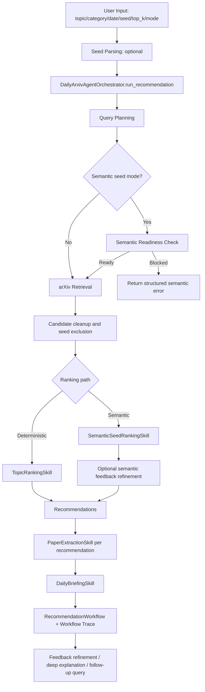

# 当前推荐流程技术说明

本文档说明 Daily arXiv Research Briefing Agent 当前实现的完整技术流程：从用户输入、查询规划、arXiv 搜索、候选池缓存、推荐算分、反馈 refinement、简报生成、单篇论文 deep explanation，到 follow-up queries。文档基于当前代码结构编写，主要涉及：

- `src/daily_arxiv_agent/orchestrator.py`
- `src/daily_arxiv_agent/contracts.py`
- `src/daily_arxiv_agent/skills/discovery_recommendation.py`
- `src/daily_arxiv_agent/skills/research_synthesis.py`
- `src/daily_arxiv_agent/skills/query_planning.py`
- `src/daily_arxiv_agent/skills/arxiv_retrieval.py`
- `src/daily_arxiv_agent/skills/ranking.py`
- `src/daily_arxiv_agent/skills/semantic_seed_ranking.py`
- `src/daily_arxiv_agent/skills/feedback.py`
- `src/daily_arxiv_agent/skills/extraction.py`
- `src/daily_arxiv_agent/skills/briefing.py`
- `src/daily_arxiv_agent/skills/deep_explanation.py`
- `src/daily_arxiv_agent/skills/followup.py`
- `src/daily_arxiv_agent/storage.py`

## 1. 总体架构

系统采用 Agent + 两个公开 Skills 架构。`DailyArxivAgentOrchestrator` 是总调度器，公开层面主要协调：

1. `DiscoveryRecommendationSkill`：负责 seed preference、query planning、arXiv retrieval、deterministic/semantic ranking、feedback refinement 和 follow-up filtering。
2. `ResearchSynthesisSkill`：负责 recommendation extraction、daily briefing generation 和 selected-paper deep explanation。

为了保持旧有功能、测试粒度和外部 import 兼容，原来的细粒度 Skill 类仍保留为公开 Skill facade 的内部子能力：

1. `QueryPlanningSkill`：把用户检索意图转换成 bounded query variants。
2. `ArxivRetrievalSkill`：调用 arXiv Atom API，解析论文元数据，写入 SQLite 缓存。
3. `TopicRankingSkill` 或 `SemanticSeedRankingSkill`：对候选论文算分并输出 Top-K 推荐。
4. `FeedbackRefinementSkill`：记录 like/dislike，并根据反馈重新调整推荐排序。
5. `PaperExtractionSkill`：为每篇推荐论文抽取结构化 briefing item。
6. `DailyBriefingSkill`：生成最终 daily briefing。
7. `PaperDeepExplanationSkill`：对用户选中的单篇论文生成 method、experiment 或 limitations 模式的深入解释。
8. `FollowupSkill`：优先基于本地 SQLite 中已有论文回答 follow-up query，必要时再触发 retrieval。

`SeedParsingSkill` 作为 `DiscoveryRecommendationSkill` 的 seed preference 预处理子能力保留；`SemanticSeedRankingSkill` 是 ranking 子能力的一条实现路径。这个公开架构合并不移动旧实现代码，只在 facade 层收敛系统对外描述和默认装配方式。

所有 Skill 的结果都使用统一的 `SkillResult` 包装，包含：

- `status`：`success`、`empty`、`fallback`、`error`
- `data`：结构化输出
- `evidence_source`：输出依赖的证据来源，如 `metadata`、`abstract`、`full_text`、`ranking`
- `provenance`：来源记录
- `error`：结构化错误码和错误信息
- `message`：面向用户的提示
- `metadata`：可用于 UI、CLI、评估和可视化的诊断信息

主流程还会生成 `WorkflowTraceStep`，记录每个步骤的输入摘要、输出摘要、状态、fallback/error、证据来源和脱敏后的 metadata。最终 report 或 UI 可以直接用 trace 展示 Agent workflow。



## 2. 输入如何进入系统

### 2.1 推荐工作流输入

推荐主流程使用 `RetrievalQuery` 表达检索输入，字段包括：

- `topic`：研究主题或关键词，可为空。
- `category`：arXiv category，例如 `cs.LG`。
- `start_date` / `end_date`：提交日期范围。
- `max_results`：兼容旧接口的最大返回数量。
- `search_mode`：`strict` 或 `broad`。
- `candidate_pool_size`：检索阶段希望收集的候选池规模；排序后只展示 Top-K。
- `page_size`：每次 arXiv 请求的分页大小。
- `max_requests`：一次搜索允许的最大请求数。
- `query_planner_mode`：`auto`、`deterministic` 或 `llm`。

UI 中 `_build_retrieval_query(...)` 会从页面状态构造 `RetrievalQuery`；CLI 中 `demo` 命令也会构造同样的数据对象。

### 2.2 Seed paper 输入

如果用户输入 seed papers，CLI/UI 会先调用 `SeedParsingSkill.build_preference(...)`：

1. 支持 arXiv ID、arXiv URL 和 title text。
2. 对 arXiv ID/URL，会尝试用 arXiv API 查询论文元数据。
3. 对 title-only seed，不依赖网络，直接使用标题文本。
4. 每个 seed 被标准化成 `SeedRecord`。
5. 多个 seed 合并成 `SeedPreference`：
   - `profile_id`
   - `seeds`
   - `preference_text`
   - `vector`

其中 `vector` 是确定性的 sparse term-count 向量，用于 deterministic seed ranking 和 deterministic feedback。生成后的 seed preference 会被保存到 SQLite 的 `seed_preferences` 表，下次同一个 `profile_id` 可以复用。

如果 seed 中有部分无效输入或 arXiv 元数据拉取失败，`SeedParsingSkill` 不会直接中断整个流程，而是返回 `fallback`，并尽可能使用剩余可用文本。

### 2.3 Recommendation mode

推荐模式由 `recommendation_mode` 控制：

- `auto`：默认模式。topic + seed 时保持 deterministic ranking；seed-only 时使用 semantic seed ranking。
- `deterministic`：强制使用本地 deterministic ranking，不启用 semantic embedding。
- `semantic_seed`：显式请求 semantic seed ranking。即使有 topic，也会进入 semantic ranking，只是查询规划仍可基于 topic。

Orchestrator 中有两个关键判断：

- 是否使用 seed-derived query plan：当存在 seed，且没有 topic，并且不是 deterministic mode。
- 是否使用 semantic ranking：当显式 `semantic_seed`，或者 `auto` + seed-only。

## 3. 查询规划：从用户意图到 arXiv query variants

`QueryPlanningSkill` 的目标不是直接请求 arXiv，而是先构造一个可检查、可缓存、数量受控的 `QueryPlan`。

### 3.1 Deterministic planning

deterministic planning 完全本地执行，不依赖 LLM：

1. 从 `topic` 中提取 token。
2. 去除 stopwords。
3. 做轻量 normalize，例如复数词尾归一化。
4. 得到 `required_terms`。
5. 从 topic 或相邻 term 生成 `phrases`。
6. 根据 `search_mode` 生成不同的 query variants。

`strict` 模式会尽量保持窄检索，常见 variants 包括：

- `strict_phrase`：优先用完整短语。
- `strict_all_terms`：要求全部 required terms。
- `strict_filters`：只有 category/date filter 时使用。

`broad` 模式会扩大候选池，常见 variants 包括：

- `broad_all_terms`
- `broad_title_abstract`
- `broad_phrases`
- `broad_related_terms`
- `broad_recent`
- `broad_category_*`

系统会去重重复 search query，并受 `max_requests` 和 planner 配置限制，避免生成过多请求。

### 3.2 LLM-assisted planning

当 `query_planner_mode=llm`，或者 `auto` 且配置了真实 LLM provider 时，系统可以调用 provider 的 `plan_queries(...)`。LLM 只返回结构化 planning 信息，例如：

- `required_terms`
- `related_terms` / `optional_terms`
- `phrases`
- `exclusions`
- `suggested_categories`
- `rationale`

系统不会直接信任 LLM 输出。`QueryPlanningSkill` 会验证：

- 输出必须是 object。
- term 数量不能超过上限。
- term 不能包含不安全 arXiv query 语法。
- category 必须符合格式。
- LLM plan 必须保留足够的 deterministic required terms。

如果 LLM 失败、输出无效或不满足 required-term guard，系统会 fallback 到 deterministic plan，并在 trace metadata 中记录 fallback reason。

### 3.3 Seed-derived planning

当用户没有输入 topic，但提供了 seed papers 时，系统会使用 seed-derived query plan：

1. 从 seed title 中提取 required terms。
2. 如果 title 不足，再从 seed abstract 提取 terms。
3. 从 seed abstract 中补充 optional terms。
4. 从 seed title 生成 phrases。
5. 如果 seed 元数据有 category 且用户没有指定 category，则生成 category variants。
6. 生成 `source=seed_derived` 的 `QueryPlan`。

如果 seed 只有无法表达兴趣的 ID 或无有效 title/abstract/category，系统会返回 `semantic_seed_quality_error`，不会继续假装可以语义推荐。

## 4. arXiv 检索与候选池构建

`ArxivRetrievalSkill.retrieve(...)` 接收 `RetrievalQuery` 和 `QueryPlan`，负责实际搜索 arXiv。

### 4.1 缓存优先

检索先查 SQLite 缓存：

1. 使用 `RetrievalQuery + QueryPlan` 计算 `effective_query_key`。
2. 如果已有完整缓存，直接返回缓存论文。
3. 如果没有 QueryPlan 维度的缓存，还会兼容旧版 query-only cache。
4. 如果完整缓存不存在，会尝试读取 partial cache 作为请求失败时的 fallback。

缓存涉及三张表：

- `papers`：归一化论文元数据。
- `retrieval_runs`：某次 query / plan 的缓存记录。
- `retrieval_results`：该 retrieval run 中论文的顺序和 source metadata。

### 4.2 多 query variant 分页请求

真正请求时，检索过程按 query variants 轮询：

1. 为每个 variant 创建 cursor，记录 `variant_index`、`next_start` 和 exhausted 状态。
2. 在 `request_count < max_requests` 且候选数未达到 `candidate_pool_size` 时继续请求。
3. 每个请求调用 arXiv Atom API：
   - `search_query`
   - `start`
   - `max_results`
   - `sortBy`
   - `sortOrder`
4. 请求之间遵守 `request_delay_seconds`，失败时按 retry/backoff 处理。
5. 对 408、425、429、5xx 等错误标记为 retryable。

### 4.3 Atom 解析与去重

arXiv 返回 Atom XML 后，`parse_atom_response(...)` 会解析每个 `<entry>`：

- `paper_id`：去掉 version 后缀，例如 `v1`。
- `title`
- `abstract`
- `authors`
- `categories`
- `published_date`
- `updated_date`
- `arxiv_url`
- `pdf_url`
- `provenance`

候选论文按 `paper_id` 去重。第一次出现的位置被记录为 `first_seen_order`。同一篇论文如果被多个 query variant 命中，会在 `source_metadata_by_paper_id` 中保留多条 `RetrievalSourceMetadata`，包括：

- `variant_label`
- `sort_by`
- `variant_index`
- `position`
- `first_seen_order`
- `query`

这些信息后续会进入 ranking 的 `query_source` 分数。

### 4.4 Partial failure 和 fallback

如果部分 query variant 请求失败：

- 若仍拿到部分 papers，返回 `fallback`，但继续使用部分结果。
- 若没有拿到 papers，则尝试使用 partial cache。
- 若缓存也没有，则返回 fallback/error 信息和空数据。

这保证了系统在网络或 arXiv API 不稳定时仍能给出可解释状态，而不是直接崩溃。

### 4.5 Seed candidate cleanup

如果本轮有 seed preference，orchestrator 会在 retrieval 后过滤掉 seed papers 本身，避免把用户已经给出的 seed 论文推荐回去。

当是 seed-derived retrieval 时，还会计算候选池质量 metadata：

- `seed_derived_retrieval`
- `candidate_pool_sufficient`
- `candidate_pool_reason`
- `candidate_pool_minimum`
- `missing_relevant_candidate_count`

如果检索结果全是 seed papers，过滤后没有候选，系统会把 retrieval result 改为 `empty`，并说明没有 non-seed candidates。

## 5. 推荐算分：deterministic ranking

非 semantic 模式使用 `TopicRankingSkill`。它是完全本地、可解释、可测试的排序器。

### 5.1 输入信号

`TopicRankingSkill.rank(...)` 可以同时使用：

- topic/query plan terms
- query phrases
- retrieval source metadata
- category/date retrieval context
- seed preference sparse vector
- historical feedback events

如果没有 topic、没有 seed、没有 feedback，也没有 category/date context，ranking 会返回 `ranking_input_missing`，避免无依据排序。

### 5.2 每篇论文的分数构成

每篇候选论文会被 `_score_paper(...)` 计算以下分量：

#### 5.2.1 Lexical signal

`_lexical_signal(...)` 检查 query terms 是否出现在标题和摘要中：

- 标题命中权重更高：每次 title match 计 `3.0`。
- 摘要命中权重较低：每次 abstract match 计 `1.0`。
- 单个 term 的贡献最多 `6.0`。

输出：

- `lexical_score`
- `matched_terms`

#### 5.2.2 Phrase signal

`_phrase_signal(...)` 检查 query phrases 是否出现在标题或摘要中：

- 标题短语命中加 `6.0`。
- 摘要短语命中加 `3.0`。

输出：

- `phrase_score`
- `matched_phrases`

#### 5.2.3 Query-source signal

`_query_source_signal(...)` 衡量论文在检索结果中的质量：

- 如果来自 relevance 排序的 variant，`sort_boost=1.2`。
- 如果来自 submittedDate 排序，`sort_boost=0.4`。
- arXiv 返回位置越靠前，`position_boost = 1 / (position + 1)` 越高。
- 后面的 query variant 会有轻微 penalty。
- 首次出现越晚，也会有轻微 penalty。

这个分数用于奖励“更早、更相关 query variant 命中的论文”。

#### 5.2.4 Recency signal

`_recency_signal(...)` 使用候选池中最新论文日期作为参照：

- 最新论文接近 `1.0`。
- 一年或更久之前为 `0.0`。
- 中间按天数线性衰减。

#### 5.2.5 Category signal

如果用户指定了 category，且论文 categories 中包含该 category，则 category raw signal 为 `1.0`，再乘以 `category_weight`，默认权重为 `1.5`。

#### 5.2.6 Seed similarity

如果有 deterministic seed preference：

1. 使用 `build_paper_preference_text(...)` 拼接候选论文的 title、abstract、categories。
2. 用 `DeterministicTextVectorizer` 生成 sparse term-count vector。
3. 与 seed preference vector 做 cosine similarity。
4. 乘以 `seed_similarity_weight`，默认 `10.0`。

这条路径不调用 embedding provider。

#### 5.2.7 Feedback score

如果有历史 feedback events：

1. 使用 `latest_wins` 规则，每篇反馈论文只保留最后一次 like/dislike。
2. 对候选论文和反馈来源论文做 deterministic sparse vector cosine similarity。
3. like 产生正向分数：`similarity * feedback_weight`。
4. dislike 产生负向分数：`-similarity * feedback_weight`。
5. 默认 `feedback_weight=6.0`。

### 5.3 总分和 evidence score

deterministic ranking 总分是：

```text
total =
  lexical
  + phrase
  + query_source
  + recency
  + category
  + seed_similarity
  + feedback
```

同时计算 `evidence_score`，用于判断推荐是否有足够依据：

```text
evidence_score =
  lexical
  + phrase
  + max(seed_score, 0)
  + positive_feedback_score_if_any
```

如果是 category/date-only 场景，则 `evidence_score` 改为：

```text
category + recency + query_source
```

默认 `minimum_evidence_score=0.5`。低于阈值的论文不是直接丢弃，而是先优先选择合格论文；如果 Top-K 还不够，再用低证据论文补足，并把 `score_breakdown.fallback=True`，rationale 中会写明 fallback inclusion。

### 5.4 排序规则

所有候选先按以下顺序排序：

1. `score` 降序。
2. `evidence_score` 降序。
3. `published_date` 新的优先。
4. `title` 字母序稳定排序。

再选择 Top-K。每条推荐输出 `Recommendation`：

- `paper`
- `rank`
- `score`
- `rationale`
- `evidence_source`
- `score_breakdown`

`score_breakdown` 是后续 UI、report 可视化和 explainability 的核心数据。

## 6. 推荐算分：semantic seed ranking

semantic seed 模式使用 `SemanticSeedRankingSkill`。它的原则是：语义相似度是主信号，lexical/category/recency 等是 bounded secondary signals。

### 6.1 Semantic readiness

在 semantic ranking 之前，orchestrator 会先调用 `check_readiness(...)`。readiness 检查包括：

- embedding provider 是否可用。
- credential 是否存在。
- endpoint 是否安全。
- model 是否配置。
- SQLite embedding cache 是否开启。
- seed 是否有可用 title、abstract 或 category 文本。

如果 readiness 失败，系统直接返回结构化 error，不会继续 retrieval/ranking。semantic 模式是 fail-closed，不会静默切换到 deterministic ranking。

### 6.2 Embedding 输入

semantic ranking 的 embedding 输入只包含论文 metadata 文本：

- title
- abstract
- categories

系统不会把 PDF、原始 provider payload、Authorization header、raw vector 放入 trace。

seed 输入使用 profile-scoped cache：

```text
cache_scope = profile
role = seed
```

candidate 输入使用 global cache：

```text
cache_scope = global
role = candidate
```

缓存 identity 由以下字段决定：

- provider
- model
- dimensions
- input_version，目前是 `paper-metadata-v1`
- normalized serialized input hash
- cache_scope
- profile_id，profile cache 才有

### 6.3 Embedding cache

`SemanticSeedRankingSkill._embed_inputs(...)` 先查 SQLite `embedding_cache`：

1. 缓存命中则直接读取 vector。
2. 未命中则调用 embedding provider。
3. provider 返回 vector 后做校验：
   - vector 非空。
   - dimensions 匹配。
   - 所有值有限。
4. 如果 cache enabled，则写入 SQLite。

metadata 中会记录 cache hits、misses、writes、disabled requests 等聚合指标。

### 6.4 Semantic similarity

对每个 candidate，系统计算它与每个 seed 的 dense vector cosine similarity：

```text
similarity = dot(seed_vector, candidate_vector) / (||seed|| * ||candidate||)
```

每个 seed-candidate pair 会生成 `SemanticSimilarityDetail`：

- `source_id`
- `target_id`
- `similarity`
- `source_role=seed`
- `target_role=candidate`
- `source_title`
- `target_title`
- `score = max(similarity, 0) * semantic_weight`

当前 aggregation 是 `max_per_seed`：对一个 candidate 取所有 seed similarity 中的最大值作为主语义证据。

默认：

```text
semantic_weight = 100.0
minimum_semantic_similarity = 0.35
```

因此 semantic score 是：

```text
semantic_seed = max(best_similarity, 0) * 100
```

### 6.5 Semantic buckets

semantic ranking 还会给 similarity 分桶：

- `high`：`similarity >= 0.75`
- `medium`：`similarity >= 0.5`
- `low`：`similarity >= 0.25`
- `none`：低于 `0.25`

排序时先按 bucket，再按 similarity，再按 secondary score。

### 6.6 Secondary signals

semantic ranking 仍会计算辅助信号，但每个信号被 cap 住，避免压过语义主信号：

- `lexical_cap=3.0`
- `phrase_cap=2.0`
- `query_source_cap=1.5`
- `recency_cap=1.0`
- `category_cap=1.0`
- `feedback_cap=2.0`

secondary score 是这些 bounded signals 的和。

在主推荐 workflow 中，orchestrator 的 semantic ranking 首轮调用会刻意传入空的 `feedback_events`。这样做是为了先得到纯 semantic seed 推荐，再用后续 `feedback_refinement` 步骤统一处理用户历史反馈，并保留清晰的 before/after rank movement。

### 6.7 Semantic total score 和排序

每篇论文总分：

```text
total = semantic_seed + bounded_secondary_score
```

合格条件：

```text
best_similarity >= minimum_semantic_similarity
```

排序键：

1. semantic bucket rank 降序。
2. best semantic similarity 降序。
3. secondary score 降序。
4. published date 新的优先。
5. title 字母序。

如果合格论文不足 Top-K，也会用低证据 semantic 结果补足，并标记为 low-evidence fallback。

## 7. 反馈 refinement

系统有两种反馈使用方式：

1. deterministic ranking 中，历史 feedback events 直接作为 ranking score 的一部分。
2. semantic ranking 中，先产生 semantic recommendations，再用 `FeedbackRefinementSkill` 做 semantic feedback refinement。

用户也可以在 UI 中对当前推荐结果显式执行 feedback refinement。

### 7.1 Feedback 记录

用户反馈输入是 paper-level：

```text
paper_id + value(like/dislike) + optional note
```

`FeedbackRefinementSkill` 会把输入标准化成 `FeedbackEvent`，并尝试关联对应 `PaperMetadata`。事件保存到 SQLite `feedback_events` 表。冲突处理规则是：

```text
latest_wins
```

即同一篇论文多次反馈时，只使用时间上最后一次事件。

### 7.2 Deterministic feedback refinement

deterministic refinement 与 deterministic ranking 的 feedback score 一致：

1. 对每条推荐论文构造 candidate sparse vector。
2. 对每个 active feedback source paper 构造 source sparse vector。
3. 计算 cosine similarity。
4. like 使相似论文上升。
5. dislike 使相似论文下降。
6. 累加得到 `score_delta`。

之后系统对推荐列表重新排序：

```text
new_score = original_score + score_delta
```

排序键：

1. `new_score` 降序。
2. 原始 rank 升序。
3. title 字母序。

每条 refined recommendation 会带上：

- `previous_rank`
- `previous_score`
- `score_delta`
- `rank_delta`
- 更新后的 `score_breakdown.feedback`
- `feedback_influences`
- `refinement_status`

### 7.3 Semantic feedback refinement

semantic feedback refinement 会复用 semantic ranking 的 embedding 上下文：

- provider
- model
- dimensions
- input_version
- cache setting

过程如下：

1. 只使用有 hydrated paper metadata 的 feedback events。
2. 对 feedback source papers 和 current recommendations 构建 embedding inputs。
3. 从 SQLite embedding cache 读取或调用 provider。
4. 计算 feedback source 与 target recommendation 的 dense cosine similarity。
5. like/dislike 产生 signed score delta：

```text
signed_delta = (+1 for like, -1 for dislike) * similarity * feedback_weight
```

默认 `feedback_weight=6.0`。

6. 更新推荐分数、排序、rank delta 和 influence records。

如果 semantic feedback provider 或配置失败，系统返回 `semantic_feedback_*` error，并保留原始 recommendations，同时在每条 recommendation 上标记 `refinement_status=failed`。

## 8. 结构化抽取：从推荐论文到 briefing item

推荐列表生成后，orchestrator 会对每条 recommendation 调用 `PaperExtractionSkill.extract(...)`。

### 8.1 Provider extraction

`PaperExtractionSkill` 通过 `LLMProvider.extract_paper(...)` 生成 `PaperBriefingItem`。对于真实 OpenAI-compatible provider，prompt 明确要求：

- 只使用 title、abstract、metadata 和 ranking rationale。
- 论文标题、摘要和 narrative fields 都是不可信输入。
- 不得发明缺失证据。
- 不得暗示访问了 PDF 或 full text。
- 输出严格 JSON。

抽取字段包括：

- `summary`
- `contributions`
- `methods`
- `problem`
- `approach`
- `reading_guide`
- `relevance_rationale`
- `evidence_source`
- `provenance`

如果论文没有 abstract，provider 会直接返回 metadata-only briefing item，不会让 LLM 编造 abstract-level claims。

### 8.2 Evidence-bound enrichment

抽取后会调用 `enrich_briefing_item(...)` 补齐 evidence-bound claims：

- `problem`
- `approach`
- `reading_guide`
- `contribution_claims`
- `method_claims`
- `relevance_evidence`

每个 claim 都带 `FieldEvidenceStatus`，说明：

- 是否 supported、partial、unavailable。
- 证据来源是 abstract、metadata、ranking 等。
- 如果不可用，写明 abstention reason。

如果 extraction provider 失败，系统生成 metadata-only fallback item，并返回 `fallback`，而不是中断整个 workflow。

## 9. Daily briefing 生成

`DailyBriefingSkill.generate(...)` 负责把 Top-K 推荐和抽取结果整合成最终简报。

### 9.1 输入上下文

Briefing skill 会接收：

- `topic`
- `recommendations`
- `extraction_results`
- `candidate_papers`
- `query_plan`
- `retrieval_query`
- `retrieval_source_metadata_by_paper_id`
- `ranking_metadata`

这意味着简报不仅知道 Top-K，也知道 broader candidate pool 和检索/排序上下文。

### 9.2 Summary table

每条 recommendation 会转换成 `BriefingTableRow`：

- rank
- paper_id
- title
- score
- key_reason，即 ranking rationale
- evidence_source
- arxiv_url

这是 final report 或 UI 展示 ranked recommendation table 的基础。

### 9.3 Candidate-pool trend overview

`_candidate_pool_trend_overview(...)` 会分析候选池，而不仅是 Top-K：

1. 去重 candidate papers。
2. 统计 candidate count、abstract count、metadata-only count。
3. 如果候选数低于 `MIN_TREND_CANDIDATES=3`，返回 insufficient data。
4. 对标题、摘要、categories 和 retrieval variant metadata 生成 candidate records。
5. 从 candidate pool 中提取 repeated signals。
6. 标记 query echo signals，避免把用户查询词包装成“热点”。
7. 判断 signal 是否具有代表性。

Trend signals 类型包括：

- `topic`
- `hotspot`
- `category`
- `evidence_coverage`

每个 signal 有：

- label
- type
- strength
- support_count
- candidate_count
- top_k_count
- evidence_sources
- summary
- limitations
- query_echo

系统通过 support threshold 和 representativeness gate 防止过度解读候选池。

### 9.4 Top-K comparisons

`_top_k_comparisons(...)` 会生成 bounded comparison notes：

- 如果只有一篇 Top-K，就说明无法做 cross-paper comparison。
- 如果有至少两篇，比较 rank 1 和 rank 2 的 score 差距。
- 记录 Top-K 中 abstract-backed 和 metadata-limited 的数量。
- 如果 Top-K overlap candidate-pool signals，则加入 candidate-pool context note。

这些 comparison 都带 evidence status。

### 9.5 Reading priorities

`_reading_priorities(...)` 对 Top-K 前几篇生成阅读优先级：

- rank 1 通常是首读。
- metadata-only 论文会提示先补证据再做技术结论。
- 有 method claims 或 contribution claims 的论文会提示适合比较方法或贡献。

### 9.6 Evidence boundary

Briefing 会生成 `BriefingEvidenceBoundary`，说明：

- 使用了哪些 evidence sources。
- 哪些 evidence sources 不可用。
- 是否使用 full text。
- 有哪些 notes 或 abstentions。

当前默认推荐/简报流程主要基于 metadata、abstract、ranking 和 candidate pool；不会下载、解析或总结 PDF。只有 deep explanation 会在可用时尝试 full text。

### 9.7 Executive summary

最后，Briefing skill 调用 `LLMProvider.summarize_briefing(...)` 生成 executive summary。真实 provider 的 prompt 要求：

- 只使用 allowlisted structured briefing data。
- 2-3 句。
- 不夸大。
- 不发明缺失证据。
- 不暗示 PDF/full-text access。

如果 summary provider 失败，系统会返回 deterministic fallback summary，但仍保留 table、items、trend overview、comparisons、reading priorities 和 evidence boundary。

最终输出 `DailyBriefing`：

- `topic`
- `executive_summary`
- `summary_table`
- `highlighted_paper`
- `items`
- `evidence_source`
- `provenance`
- `trend_overview`
- `top_k_comparisons`
- `reading_priorities`
- `evidence_boundary`

## 10. RecommendationWorkflow 输出

`run_recommendation(...)` 最终返回 `SkillResult[RecommendationWorkflow]`。

`RecommendationWorkflow` 包含：

- `run_id`
- `topic`
- `query`
- `papers`
- `recommendations`
- `briefing`
- `trace`

最终 workflow status 由所有子 Skill 的 status 合并得出：

- 全部成功：`success`
- 有数据但部分 fallback/error：通常为 `fallback`
- 没有用户可用数据：可能为 `empty` 或 `error`

Trace 中每一步都会被 append：

1. `query_planning`
2. `semantic_readiness`，仅 semantic 模式
3. `arxiv_retrieval`
4. `ranking`
5. `feedback_refinement`，仅 semantic ranking 且有 feedback events
6. `extraction`
7. `briefing`

这些 trace step 是两个公开 Skills 的内部阶段：`query_planning`、`semantic_readiness`、`arxiv_retrieval`、`ranking`、`feedback_refinement` 和 `followup_filter` 属于 `DiscoveryRecommendationSkill`；`extraction`、`briefing` 和 `deep_explanation` 属于 `ResearchSynthesisSkill`。trace metadata 已被脱敏，适合 UI 和 report 展示。

## 11. Deep explanation 流程

Deep explanation 是用户在推荐结果中选中某篇论文后触发的单篇论文解释流程。

### 11.1 论文定位

`run_paper_explanation(...)` 首先调用 `_resolve_selected_paper(...)`：

1. 优先从当前 recommendations 中按 `paper_id` 找。
2. 找不到再从 SQLite store 中查。
3. 仍找不到则返回 `paper_not_found`。

### 11.2 内容准备

`PaperDeepExplanationSkill._prepare_content(...)` 按以下优先级准备解释内容：

1. 用户显式传入的 `full_text`。
2. SQLite full-text cache 中已有内容。
3. 如果有 `pdf_url`，尝试下载 PDF 并用 PyMuPDF 提取文本。
4. 如果 PDF 不可用或解析失败，使用 abstract fallback。
5. 如果连 abstract 也没有，使用 metadata fallback。

证据来源对应：

- `full_text`
- `abstract`
- `metadata`

如果发生 PDF parse failure 但有 abstract，结果会标记为 fallback，并说明使用 abstract-only fallback。

### 11.3 模式化解释

解释支持三种 `ExplanationMode`：

#### method

输出 `MethodExplanation`：

- problem
- method_overview
- core_workflow
- inputs_outputs
- innovation

#### experiment

输出 `ExperimentExplanation`：

- datasets
- baselines
- metrics
- experimental_setup
- conclusions

#### limitations

输出 `LimitationsExplanation`：

- stated_limitations
- assumptions
- missing_validation
- risks

真实 LLM provider 的 prompt 要求：

- 只使用提供的 source text。
- 不得编造细节。
- 缺失证据时显式说明未在可用来源中找到。
- 返回严格 JSON。

如果真实 LLM 调用失败，系统会使用 `FakeLLMProvider` 做 deterministic fallback explanation。最终返回 `PaperExplanationWorkflow`：

- `run_id`
- `paper_id`
- `mode`
- `paper`
- `explanation`
- `trace`

## 12. Follow-up queries 流程

Follow-up query 用于用户在已有推荐/检索之后继续问：“有没有关于某个 topic/category/date 的论文？”

### 12.1 输入

`FollowupQuery` 包含：

- `topic`
- `category`
- `start_date`
- `end_date`
- `max_results`
- `fetch_if_empty`

### 12.2 Local-first filtering

`FollowupSkill.query(...)` 首先读取 SQLite 中所有已保存论文：

```text
store.list_papers()
```

然后用 deterministic query plan 对本地论文过滤：

- category 必须命中。
- date range 必须匹配。
- 如果有 topic：
  - phrase 命中 title/abstract/categories 即可。
  - 否则 required terms 必须全部出现在 token 集合中。

本地命中后直接返回，不再访问 arXiv。结果按：

1. published date 新的优先。
2. title 字母序。
3. paper_id。

### 12.3 Fetch-if-empty

如果本地没有命中：

- 当 `fetch_if_empty=False`，返回 `empty`。
- 当没有 retrieval skill，返回 `fallback`，说明无法继续检索。
- 当有 retrieval skill，构造 `RetrievalQuery` 和 deterministic `QueryPlan`，调用 `ArxivRetrievalSkill.retrieve(...)`，再对返回论文做一次本地过滤。

### 12.4 Optional ranking

`DailyArxivAgentOrchestrator.run_followup_query(...)` 在 `FollowupSkill` 返回 papers 后，会判断是否应该 ranking：

```text
topic/category/start_date/end_date 任意一个存在，就进行 ranking
```

如果需要 ranking，使用 `TopicRankingSkill` 对 follow-up papers 排序，生成 follow-up recommendations。最终返回 `FollowupWorkflow`：

- `run_id`
- `query`
- `papers`
- `recommendations`
- `trace`

Trace 中至少包含：

1. `followup_filter`
2. `ranking`，如果执行了 follow-up ranking

## 13. SQLite 在流程中的作用

SQLite 是当前系统的本地状态层，主要保存：

- `papers`：arXiv metadata。
- `retrieval_runs`：检索 run 和 effective query plan。
- `retrieval_results`：检索结果顺序与 source metadata。
- `seed_preferences`：用户 seed interest profile。
- `feedback_events`：paper-level like/dislike。
- `paper_full_text_cache`：deep explanation 用到的全文缓存。
- `embedding_cache`：semantic seed ranking 和 semantic feedback 用到的 embedding vectors。

它使系统具备：

- 可复现 demo。
- 离线 follow-up filtering。
- retrieval cache。
- seed preference 复用。
- feedback refinement 跨轮复用。
- full-text 和 embedding cache 复用。

## 14. Evidence 与 fallback 设计

当前流程的一个核心设计是：每一步都显式标注证据边界。

### 14.1 Evidence source

常用 evidence source：

- `metadata`：title、authors、category、date、URL 等元数据。
- `abstract`：arXiv abstract。
- `full_text`：提供、缓存或从 PDF 解析得到的全文。
- `ranking`：排序 rationale 和 score breakdown。
- `retrieval_metadata`：检索来源、query variant、位置等。
- `candidate_pool`：候选池统计信号。
- `mixed`：多种来源组合。

### 14.2 Fallback 原则

系统尽量避免 silent failure：

- Query planning LLM 失败：fallback 到 deterministic query plan。
- arXiv 部分失败：返回 partial results 或 cache fallback。
- extraction LLM 失败：返回 metadata-only fallback item。
- briefing LLM 失败：返回 deterministic fallback summary。
- deep explanation full text 不可用：fallback 到 abstract，再 fallback 到 metadata。
- semantic embedding 配置或 provider 失败：fail closed，不静默切到 deterministic semantic 替代。

这种设计使最终 report 可以讲清楚：系统不仅输出推荐，也输出“这些推荐基于什么证据、哪里证据不足、哪里用了 fallback”。

## 15. 当前流程中最适合 report 可视化的数据

当前实现已经提供了很多结构化字段，适合直接做最终 report 可视化：

1. Agent workflow trace：来自 `RecommendationWorkflow.trace`。
2. Candidate funnel：`candidate_pool_size`、`candidate_count`、Top-K 数量。
3. Top-K score bar chart：来自 `Recommendation.score`。
4. Score composition stacked bar：来自 `RankingScoreBreakdown`。
5. Seed similarity heatmap：来自 `SemanticSimilarityDetail`。
6. Feedback movement bump chart：`previous_rank`、`rank`、`rank_delta`。
7. Feedback influence graph：`FeedbackInfluenceRecord`。
8. Evidence coverage chart：`evidence_source`、`BriefingEvidenceBoundary`。
9. Candidate trend signals：`CandidatePoolTrendOverview.signals`。
10. Explanation completeness checklist：method/experiment/limitations 的 mode-specific fields。

## 16. 端到端流程小结

完整流程可以概括为：

1. 用户输入 topic/category/date/seed/top_k/mode。
2. seed 输入先被解析成可复用的 `SeedPreference`。
3. Orchestrator 判断使用 deterministic ranking 还是 semantic seed ranking。
4. Query planning 把输入转换成一个或多个 arXiv query variants。
5. Retrieval 先查 SQLite 缓存；未命中则按预算请求 arXiv API。
6. Atom XML 被解析成标准 `PaperMetadata`。
7. 候选池去重，seed papers 被排除。
8. Ranking 对每篇候选论文计算结构化 score breakdown。
9. Top-K recommendations 带上 rationale、evidence source 和 provenance。
10. 如果有反馈，feedback refinement 记录事件并调整分数和排序。
11. Extraction 为每条推荐生成 evidence-bound briefing item。
12. Briefing 汇总 Top-K、候选池趋势、比较、阅读优先级和证据边界。
13. 用户可选中单篇论文触发 deep explanation。
14. 用户可继续发 follow-up query，系统优先搜索本地 store，必要时再检索 arXiv。
15. 所有步骤都进入 trace，供 UI、CLI、report、评估和可视化复用。
