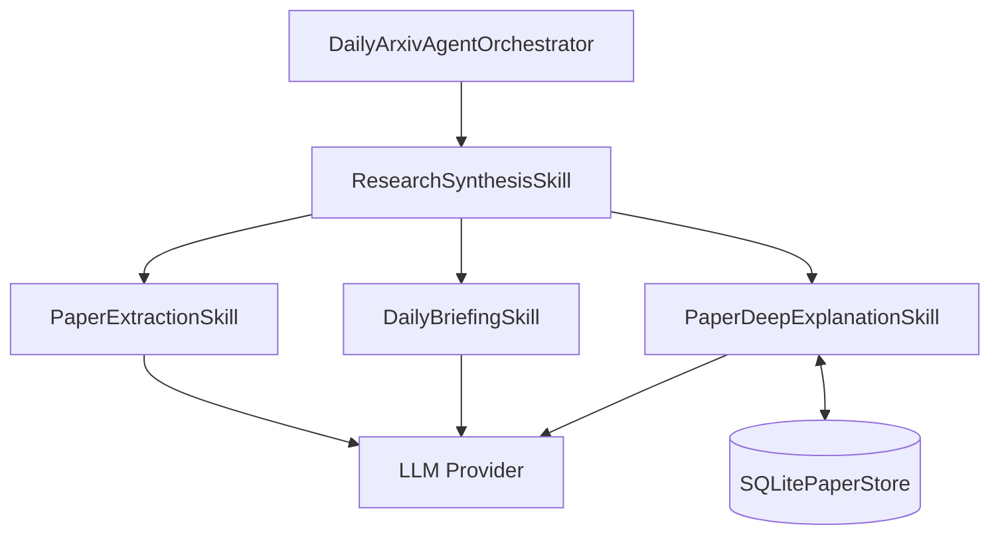
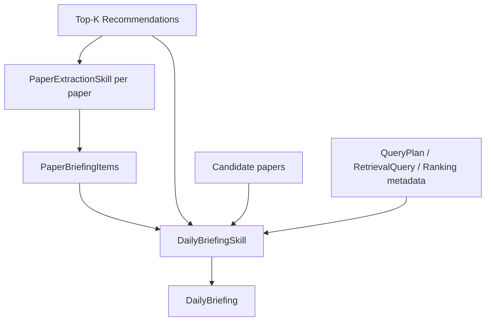
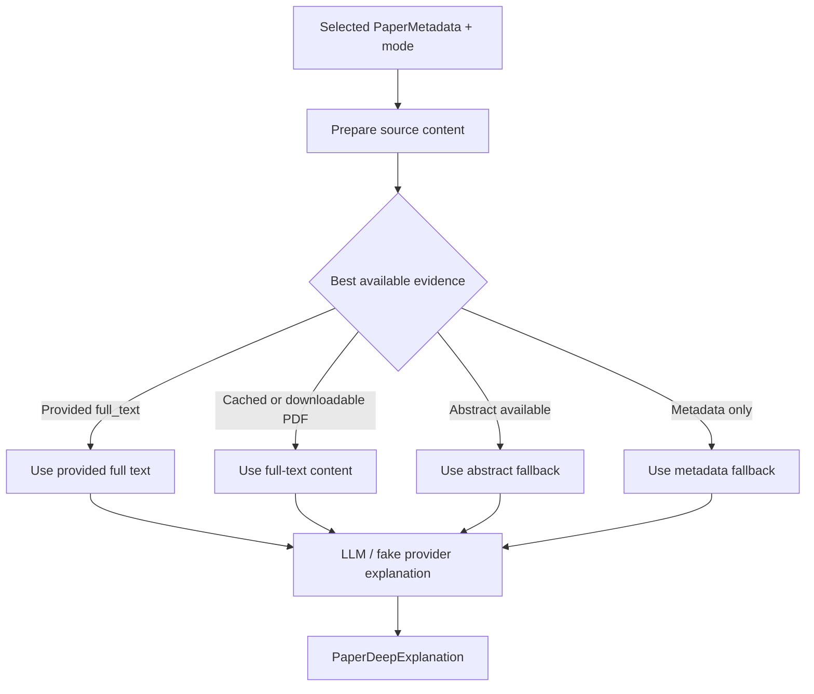

# ResearchSynthesisSkill 详解

`ResearchSynthesisSkill` 是当前架构中的公开生成侧 Skill。它不负责检索和排序论文，而是负责把已经选出的推荐论文转成可阅读、可展示、证据边界清晰的研究输出。

代码位置：

- `src/daily_arxiv_agent/skills/research_synthesis.py`

## 1. 它解决什么问题

推荐列表本身只告诉用户“哪些论文排在前面”。但 daily research briefing 还需要回答：

- 每篇论文大概讲什么？
- 它为什么和用户兴趣相关？
- 哪些结论有 abstract 支持，哪些只是 metadata/ranking 支持？
- Top-K 论文之间有什么阅读优先级？
- 用户选中某篇论文后，能否进一步解释 method、experiment 或 limitations？

`ResearchSynthesisSkill` 的职责就是把推荐结果转成研究阅读材料。

它回答的是：

> “这些推荐论文应该如何被理解、比较和阅读？”

## 2. 它在系统中的位置

推荐侧完成后，orchestrator 会把 Top-K `Recommendation` 交给 `ResearchSynthesisSkill`。

这个 Skill 同样是 facade。它保留旧的细粒度生成能力，但对外收敛为一个公开 synthesis 入口。

## 3. 内部子能力

| 内部能力 | 作用 |
| --- | --- |
| `PaperExtractionSkill` | 把单条 `Recommendation` 抽取成结构化 `PaperBriefingItem`。 |
| `DailyBriefingSkill` | 把 Top-K recommendations 和 briefing items 组织成 `DailyBriefing`。 |
| `PaperDeepExplanationSkill` | 对用户选中的单篇论文生成 method、experiment 或 limitations 解释。 |

## 4. 公开方法

| 方法 | 输入 | 输出 | 说明 |
| --- | --- | --- | --- |
| `extract_paper(...)` | 单条 `Recommendation`、topic | `SkillResult[PaperBriefingItem]` | 为单篇推荐论文生成结构化 briefing item。 |
| `generate_briefing(...)` | topic、recommendations、extraction results、候选池上下文 | `SkillResult[DailyBriefing]` | 生成最终 daily briefing。 |
| `explain_paper(...)` | `PaperMetadata`、解释模式、可选全文 | `SkillResult[PaperDeepExplanation]` | 对选中论文生成深入解释。 |

## 5. Briefing 生成如何完成工作

Daily briefing 的生成分两层：先做单篇论文抽取，再做整体简报组织。

### 5.1 单篇论文抽取

`extract_paper(...)` 接收一条 `Recommendation`。这条 recommendation 已经包含：

- `PaperMetadata`
- rank
- score
- ranking rationale
- evidence source
- optional score breakdown

抽取阶段会把它转成 `PaperBriefingItem`，通常包括：

- paper ID 和 title
- rank 和 score
- summary
- contributions
- methods
- relevance rationale
- problem / approach / reading guide
- evidence-bound claims

真实 provider 可生成更自然的结构化内容；fake provider 用于测试和离线 demo。无论哪种 provider，输出都要保持结构化。

### 5.2 证据边界

这个 Skill 的核心原则是：不把证据不足的内容包装成确定结论。

常见证据来源包括：

- `metadata`：标题、作者、分类、日期、URL。
- `abstract`：arXiv abstract。
- `ranking`：排序理由和分数解释。
- `candidate_pool`：候选池统计和趋势信号。
- `full_text`：只在 deep explanation 中可能使用。

如果论文没有 abstract，briefing item 会降级为 metadata-only，不会编造 abstract-level method 或 contribution。

### 5.3 整体 DailyBriefing

`generate_briefing(...)` 会把多个 briefing items 和推荐上下文组合成 `DailyBriefing`。

输出通常包括：

- executive summary
- summary table
- highlighted paper
- per-paper briefing items
- candidate-pool trend overview
- Top-K comparison notes
- reading priorities
- evidence boundary

这里的重点不是重新排序论文，而是把已经排序好的推荐转成可读报告。

## 6. Deep Explanation 如何完成工作

Deep explanation 用于用户选中一篇论文后继续追问更深入的问题。

支持三种解释模式：

| 模式 | 输出重点 |
| --- | --- |
| `method` | 问题、方法概览、核心流程、输入输出、创新点。 |
| `experiment` | 数据集、baseline、指标、实验设置、结论。 |
| `limitations` | 已声明限制、假设、缺失验证、风险。 |

如果全文不可用，系统会按证据可用性退回到 abstract 或 metadata，并在结果中标明来源。

## 7. 输入和输出对象

`ResearchSynthesisSkill` 主要消费推荐侧产物：

- `Recommendation`
- `PaperMetadata`
- `QueryPlan`
- `RetrievalQuery`
- ranking metadata
- candidate papers

主要输出是生成侧产物：

- `PaperBriefingItem`
- `DailyBriefing`
- `PaperDeepExplanation`

这些输出仍然包在 `SkillResult` 中，因此调用方可以统一读取：

- status
- data
- evidence source
- provenance
- fallback/error
- metadata

## 8. 状态和 fallback

这个 Skill 的失败处理重点是“尽量产出证据边界清楚的可用结果”。

常见 fallback 包括：

- extraction provider 失败时，生成 deterministic fallback briefing item。
- summary provider 失败时，保留表格、items、阅读优先级和 evidence boundary，只替换为 fallback summary。
- full text 不可用时，deep explanation 退回到 abstract。
- abstract 也不可用时，deep explanation 退回到 metadata。

因此 synthesis 阶段不会因为某个 LLM 调用失败就直接丢掉整个 workflow。

## 9. 与 DiscoveryRecommendationSkill 的关系

两个公开 Skill 的边界可以这样理解：

| 问题 | 所属 Skill |
| --- | --- |
| 应该检索哪些论文？ | `DiscoveryRecommendationSkill` |
| 哪些论文应该排在前面？ | `DiscoveryRecommendationSkill` |
| 用户反馈如何改变排序？ | `DiscoveryRecommendationSkill` |
| 推荐论文应该如何被解释？ | `ResearchSynthesisSkill` |
| daily briefing 应该如何组织？ | `ResearchSynthesisSkill` |
| 选中论文如何深入解释？ | `ResearchSynthesisSkill` |

推荐侧产出结构化 `Recommendation`；生成侧消费这些 recommendation，产出面向阅读和展示的 briefing/explanation。

## 10. 这个 Skill 不做什么

`ResearchSynthesisSkill` 不负责：

- 构造 arXiv query。
- 调用 arXiv API 检索候选论文。
- 计算推荐排序。
- 保存 feedback event。
- 执行 follow-up filtering。
- 决定 semantic seed ranking 是否可用。

这些工作属于 `DiscoveryRecommendationSkill`。

## 11. 一句话总结

`ResearchSynthesisSkill` 是系统的“把推荐结果讲清楚”能力中心。它把 Top-K 推荐论文转成结构化 briefing、证据边界和单篇深入解释，让推荐结果可以被用户阅读、比较和展示。
